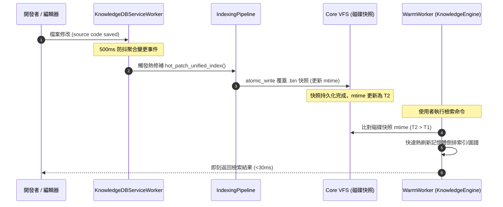

# 架構設計說明書 (Architecture Design)

> 功能名稱：knowledge_db_service_worker_and_pipeline  
> 建立日期：2026-09-06  
> 所屬主計畫：2026_09_06_1927_knowledge_db_architecture_consolidation  
> 狀態：Confirmed  

> 模板版本：v1.2  

---

## 1. 模組架構分層與職責邊界 (Layered Architecture)

```text
+-------------------------------------------------------------------------+
|                              CLI / Host                                 |
|                       python yscb.py knowledge-db ...                  |
+------------------------------------+------------------------------------+
                                     |
                                     v
+-------------------------------------------------------------------------+
|                  Server Module (Supervisor & Daemon)                    |
|  +---------------------------+       +-------------------------------+  |
|  | MasterSupervisor          |       | WarmWorker                    |  |
|  | - 127.0.0.1:0 Dynamic Port|       | - Pre-warm on Worker Start    |  |
|  | - 15m Shared Idle TTL     |       | - Eager Load KnowledgeEngine  |  |
|  | - ServiceManager          |       | - In-Memory Singleton Cache   |  |
|  +-------------+-------------+       +---------------+---------------+  |
+----------------|-------------------------------------|------------------+
                 | (manages lifecycle)                 | (dispatches CLI)
                 v                                     v
+------------------------------------+ +----------------------------------+
| KnowledgeDBServiceWorker           | | KnowledgeEngine (Query Pipeline) |
| (in server/service.py extension)   | | - mtime Check (<1ms)             |
| - Watchdog File Observer           | | - In-Memory BM25 / Graph Cache   |
| - 500ms Debounce Queue             | | - In-Memory FastEmbed Singleton  |
| - Incremental Hot Patch (Pipeline) | | - Hybrid Search / Topology Link  |
+-----------------+------------------+ +---------------+------------------+
                  |                                    |
                  +-----------------+------------------+
                                    | (reads/writes)
                                    v
+-------------------------------------------------------------------------+
|               Microkernel Primitives (core.platform & core.vfs)         |
|  - core.platform.lock (InterProcessLock for binary snapshot sync)       |
|  - core.vfs (atomic_write for zero-corruption binary index snapshots)   |
+-------------------------------------------------------------------------+
```

---

## 2. 核心資料流與循序圖 (Data Flow & Sequence Diagram)

### 2.1 Service Worker 背景熱修補與 Worker 記憶體快取熱刷新



---

## 3. 受影響檔案與新建檔案清單 (Impacted & New Files Inventory)

| 檔案路徑 | 類型 | 職責與變更說明 |
| :--- | :---: | :--- |
| `ys_codebase/source/knowledge-db/knowledge_db/service.py` | New | 實作 `KnowledgeDBServiceWorker`，繼承 `server.service.BaseServiceWorker` |
| `ys_codebase/source/knowledge-db/knowledge_db/engine.py` | Modify | 實作 `KnowledgeEngine` 單例快取、`server_worker_warming` 預熱載入與 mtime 比對熱刷新 |
| `ys_codebase/source/knowledge-db/knowledge_db/daemon.py` | Modify | 刪除 `HotReloadServer` 自製守護進程，精簡/轉發為輕量輔助函式 |
| `ys_codebase/source/knowledge-db/scripts/cli.py` | Modify | 徹底拔除 `daemon` 子命令及其分支代碼 |
| `ys_codebase/source/knowledge-db/tests/test_service_worker.py` | New | 涵蓋 Service Worker 生命週期、mtime 快取熱刷新與預熱單元測試 |

---

## 4. 架構決策記錄 (Architecture Decision Records)

- **[P02:DR-01] Service Worker 實作收斂至 `knowledge_db.service`**：將所有由 Server Master 託管之背景 Watcher 邏輯獨立收斂至 `knowledge_db.service`，與查詢引擎完全解耦。
- **[P02:DR-02] 記憶體快取單例封裝於 `KnowledgeEngine`**：快取實體包含快照檔案路徑、快照二進位反序列化對象與快照最後修改時間 (`last_mtime`)；檢索前僅執行極度輕量的 `stat().st_mtime` 浮點數比對（耗時 <0.05ms）。
- **[P02:DR-03] 徹底消除自製進程與鎖**：移除 `daemon.py` 中所有自製的 PID 鎖與 subprocess 管理，所有跨進程互斥鎖統一調用 `core.platform.lock.InterProcessLock`。
