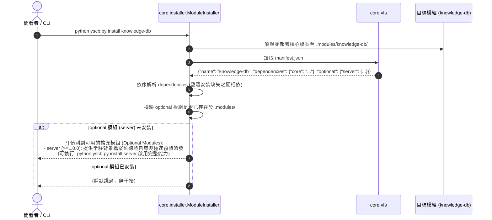

# 架構設計說明書 (Architecture Design)

> 功能名稱：optional_manifest_and_daemon_cleanup  
> 建立日期：2026-09-06  
> 所屬主計畫：2026_09_06_1927_knowledge_db_architecture_consolidation  
> 狀態：Confirmed  

> 模板版本：v1.2  

---

## 1. 模組架構分層與職責邊界 (Layered Architecture)

```text
┌────────────────────────────────────────────────────────────────────────┐
│                        YSCB CLI Toolchain                              │
├──────────────────────────────────┬─────────────────────────────────────┤
│  安裝與依賴解析 (core.installer) │   靜態語法與合規檢核 (dev.checker)  │
│  - 遍歷 optional 字典清單        │   - 驗證 optional 為 dict           │
│  - 檢測工作區已安裝狀態          │   - 驗證各項具備 version 與 hint    │
│  - 輸出友善提示卡片與安裝指令    │   - 阻斷不合規格式 (Gate 1)         │
├──────────────────────────────────┴─────────────────────────────────────┤
│                 領域模組清純化 (Domain Clean Architecture)             │
│  - knowledge-db: 徹底刪除 daemon.py 與 hook.core.py                    │
│  - 僅透過 yscb.py + server 自動享受熱啟動，代碼零感知                   │
│  - manifest.json: 核心依賴僅硬綁定 core，server 登記為 optional        │
└────────────────────────────────────────────────────────────────────────┘
```

---

## 2. 核心資料流與循序圖 (Data Flow & Sequence Diagram)



---

## 3. 受影響檔案與新建檔案清單 (Impacted & New Files Inventory)

| 檔案路徑 | 類型 | 職責與變更說明 |
| :--- | :---: | :--- |
| `source/core/core/installer.py` | Modify | 新增 `_check_optional_dependencies()`，於安裝後提示未安裝之 optional 模組 |
| `source/dev/dev/checker.py` | Modify | 於 `Checker._check_manifest` 新增 `optional` 欄位結構合規檢核 |
| `source/knowledge-db/manifest.json` | Modify | 將 `"server": ">=1.0.0"` 自 `dependencies` 移轉至 `optional` 欄位 |
| `source/knowledge-db/knowledge_db/daemon.py` | Delete | 徹底刪除廢棄的自製守護進程相容檔 |
| `source/knowledge-db/scripts/hook.core.py` | Delete | 徹底刪除廢棄的 pre_cli_dispatch 私有拉起勾點檔 |
| `source/knowledge-db/scripts/cli.py` | Modify | 移除對 `daemon.py` 的殘留 import 與提示函式 |
| `source/core/tests/test_installer.py` | Modify | 新增 optional 欄位解析與未安裝提示之單元測試 |
| `source/dev/tests/test_checker.py` | Modify | 新增 `optional` 結構合規與格式異常攔截之單元測試 |

---

## 4. 架構決策記錄 (Architecture Decision Records)

- **[P02:DR-01] 溫和提示原則（Non-Intrusive Guidance）**：`optional` 模組不自動下載、不安裝，僅在目標模組完成主流程安裝後輸出建議提示，絕不中斷主安裝流程。
- **[P02:DR-02] 靜態合規守門（Fail Fast on Invalid Schema）**：在 `dev check` 與發布階段嚴格檢核 `optional` 結構，防止模組開發者漏填 `version` 或 `hint` 導致安裝體驗不良。
- **[P02:DR-03] 物理級死碼清理（Physical Dead Code Elimination）**：徹底刪除 `daemon.py` 與 `hook.core.py`，不留 stub，落實模組對冷熱啟動零感知。
