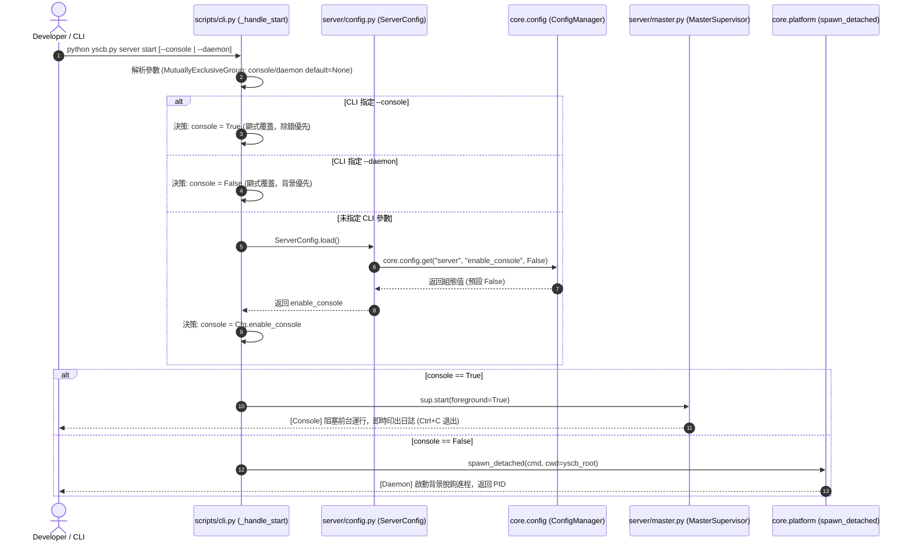

# 架構設計說明書 (Architecture Design)

> 功能名稱：server_console_config  
> 建立日期：2026-09-06  
> 所屬主計畫：2026_09_06_1927_knowledge_db_architecture_consolidation  
> 狀態：Confirmed  

> 模板版本：v1.2  

---

## 1. 模組架構分層與職責邊界 (Layered Architecture)

```text
┌─────────────────────────────────────────────────────────────┐
│                    CLI Layer (scripts/cli.py)               │
│   • MutuallyExclusiveGroup: --console (Debug) vs --daemon    │
│   • _resolve_enable_console(): 仲裁 CLI 顯式輸入與組態回退     │
└──────────────┬──────────────────────────────┬───────────────┘
               │                              │
               ▼                              ▼
┌───────────────────────────────┐ ┌───────────────────────────┐
│ Config Layer (server/config.py)│ │ Master (server/master.py) │
│ • ServerConfig Dataclass      │ │ • MasterSupervisor.start  │
│ • core.config.get() 橋接      │ │   - foreground=True (Console)
│ • 寬鬆型別防禦解析 ("true"->True)│ │   - spawn_detached (Daemon)│
└───────────────────────────────┘ └───────────────────────────┘
```

---

## 2. 核心資料流與循序圖 (Data Flow & Sequence Diagram)



---

## 3. 受影響檔案與新建檔案清單 (Impacted & New Files Inventory)

| 檔案路徑 | 類型 | 職責與變更說明 |
| :--- | :---: | :--- |
| `source/server/server/config.py` | New | 定義 `ServerConfig` 資料類別，封裝 `core.config` 讀取與型別防禦轉換 |
| `source/server/scripts/cli.py` | Modify | 實作互斥參數群組與 `_resolve_enable_console` 優先級分流 |
| `source/server/tests/test_server_config.py` | New | 涵蓋預設值、`core.config` 覆蓋、CLI 優先級覆蓋等單元測試 |

---

## 4. 架構決策記錄 (Architecture Decision Records)

- **[P02:DR-01] 獨立 `server/config.py` 模組**：
  - 職責單一原則：由專屬的 `config.py` 負責模組組態定義與 `core.config` 交互，避免將組態載入與字串轉型雜湊邏輯混入 `scripts/cli.py`。
- **[P02:DR-02] 互斥群組與三態解析**：
  - 在 `argparse` 中使用 `add_mutually_exclusive_group()`，`--console` 與 `--daemon` 預設皆設為 `None`，以乾淨區分使用者「顯式給予」與「未給予需讀取設定檔」的狀態。
