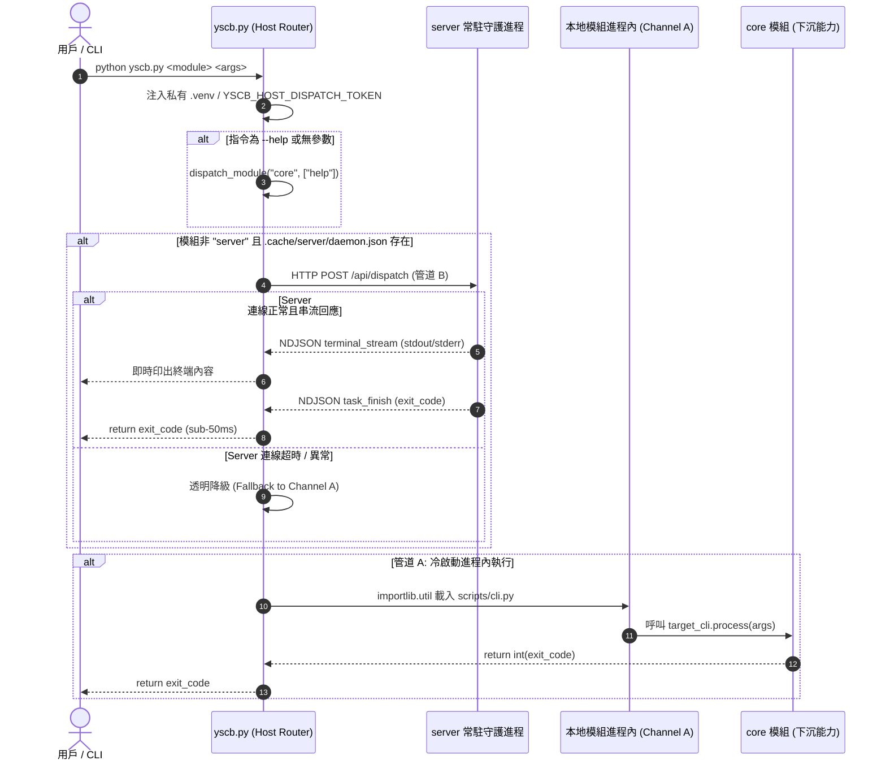

# 架構設計說明書 (Architecture Design)

> 功能名稱：yscb_host_slimming_and_dual_channel_dispatch  
> 建立日期：2026-09-06  
> 所屬主計畫：2026_09_06_1927_knowledge_db_architecture_consolidation  
> 狀態：Confirmed  

> 模板版本：v1.2  

---

## 1. 模組架構分層與職責邊界 (Layered Architecture)

```text
+-------------------------------------------------------------------------+
|                  用戶 / AI Agent CLI (python yscb.py ...)                |
+-------------------------------------------------------------------------+
                                    |
                                    v
+-------------------------------------------------------------------------+
|  yscb.py (Ultra-Thin Single-File Host Bootstrapper & CLI Router, ~220L) |
|  • 私有 .venv 探測與 sys.path 注入                                      |
|  • 環境變數 (YSCB_HOST_DIR) 與剛性安全防偽標記 (YSCB_HOST_DISPATCH_TOKEN)|
|  • 最小自舉 cmd_init (< 40 行，無 core 時下載解壓)                      |
|  • 雙管道路由分派 (Dual-Channel Dispatcher)                             |
|  • 退出碼 1:1 剛性透傳 (Exit Code Passthrough)                          |
+-------------------------------------------------------------------------+
            |                                       |
  [管道 B: 熱派發 (sub-50ms)]               [管道 A: 冷啟動 (進程內)]
            |                                       |
            v                                       v
+-----------------------+              +----------------------------------+
| server 模組常駐守護進程 |              | 各模組 scripts/cli.py (process)   |
| • HTTP POST /api/disp |              | • core (install, update, restore)|
| • NDJSON 串流 stdout/err|              | • dev, server, knowledge-db      |
+-----------------------+              +----------------------------------+
                                                    ^
                                                    | (Fallback 兜底)
                                                    +---------------------+
```

---

## 2. 核心資料流與循序圖 (Data Flow & Sequence Diagram)



---

## 3. 受影響檔案與新建檔案清單 (Impacted & New Files Inventory)

| 檔案路徑 | 類型 | 職責與變更說明 |
| :--- | :---: | :--- |
| `yscb.py` | Modify | 剝除套件還原、Git 忽略規則、手動 Help 等邏輯，瘦身至 ~220 行純淨雙管道路由。 |
| `ys_codebase/source/core/core/installer.py` | Modify | 承接 `cmd_restore`、`_restore_module_package` 與 `_generate_internal_gitignore`。 |
| `ys_codebase/source/core/core/contributes.py` | Modify | 新增 `print_global_help()`，動態掃描已安裝模組之 `contributes/core.json` 與 `manifest.json` 聚合全域 Help。 |
| `ys_codebase/source/core/scripts/cli.py` | Modify | 串接 `restore` 指令呼叫 `Installer.cmd_restore`，串接 `help` 指令呼叫全域 Help。 |
| `ys_codebase/source/core/tests/test_installer_restore.py` | New | 針對 `core.installer` 模組還原、Git 忽略規則自愈編寫單元測試。 |
| `ys_codebase/source/core/tests/test_contributes_help.py` | New | 針對全域 Help 動態聚合引擎編寫單元測試。 |

---

## 4. 架構決策記錄 (Architecture Decision Records)

- **[P02:DR-01] 零第三方依賴純淨宿主**：`yscb.py` 堅持 100% Python 標準庫（僅使用 `sys`, `os`, `json`, `urllib.request`, `difflib`, `importlib.util`），徹底拔除任何重度相依。
- **[P02:DR-02] 雙管道優先順序與降級機制**：非 `server` 指令且常駐服務存在時，優先走管道 B（HTTP POST `/api/dispatch`）享受 sub-50ms 高速響應；連線失敗或異常時透明無感降級回管道 A（本地進程內冷啟動），雙管道均剛性回傳退出碼。
- **[P02:DR-03] 全域 Help 權力回歸 Microkernel**：宿主入口不維護命令清冊，`python yscb.py --help` 直接委託給 `core` 模組的 `help` 處理，由 `core.contributes` 統一解析生態系模組動態宣告。
