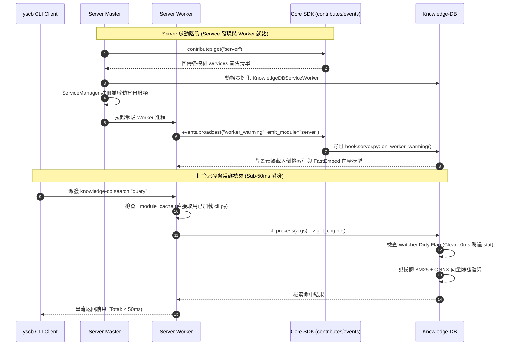

# 架構設計說明書 (Architecture Design)

> 功能名稱：sub_08_knowledge_db_search_acceleration_and_worker_singleton  
> 建立日期：2026-09-07  
> 所屬主計畫：2026_09_06_1927_knowledge_db_architecture_consolidation  
> 狀態：Confirmed  
> 模板版本：v1.2  

---

## 1. 模組架構分層與職責邊界 (Layered Architecture)

```text
+-----------------------------------------------------------------------------------+
| CLI 終端客戶端 (yscb.py thin client)                                               |
+-----------------------------------------+-----------------------------------------+
                                          | Socket IPC / In-process
                                          v
+-----------------------------------------------------------------------------------+
| Server 模組 (source/server)                                                       |
|  ├── Master (master.py)                                                           |
|  │    ├── core.contributes.get("server") --> 動態取得各模組 contributes/server.json |
|  │    ├── ServiceManager (service.py) --> 納管所有 BaseServiceWorker               |
|  │    └── status API --> 收集並格式化展示 Background Services 清單                 |
|  └── Worker (worker.py)                                                           |
|       ├── _module_cache: Dict[str, Any] --> 模組一次加載後記憶體常駐快取            |
|       └── on READY --> 非同步廣播 core.events.broadcast("worker_warming")        |
+-----------------------------------------+-----------------------------------------+
                                          | 微內核標準總線 (core SDK)
                                          v
+-----------------------------------------------------------------------------------+
| Core 模組 (source/core)                                                           |
|  ├── core.contributes: 標準聚合 module://*/contributes/server.json 宣告           |
|  └── core.events: 廣播生命週期事件並尋址 scripts/hook.server.py                   |
+-----------------------------------------+-----------------------------------------+
                                          | 領域插件 (Domain Plugin)
                                          v
+-----------------------------------------------------------------------------------+
| Knowledge-DB 模組 (source/knowledge-db)                                           |
|  ├── contributes/server.json --> 宣告 "knowledge-db-watcher" 背景服務             |
|  ├── scripts/hook.server.py --> 響應 on_worker_warming 預熱倒排與向量索引         |
|  ├── scripts/cli.py --> get_engine() 模組級單例，跨請求複用 IndexingPipeline      |
|  └── pipeline.py & service.py --> Watcher 變更標記 Dirty Flag，未髒 0ms 跳過 stat  |
+-----------------------------------------------------------------------------------+
```

---

## 2. 核心資料流與循序圖 (Data Flow & Sequence Diagram)



---

## 3. 受影響檔案與新建檔案清單 (Impacted & New Files Inventory)

| 檔案路徑 | 類型 | 職責與變更說明 |
| :--- | :---: | :--- |
| `source/server/server/worker.py` | Modify | 新增 `_module_cache` 字典，避免重複執行 `exec_module`；Worker 就緒後非同步觸發 `worker_warming` 事件 |
| `source/server/server/master.py` | Modify | 廢除硬編碼 import，改由 `core.contributes.get("server")` 動態加載 services；`_discover_service_workers` 增加異常日誌 |
| `source/server/server/service.py` | Modify | `BaseServiceWorker` 與 `ServiceManager` 支援 provider、description 擴充，提供詳細狀態輸出 |
| `source/knowledge-db/contributes/server.json` | New | 宣告 `knowledge-db-watcher` 背景服務元數據 |
| `source/knowledge-db/scripts/hook.server.py` | New | 實作 `on_worker_warming(ctx)`，非同步調用 `KnowledgeEngine.pre_warm()` |
| `source/knowledge-db/scripts/cli.py` | Modify | 實作 `get_engine() -> KnowledgeEngine` 模組級單例，跨請求複用 |
| `source/knowledge-db/knowledge_db/engine.py` | Modify | 提供 `pre_warm()` 入口點，預加載二進位倒排索引、圖譜與向量模型 |
| `source/knowledge-db/knowledge_db/pipeline.py` | Modify | 支援外部 Dirty Flag 狀態查詢，未髒時 0ms 跳過 `scanner.check_invalidation()` |

---

## 4. 架構決策記錄 (Architecture Decision Records)

- **[P02:DR-01] Worker 模組快取安全重載機制**：`_module_cache` 存儲於 Worker 進程實例內；當檔案系統變更時由 Master 透過 `ModulesWatcher` 終止並重啟全新 Worker 進程，天然解決 Python reload 模組狀態殘留問題。
- **[P02:DR-02] 非同步背景預熱隔離保證**：`worker_warming` 由 Worker 啟動後於背景獨立線程廣播與執行，完全不阻礙 Worker 接收與處理 CLI 任務。
- **[P02:DR-03] 雙軌 Dirty Flag 機制 (Dual-track Invalidation)**：若環境中由 Server 託管運行，優先依賴 Watcher 置位的記憶體 Dirty Flag；若處於獨立單機環境 (無 Server)，自動平滑回退至既有 JIT stat 逐檔比對。
