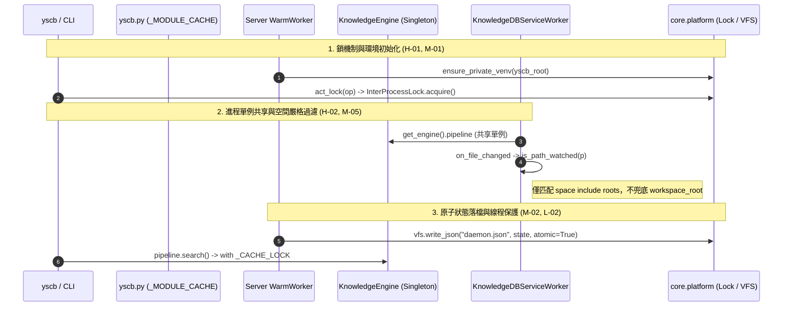

# 架構設計說明書 (Architecture Design)

> 功能名稱：sub_09_architecture_debt_remediation  
> 建立日期：2026-09-07  
> 所屬主計畫：2026_09_06_1927_knowledge_db_architecture_consolidation  
> 狀態：Confirmed  
> 模板版本：v1.2  

---

## 1. 模組架構分層與職責邊界 (Layered Architecture)

```text
+---------------------------------------------------------------------------------+
|                                 yscb 宿主入口層                                  |
|   - main() (解構標準分流)                                                       |
|   - dispatch_module (快取載入 _MODULE_CACHE，雙管道派發)                        |
|   - _is_modules_dirty (安全 with open 讀取 manifest，杜絕 FD 洩漏)               |
+---------------------------------------------------------------------------------+
                                      |
         +----------------------------+----------------------------+
         v                                                         v
+-------------------------------+                     +---------------------------+
|         server 守護層         |                     |    knowledge-db 業務層    |
| - master:                     |                     | - engine:                 |
|   _write_state() ->           |                     |   導出 get_engine() 單例  |
|   vfs.write_json(atomic=True) |                     |   清理 7 個未使用內部常數 |
| - worker:                     |                     | - service:                |
|   調用 core.platform          |                     |   is_path_watched() 嚴格  |
|   ensure_private_venv         |                     |   空間過濾 (無寬鬆兜底)   |
| - service:                    |                     |   共享 get_engine().pipeline|
|   BaseServiceWorker.start     |                     | - pipeline:               |
|   契約完整規格文件            |                     |   _CACHE_LOCK 保護快取   |
+-------------------------------+                     +---------------------------+
         |                                                         |
         +----------------------------+----------------------------+
                                      v
+---------------------------------------------------------------------------------+
|                                   core 內核層                                    |
| - platform/lock.py: InterProcessLock (跨進程文件互斥鎖)                         |
| - platform/venv.py: ensure_private_venv (下沉統一虛擬環境路徑與 .pth 解析)      |
| - engine.py: AtomicEngine.act_lock/act_unlock (改用 InterProcessLock)           |
| - guard.py: guard_dispatch (補齊安全邊界與防呆語意文檔)                         |
| - vfs/vfs.py: copy/move (跨 backend 校驗防護，拋出 NotImplementedError)         |
+---------------------------------------------------------------------------------+
```

---

## 2. 核心資料流與循序圖 (Data Flow & Sequence Diagram)



---

## 3. 受影響檔案與新建檔案清單 (Impacted & New Files Inventory)

| 檔案路徑 | 類型 | 職責與變更說明 |
| :--- | :---: | :--- |
| `source/core/core/platform/venv.py` | New | 統一封裝 `ensure_private_venv(yscb_root)` 支援平台 site-packages 與 `.pth` |
| `source/core/core/platform/__init__.py` | Modify | 導出 `ensure_private_venv` |
| `source/core/core/engine.py` | Modify | `AtomicEngine.act_lock/act_unlock` 改用 `InterProcessLock` (H-01) |
| `source/core/core/guard.py` | Modify | 補齊 Guard Token 安全邊界 Docstring (L-01) |
| `source/core/core/vfs/vfs.py` | Modify | `copy/move` 跨後端檢查並拋出 `NotImplementedError` (D-02) |
| `source/server/server/master.py` | Modify | 複用 `ensure_private_venv` (M-01)；`_write_state` 改用 VFS 原子寫入 (M-02) |
| `source/server/server/worker.py` | Modify | 複用 `ensure_private_venv` 解決 `.pth` 遺漏 (M-01) |
| `source/server/server/service.py` | Modify | `BaseServiceWorker.start` 補齊 context 規格文件 (D-01) |
| `source/knowledge-db/knowledge_db/service.py` | Modify | 移除 `is_path_watched` 兜底 (H-02)；共享 `get_engine().pipeline` (M-05) |
| `source/knowledge-db/knowledge_db/engine.py` | Modify | 導出全域單例工廠 `get_engine()` (M-05)；移除 7 個未用 formatter 常數 (L-04) |
| `source/knowledge-db/scripts/cli.py` | Modify | 轉接使用 `knowledge_db.engine.get_engine()` 單例 (M-05) |
| `source/knowledge-db/knowledge_db/pipeline.py` | Modify | `_GLOBAL_INDEX_CACHE` 加入 `_CACHE_LOCK = threading.RLock()` (L-02) |
| `yscb.py` | Modify | `_MODULE_CACHE` (M-03)、FD 洩漏修復 (M-04)、自訂逾時 (L-03)、main 拆解 (L-05) |

---

## 4. 架構決策記錄 (Architecture Decision Records)

- **[P02:DR-01] 鎖機制廢棄自製雙軌，完全收斂至 `InterProcessLock`**：
  `AtomicEngine` 內部維護 `_active_locks` 字典，透過 `acquire(blocking=True, timeout_sec=timeout)` 保證跨平台互斥，超時拋出標準 `BlockingIOError`。
- **[P02:DR-02] 空間事件過濾杜絕寬鬆兜底**：
  `is_path_watched` 僅在路徑位於註冊空間的 `resolve_space_include` 範圍內時返回 `True`，工作區根目錄非空間目錄一律返回 `False`，避免無效重檢索。
- **[P02:DR-03] `KnowledgeEngine` 進程單例下沉至模組層**：
  單例工廠定義於 `knowledge_db.engine`，使常駐 Worker 中的 ServiceWorker 與 CLI 調用點共享同一個引擎實例與快取狀態。
- **[P02:DR-04] 虛擬環境定位原語下沉至 `core.platform`**：
  避免宿主、Master、Worker 各自為政，保證 `.pth` 路徑解析行為全系統 100% 一致。
