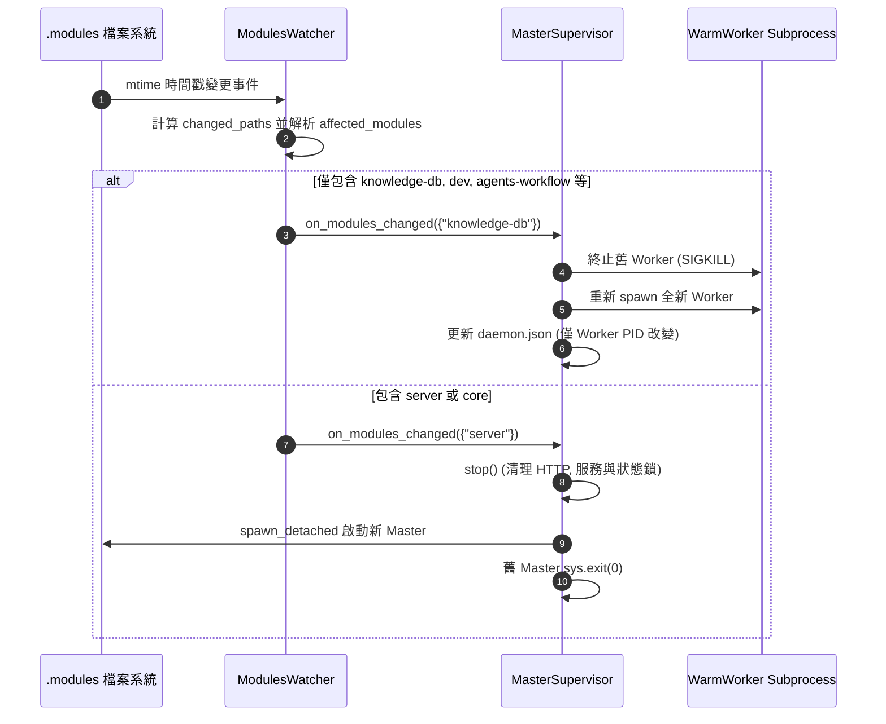

# 架構設計說明書 (Architecture Design)

> 功能名稱：sub_10_server_hot_reload_dispatch_and_master_self_restart  
> 建立日期：2026-09-07  
> 所屬主計畫：2026_09_06_1927_knowledge_db_architecture_consolidation  
> 狀態：Confirmed  
> 模板版本：v1.2  

---

## 1. 模組架構分層與職責邊界 (Layered Architecture)

```text
[ .modules/ 檔案系統變更 ]
            │
            ▼
    [ ModulesWatcher ] (watcher.py)
            │
            ├── 解析路徑 -> 提取 affected_modules (Set[str])
            └── 500ms 防抖聚合 (Debounce)
            │
            ▼
   [ on_modules_changed ] 回調分流 (master.py)
            │
       ┌────┴────────────────────────┐
       │ (包含 'server' 或 'core')    │ (僅其他領域模組)
       ▼                             ▼
 [ restart_server() ]          [ restart_worker() ]
       │                             │
 ┌─────┴──────────────┐        ┌─────┴──────────────┐
 │ 1. 停止 Background │        │ 1. 殺死舊 Worker   │
 │    Services & HTTP │        │ 2. 拉起全新 Worker │
 │ 2. 釋放 Lock/State │        │ 3. 更新 daemon.json│
 │ 3. spawn_detached  │        │    (Master 保持不變)│
 │    拉起新 Master    │        └────────────────────┘
 │ 4. 舊進程優雅退場  │
 └────────────────────┘
```

---

## 2. 核心資料流與循序圖 (Data Flow & Sequence Diagram)



---

## 3. 受影響檔案與新建檔案清單 (Impacted & New Files Inventory)

| 檔案路徑 | 類型 | 職責與變更說明 |
| :--- | :---: | :--- |
| `source/server/server/watcher.py` | Modify | 增強路徑模組解析 `get_affected_modules()`，傳遞 `affected_modules` 至回調函式，加入防抖。 |
| `source/server/server/master.py` | Modify | 接收 `affected_modules` 並分流；實作 `restart_server()` 優雅重啟整機邏輯。 |
| `source/server/tests/test_server.py` | Modify | 增加路徑解析、雙軌分流判定與重啟回調測試案例 (FT-01~03)。 |

---

## 4. 架構決策記錄 (Architecture Decision Records)

- **[P02:DR-01] 模組感知解析合約向下相容**：
  `ModulesWatcher` 的 `on_change_callback` 簽名支援 `Callable[[Set[str]], None]`，若回調函式為無參則透過檢查 `inspect.signature` 相容無參回調，確保既有單元測試向下相容。
- **[P02:DR-02] Master 重啟採用「清理後脫鉤重生」模型**：
  為避免新舊進程在 InterProcessLock 與 Localhost Port 爭碰，舊 Master 在拉起新進程前完整執行資源釋放與 state 清理，再以 `core.platform.spawn_detached` 啟動新 Master，舊進程完成任務後退出。
