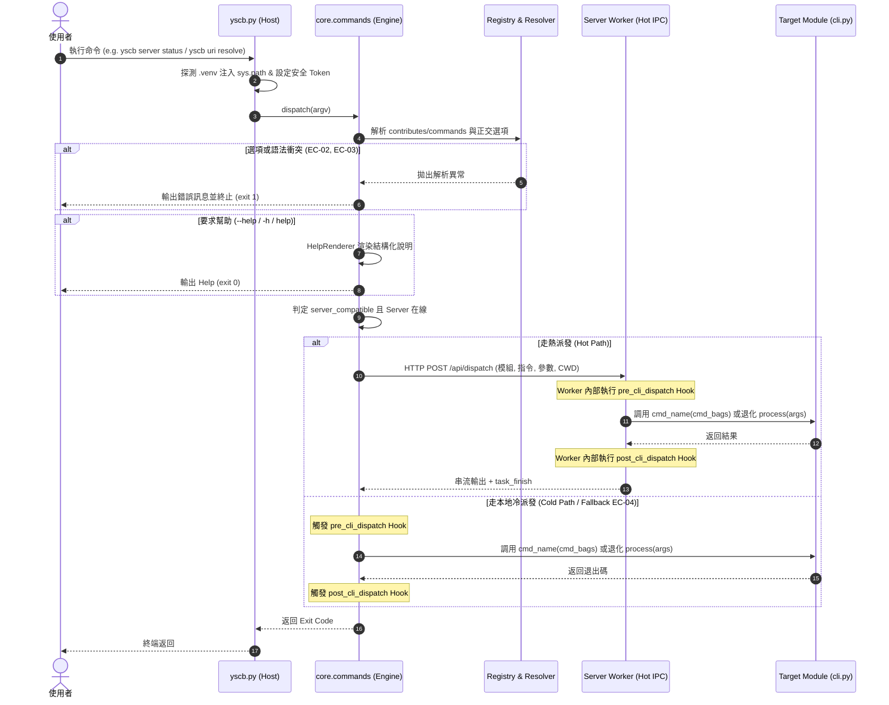

# 架構設計說明書 (Architecture Design)

> 功能名稱：core.commands 活躍執行合約與 CLI 派發管線重構  
> 建立日期：2026-09-07  
> 所屬主計畫：2026_09_07_0831_quality_update (品質更新)  
> 狀態：Confirmed  
> 依據 P01：[P01_requirements_spec.md](./P01_requirements_spec.md)  
> 模板版本：v1.2  

---

## 1. 模組架構分層與職責邊界 (Layered Architecture)

系統劃分為「宿主自舉層」、「核心命令引擎層 (core.commands)」、「伺服常駐層 (server)」與「業務模組實體層 (pioneer & legacy modules)」：

```text
+-----------------------------------------------------------------------------------+
| 1. 宿主自舉層 (Host Layer: yscb.py)                                               |
|    - init 自舉解壓                                                                |
|    - 私有微環境 (.venv) site-packages 注入                                         |
|    - 安全邊界注入 (YSCB_HOST_DIR / YSCB_HOST_DISPATCH_TOKEN)                       |
|    - 委派 core.commands.dispatch(argv)                                            |
+-----------------------------------------------------------------------------------+
                                      │
                                      ▼
+-----------------------------------------------------------------------------------+
| 2. 核心命令引擎層 (core.commands)                                                 |
|    ├── bags.py         : 強型別 CmdBags 與 CmdOption 封裝 (不可變結構)             |
|    ├── registry.py     : Contributes Commands 模式解析、別名索引 (module_alias)   |
|    ├── resolver.py     : 參數解析器、正交群組互斥檢查、別名規範化、has_value 驗證  |
|    ├── help.py         : 統一模組級與指令級 --help 終端格式化渲染器                |
|    └── dispatcher.py   : 生命週期對稱 Hook (pre/post)、雙管道路由 (Hot/Cold)、     |
|                          精確命令派發與舊版 process 靜默退化相容                   |
+-----------------------------------------------------------------------------------+
                  │                                                 │
      [server_compatible && online]                     [server_compatible==false]
                  │                                                 │
                  ▼                                                 ▼
+------------------------------------+             +--------------------------------+
| 3. 伺服常駐層 (server / worker.py) |             | 4. 本地冷派發執行體            |
|    - HTTP IPC 接收派發請求         |             |    - 即時載入目標 scripts/cli  |
|    - Worker 記憶體暖進程調用       |             |    - 執行精確命令或退化相容    |
+------------------------------------+             +--------------------------------+
                  │                                                 │
                  └────────────────────────┬────────────────────────┘
                                           │
                                           ▼
+-----------------------------------------------------------------------------------+
| 5. 模組執行層 (Module Execution Contract)                                         |
|    ├── 先驅模組 (core, server)   : 精確命令函式 def cmd_name(cmd_bags: CmdBags)   |
|    └── 未遷移模組 (dev, 等)      : 雙軌過渡退化 def process(args: List[str]) (暫存)|
+-----------------------------------------------------------------------------------+
```

### 微內核延遲加載拓撲 (PEP 562 Lazy Loading in `core/__init__.py`)
`core/__init__.py` 透過 `__getattr__` 進行按需動態導入，建立模組屬性映射表 `_MODULE_MAP`。當僅使用 `core.commands` 時，不喚醒 `AtomicEngine`、`Installer`、`PipManager`、`VFS` 等重型組件，將導入耗時自 ~77ms 降至 $\le 5\text{ms}$。

---

## 2. 核心資料流與循序圖 (Data Flow & Sequence Diagram)

### CLI 派發雙管道協同時序圖



---

## 3. 受影響檔案與新建檔案清單 (Impacted & New Files Inventory)

| 檔案路徑 | 類型 | 職責與變更說明 |
| :--- | :---: | :--- |
| `ys_codebase/source/core/core/commands/__init__.py` | New | 匯出 `dispatch`、`CmdBags`、`CmdOption` 公開 API |
| `ys_codebase/source/core/core/commands/bags.py` | New | 定義 `CmdBags` 與 `CmdOption` 資料類別 (不可變封裝) |
| `ys_codebase/source/core/core/commands/registry.py` | New | 負責聚合 `contributes/commands.json`、解析新 Schema、管理 `module_alias` 映射 |
| `ys_codebase/source/core/core/commands/resolver.py` | New | 負責 Option 解析、正交互斥檢查、別名轉規範名、`args` 與 `choice` 合法值校驗與必填檢查 |
| `ys_codebase/source/core/core/commands/help.py` | New | 負責生態系統一的模組級與指令級 `--help` 格式化終端輸出，支援 `<name=[a | b]>` 視覺提示與 `ARGUMENTS` 區塊 |
| `ys_codebase/source/core/core/commands/dispatcher.py` | New | 雙管道分流派發器、生命週期 Hook 對稱廣播、動態執行精確函式或相容退化 |
| `ys_codebase/source/core/core/__init__.py` | Modify | 實作 PEP 562 `__getattr__` 與 `__dir__`，移除 eager import，支援按需載入 |
| `yscb.py` | Modify | 拔除內部硬編碼黑名單、自製分派邏輯與快取；保留自舉、.venv 注入並完全委託 `core.commands.dispatch` |
| `ys_codebase/source/core/contributes/core.json` | Modify | 將 commands 遷移為新 Schema (含正交群組、tier、server_compatible、args/choice、pros/cons，完全移除 has_value) |
| `ys_codebase/source/server/contributes/core.json` | Modify | 將 server 指令遷移為新 Schema (含正交群組、tier、server_compatible、args/choice、pros/cons，完全移除 has_value) |
| `ys_codebase/source/core/scripts/cli.py` | Modify | 全面遷移為精確命令函式模式 (以 `CmdBags` 為參數)，移除 `process(args)` |
| `ys_codebase/source/server/scripts/cli.py` | Modify | 全面遷移為精確命令函式模式 (以 `CmdBags` 為參數)，移除 `process(args)` |
| `ys_codebase/source/server/server/worker.py` | Modify | 支援調用 `core.commands` 內部派發執行體與精確命令函式 |
| `ys_codebase/source/core/tests/test_core_commands.py` | New | 全面覆蓋 `core.commands` 之解析、互斥、派發、相容退化、args/choice 校驗與 Lazy Loading 單元測試 |

---

## 4. 架構決策記錄 (Architecture Decision Records)

- **[P02:DR-01] 引擎子包職責單一化**：`core.commands` 切分為 `bags` (資料載體)、`registry` (綱要索引)、`resolver` (語法剖析)、`help` (文件渲染) 與 `dispatcher` (管線調度)，嚴格單向依賴，無循環引用。
- **[P02:DR-02] PEP 562 延遲加載全域字典快取**：在 `core/__init__.py` 的 `__getattr__` 中，首次導入後立即寫入 `globals()[name]`，使第二次存取達到原生屬性讀取速度，兼顧首次超低延遲與後續高頻調用效能。
- **[P02:DR-03] 雙管道對稱生命週期鉤子機制**：`pre_cli_dispatch` 與 `post_cli_dispatch` 統一由實際執行環境（Worker 內部或本地派發器內部）在執行前後廣播，確保自癒與快取通知在真實執行上下文中生效，且 Client 宿主零開銷。
- **[P02:DR-04] 過渡相容層的純淨隔離與靜默退化**：透過 `hasattr(mod, cmd_name)` 判定新契約；未遷移模組靜默退化至 `mod.process(raw_args)`，不拋出 Warning。此退化邏輯集中於 `dispatcher.py` 單一點，便於 `sub_02` 剛性刪除。
- **[P02:DR-05] 模組與指令模糊推薦及分級防護**：未知模組或指令使用 `difflib.get_close_matches` 輸出建議；同一正交群組多選在 `resolver` 階段強制拋出 `MutualExclusionError` 並中斷執行。
- **[P02:DR-06] 參數模型統一收斂與零容忍刪除 has_value**：不相容歷史 `has_value`，全面以 `ArgSpec` 與 `args` 字典組織指令與選項的參數規格；`OptionResolver` 集中完成必填性與 `choice` 列舉值防呆，`HelpRenderer` 負責視覺轉譯。
- **[P02:DR-07] 同構遞迴指令樹與三態派發模型**：每個 `CommandSpec` 節點同構宣告 `cmd: Dict[str, CommandSpec]`。派發器沿著 CLI tokens 走訪指令樹：純葉子直接映射至實體函式；純分支無實體函式，呼叫時自動渲染該分支之 Subcommands 清單說明；可呼叫複合分支則在命中子指令時向下轉派，未命中時執行本體函式。函式命名約定以底線平鋪（如 `uri_list`、`config_get`）。
- **[P02:DR-08] 參數型態之結構化推導原則**：維持零冗餘標籤之結構化推導（頂層 `args` 為位置變數 Positional Var、Option 無 `args` 為布林旗標 Boolean Flag、Option 含 `args` 為帶值選項 Option Var）；並於專題手冊 `cli_commands_architecture.md` 確立對照表與行為約束。
