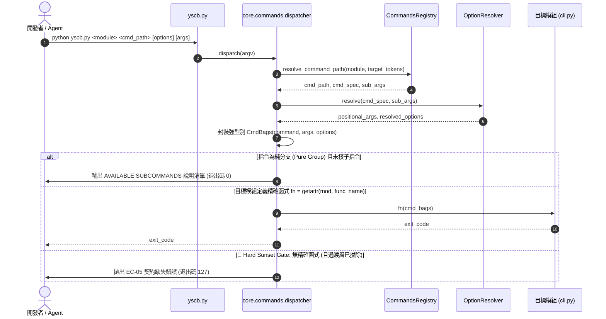

# 架構設計說明書 (Architecture Design)

> 功能名稱：全生態系模組 CLI 活躍執行合約遷移與向後相容過渡層徹底拔除  
> 建立日期：2026-09-07  
> 所屬主計畫：2026_09_07_0831_quality_update  
> 狀態：Confirmed  
> 模板版本：v1.2  

---

## 1. 模組架構分層與職責邊界 (Layered Architecture)

```text
+-------------------------------------------------------------------------+
|                              CLI 入口宿主                                |
|                        yscb.py (薄宿主純轉派)                            |
+-------------------------------------------------------------------------+
                                    |
                                    v
+-------------------------------------------------------------------------+
|                     core.commands 微內核排程與路由                       |
|  CommandsRegistry          OptionResolver            HelpRenderer       |
|  - 同構遞迴樹走訪          - Positional Var 校驗      - 全域/模組/指令   |
|  - contributes 聚合        - Orthogonal Options 互斥  - SUBCOMMANDS 清單 |
|  - module_alias 映射       - choice 列舉約束          - Visual cues     |
|                                   |                                     |
|                       CommandDispatcher                                 |
|         +-------------------------+-------------------------+           |
|         | server_compatible: true | server_compatible: false|           |
|         v                         v                         |           |
|    管道 B: HTTP IPC           管道 A: 本地冷派發             |           |
|    (Server Worker 瞬發)       (直接調用精確函式)             |           |
|                                   |                                     |
|    🚨 Hard Sunset Gate: 徹底刪除 process(args) fallback 分支             |
|    若目標函式不存在且非純分支，嚴格中斷並拋出 EC-05 (退出碼 127)        |
+-------------------------------------------------------------------------+
                                    |
            +-----------------------+-----------------------+
            v                       v                       v
+-----------------------+ +-----------------------+ +-----------------------+
|      dev 模組         | |     knowledge-db 模組 | |  agents-workflow 模組  |
| - test(cmd_bags)      | | - search(cmd_bags)    | | - plan_* (底線平鋪)   |
| - check(cmd_bags)     | | - callers(cmd_bags)   | | - release(cmd_bags)   |
| - build(cmd_bags)     | | - callees(cmd_bags)   | | - compile(cmd_bags)   |
| - release(cmd_bags)   | | - impact(cmd_bags)    | | - roadmap(cmd_bags)   |
| - bump_*(cmd_bags)    | | - status(cmd_bags)    | | - tokens(cmd_bags)    |
| (零 process/argparse) | | (開啟熱派發/單例共享) | | (同構遞迴指令樹)      |
+-----------------------+ +-----------------------+ +-----------------------+
```

---

## 2. 核心資料流與循序圖 (Data Flow & Sequence Diagram)



---

## 3. 受影響檔案與新建檔案清單 (Impacted & New Files Inventory)

| 檔案路徑 | 類型 | 職責與變更說明 |
| :--- | :---: | :--- |
| `source/dev/contributes/core.json` | Modify | 遷移 contributes commands schema（移除 phases，加入 tier, server_compatible, args, options, usage） |
| `source/dev/scripts/cli.py` | Modify | 移除 `process(args)` 與 `argparse`，改寫為接收 `CmdBags` 之精確命令函式 |
| `source/knowledge-db/contributes/core.json` | Modify | 遷移 contributes commands schema，查詢/分析指令開啟 `server_compatible: true` |
| `source/knowledge-db/scripts/cli.py` | Modify | 移除 `process(args)`，拆解為 `search`, `callers`, `callees`, `impact` 等精確命令函式，維持 `get_engine()` 單例共享 |
| `source/agents-workflow/contributes/agents-workflow.json` | Modify | 補齊 contributes commands schema，以巢狀 `cmd` 樹定義 `plan` 複合分支及全套指令清冊 |
| `source/agents-workflow/scripts/cli.py` | Modify | 移除 `process(args)`，以底線平鋪函式（`plan_status`, `plan_check` 等）承接同構子指令 |
| `source/core/core/commands/dispatcher.py` | Modify | 🚨 **剛性拔除向後相容過渡層**：徹底刪除 `process` fallback 分支與判定邏輯 |
| `source/core/tests/test_core_commands.py` | Modify | 將 FT-08 退化測試升級為 EC-05 嚴格斷言測試（未定義精確函式必返回 127） |

---

## 4. 架構決策記錄 (Architecture Decision Records)

- **[P02:DR-01] `dev` 模組平鋪命令映射與別名處理**：
  `create`、`check`、`build`、`test`、`release`、`release-check`、`release-git` 與 `bump-*` 系列全面宣告為頂層指令；`test` 指令之 `--quiet` 與 `--verbose` 宣告為正交互斥群組；實作端以原生 `cmd_bags` 讀取參數。
- **[P02:DR-02] `knowledge-db` 模組 `server_compatible` 熱派發隔離**：
  `search`、`callers`、`callees`、`impact`、`status` 標註 `server_compatible: true`，在常駐 Worker 進程中執行且共享唯一 `KnowledgeEngine` 單例；具有副作用之 `clean`、`bundle`、`scan`、`index` 維持 `server_compatible: false`，走本地隔離進程執行。
- **[P02:DR-03] `agents-workflow plan` 複合分支與底線平鋪命名**：
  `plan` 宣告為複合分支（Hybrid Group），直接執行 `python yscb.py agents-workflow plan` 預設輸出子指令 Help；其子指令 `archive`, `status`, `search`, `check`, `verify` 宣告於其 `cmd` 字典下，由 `plan_archive(cmd_bags)` 等平鋪函式承接；`verify` 與 `check` 保持同義對稱。
- **[P02:DR-04] Hard Sunset Gate (硬性拔除過渡層)**：
  刪除 `dispatcher.py` 中的 `if cmd_spec is None and hasattr(mod, "process"):` 與 `elif hasattr(mod, "process"):` 分支，未實作精確函式一律阻斷為 `EC-05` (127)，零殘留相容技術債。
