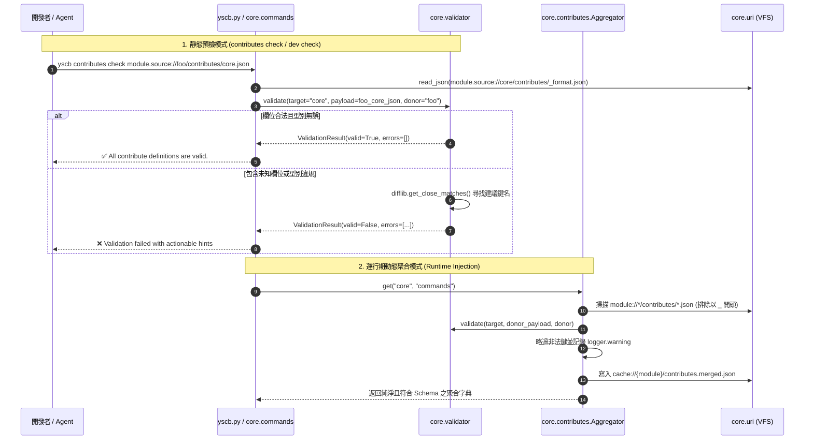

# 架構設計說明書 (Architecture Design)

> 功能名稱：Contributes 宣告架構升級與 Schema 剛性校驗 (Contributes Schema & Rigid Validation)  
> 建立日期：2026-09-07  
> 所屬主計畫：2026_09_07_0831_quality_update (品質更新)  
> 狀態：Confirmed  
> 模板版本：v1.2  

---

## 1. 模組架構分層與職責邊界 (Layered Architecture)

```text
+-------------------------------------------------------------------------------+
|                             CLI / IDE / Developer                             |
|    python yscb.py contributes list / check  |  python yscb.py dev check      |
+-------------------------------------------------------------------------------+
                                        │
                   ┌────────────────────┴────────────────────┐
                   ▼                                         ▼
+------------------------------------+    +------------------------------------+
|  [Dev Toolchain] dev.checker       |    |  [Core CLI] core.commands.contrib  |
|  - ContributesCheckPass (Pre-flight|    |  - contributes list / check        |
|  - dev.scaffold: _format/_manifest |    |  - First-Class URI Resolution      |
+------------------------------------+    +------------------------------------+
                   │                                         │
                   └────────────────────┬────────────────────┘
                                        ▼
+-------------------------------------------------------------------------------+
|                    [Core Engine] core.contributes.validator                   |
|  - TypeSignatureParser: 解析 "str!", "enum(a, b)? = a", "bool? = false"        |
|  - ContributesValidator: 遞迴走訪校驗、_types 別名解析、通配符 "*" 解算         |
|  - DiagnosticReporter: Levenshtein 近似拼寫建議 (difflib.get_close_matches)   |
|  - MetaValidator: 校驗 _format.json 本身之合法性 (--format check)             |
+-------------------------------------------------------------------------------+
                                        │
                                        ▼
+-------------------------------------------------------------------------------+
|                  [Runtime Injection] core.contributes                         |
|  - ContributesAggregator.scan_and_inject(): Ingress/Egress 邊界檢核           |
|  - 移除盲目 except pass，過濾非目標鍵，阻斷髒資料寫入 contributes.merged.json   |
|  - 聚合快照與 JIT 變更嗅探保持零無謂重複驗證                                   |
+-------------------------------------------------------------------------------+
```

---

## 2. 核心資料流與循序圖 (Data Flow & Sequence Diagram)



---

## 3. 受影響檔案與新建檔案清單 (Impacted & New Files Inventory)

| 檔案路徑 | 類型 | 職責與變更說明 |
| :--- | :---: | :--- |
| `source/core/core/validator.py` | New | 實作 100% 原生標準庫輕量型別 DSL 解析器、通配符比對、近似拼寫建議與 Meta-Schema 校驗引擎。 |
| `source/core/core/contributes.py` | Modify | 引入 Validator 介面；`_scan_contributes_inputs` 嚴格過濾 `_` 開頭特殊檔；`scan_and_inject` 加入邊界驗證與過濾，移除盲目 `except: pass`；導出 Public SDK。 |
| `source/core/core/commands/contributes_cmd.py` | New | 實作 `contributes list` 與 `contributes check` 子指令，支援 `--format` 與語意 URI 協議。 |
| `source/core/contributes/core.json` | Modify | 註冊 `contributes` 指令樹（`list`, `check`），清理舊有 `phases` 殘留。 |
| `source/core/contributes/_format.json` | New | 定義 `core` 模組開放之 Ingress 契約（`uri_schemes`, `commands`, `events`）。 |
| `source/core/contributes/_manifest.md` | New | 記錄 `core` 對外貢獻之導覽清冊。 |
| `source/dev/dev/checker.py` | Modify | 新增 `ContributesCheckPass`，於 `dev check` 時靜態阻斷 Schema 違規與跨目標越權。 |
| `source/dev/dev/scaffold.py` | Modify | 更新 `Scaffolder.create_module`，自動建立帶有教學範例之 `_format.json` 與 `_manifest.md`。 |
| `source/dev/contributes/_format.json` | New | 定義 `dev` 模組開放之 Ingress 契約。 |
| `source/dev/contributes/_manifest.md` | New | 記錄 `dev` 模組對外貢獻清冊。 |
| `source/server/contributes/_format.json` | New | 定義 `server` 模組開放之 Ingress 契約。 |
| `source/server/contributes/_manifest.md` | New | 記錄 `server` 模組對外貢獻清冊。 |
| `source/agents-workflow/contributes/_format.json` | New | 定義 `agents-workflow` 開放之 Ingress 契約（`export`, `token`, `insert`, `release_target`）。 |
| `source/agents-workflow/contributes/_manifest.md` | New | 記錄 `agents-workflow` 對外貢獻清冊。 |
| `source/knowledge-db/contributes/_format.json` | New | 定義 `knowledge-db` 開放之 Ingress 契約。 |
| `source/knowledge-db/contributes/_manifest.md` | New | 記錄 `knowledge-db` 對外貢獻清冊。 |

---

## 4. 架構決策記錄 (Architecture Decision Records)

- **[P02:DR-01] 引擎職責解耦 (Validator vs. Aggregator)**：
  校驗邏輯完全獨立於 `core.validator`，`contributes.py` 僅負責聚合與快取治理。校驗器為純無狀態函式與物件，便於單元測試與 CLI 復用。
- **[P02:DR-02] 通配符 `*` 與具名鍵優先順序**：
  在校驗 Dict 結構時，先精確比對具名規格鍵（如 `module_alias`, `cmd`）；若不存在具名鍵且結構包含 `"*"`，則其餘所有動態鍵統一由 `"*"` 對應之規則驗證。
- **[P02:DR-03] 樹狀遞迴深度熔斷防禦**：
  在解析 `$CommandNode` 等自我參照或遞迴結構時，引入 `max_depth=10` 熔斷計數器，防止惡意構造的環狀 JSON 導致 Python 棧溢位。
- **[P02:DR-04] 運行期過濾與警告 (Tolerant Ingress, Strict Egress)**：
  `ContributesAggregator` 在運行期若遇到部分鍵違規，不直接導致全系統崩潰，而是記錄 `logger.warning` 並剔除違規鍵；在 `dev check` 與 `contributes check` 靜態環境則採零容忍 Exit 1 阻斷。
