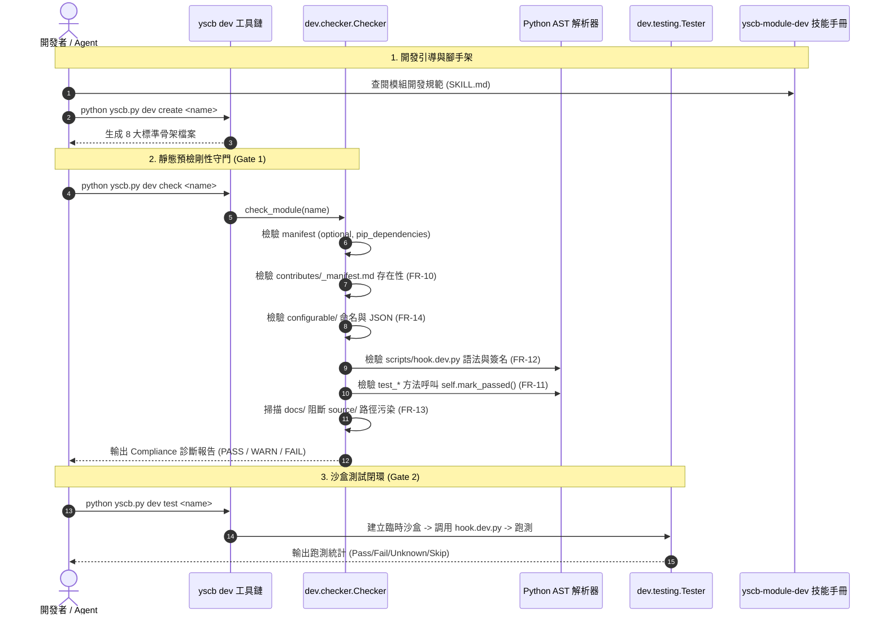

# 架構設計說明書 (Architecture Design)

> 功能名稱：yscb-module-dev 技能手冊全方位品質優化與能力補齊 (Skill Quality Refinement & Capability Completion)  
> 建立日期：2026-09-08  
> 所屬主計畫：2026_09_07_0831_quality_update (品質更新)  
> 狀態：Confirmed  
> 模板版本：v1.2  

---

## 1. 模組架構分層與職責邊界 (Layered Architecture)

本計畫劃分為兩大互為支撐的工程軌道：**技能手冊資產層**與**CLI剛性守門檢核層**。

```text
+-------------------------------------------------------------------------------+
| 1. 技能手冊指引層 (Skill Documentation & Guild Layer)                         |
|    - SKILL.md (觸發時機導航、雙軌流水線、模組腳手架入口)                       |
|    - cli_and_commands.md (指令設計、對稱性、dev create、發布管線進階指令)     |
|    - acceptance_checklist.md (4大 Gate、四大文檔視角、AST 檢核紅線、清冊)     |
|    - testing_and_sandbox.md (YSCBTestCase、mark_passed、4-Tier 分類、沙盒鉤子)|
|    - contributes_guide.md (Ingress/Egress 邊界、_manifest.md、module:// 語意) |
+-------------------------------------------------------------------------------+
                                      |
                                      v (定義規範、引導遵循)
+-------------------------------------------------------------------------------+
| 2. CLI 剛性守門檢核層 (Automated Guard Pipeline - dev/checker.py)             |
|    - _check_manifest() : 欄位檢查 (name, version, optional, pip_dependencies) |
|    - _check_core_injection() : contributes/_manifest.md 剛性存在性檢驗        |
|    - _check_file_structure() : configurable/ 命名檢驗、淘汰舊 format.md 檢查  |
|    - _check_sandbox_hooks() : scripts/hook.dev.py 語法與簽名契約檢驗 (新增)   |
|    - _check_docs_pollution() : docs/ 第三方文檔 project://source/ 掃描 (新增)  |
|    - _check_test_classes() : AST 靜態檢測測試方法 self.mark_passed() 調用 (新增)|
+-------------------------------------------------------------------------------+
                                      |
                                      v (運行期保障)
+-------------------------------------------------------------------------------+
| 3. 測試執行與沙盒運行層 (Virtual Sandbox & Test Engine - dev/testing/)        |
|    - YSCBTestCase (tearDown 狀態分類、斷言庫、Mock 工具)                       |
|    - SandboxProvisioner (派發 scripts/hook.dev.py on_test_setup/teardown)     |
|    - runner.py (4-Tier Taxonomy 分類過濾 --type, --target)                    |
+-------------------------------------------------------------------------------+
```

---

## 2. 核心資料流與循序圖 (Data Flow & Sequence Diagram)



---

## 3. 受影響檔案與新建檔案清單 (Impacted & New Files Inventory)

| 檔案路徑 | 類型 | 職責與變更說明 |
| :--- | :---: | :--- |
| `source/dev/dev/checker.py` | Modify | 實作 FR-10 ~ FR-14 剛性檢驗方法（`_manifest.md` 檢核、`mark_passed()` AST 掃描、`hook.dev.py` 語法簽名檢驗、`docs/` 路徑掃描、`configurable/` 檔案命名約束） |
| `source/dev/tests/test_checker.py` | Modify | 新增 FT-10 ~ FT-14 單元測試，斷言 Checker 5 項新檢核邏輯之 PASS / WARN / FAIL 判定 |
| `source/dev/assets/skills/yscb-module-dev/SKILL.md` | Modify | 實作 FR-01, FR-08（「觸發時機」導航、移除自檢速查、軌道 B 授權守門、`dev create` 入口、Unicode 流程表示） |
| `source/dev/assets/skills/yscb-module-dev/references/acceptance_checklist.md` | Modify | 實作 FR-05, FR-06, FR-07, FR-08（章節標題修正、四大文檔視角垂直展開、AST 紅線清冊、`_manifest.md` 排查入口、`configurable/` 規範） |
| `source/dev/assets/skills/yscb-module-dev/references/cli_and_commands.md` | Modify | 實作 FR-01, FR-05, FR-07, FR-09（`dev create` 腳手架章節、3.2 章節號更正、`manifest` 進階欄位、`release-check` / `release-git` 說明、Server 協同引流） |
| `source/dev/assets/skills/yscb-module-dev/references/contributes_guide.md` | Modify | 實作 FR-07, FR-08（Host 視角路徑備註、第三方 `module://` 語意引用健全） |
| `source/dev/assets/skills/yscb-module-dev/references/testing_and_sandbox.md` | Modify | 實作 FR-02, FR-03, FR-04, FR-07（測試範例加入 `mark_passed()`、4-Tier 分類標籤、`hook.dev.py` 沙盒鉤子、專屬斷言與 Mock 清單、`contributes check` 引流） |

---

## 4. 架構決策記錄 (Architecture Decision Records)

- **[P02:DR-01] 剛性檢核靜態化 (Pure AST Static Analysis for Checker)**：
  `dev check` 擴充之所有程式碼檢查（包括 `mark_passed` 檢驗與 `hook.dev.py` 檢驗）一律使用 Python 內建 `ast` 模組進行靜態語法樹走訪，**絕對禁止動態 import 目標模組代碼**，避免靜態檢查時產生副作用或環境污染。
- **[P02:DR-02] 漸進警告與硬性阻斷分級策略 (Check Severity Policy)**：
  - `contributes/_manifest.md` 缺失：判定為 `WARN`（漸進容錯）或 `FAIL`（若具備 `_format.json` 則為 `FAIL`）。
  - `mark_passed()` 呼叫遺漏：判定為 `WARN`（提醒開發者避免產生 UNKNOWN 狀態，不阻斷既有尚未升級的歷史測試）。
  - `hook.dev.py` 語法錯誤或頂層散落語句：判定為 `FAIL`（因匯入崩潰會直接破壞測試引擎）。
  - `docs/` 出現 `project://source/` 硬編碼：判定為 `WARN`。
- **[P02:DR-03] 零第三方依賴原則 (Zero 3rd-party Dependency)**：
  所有新實作完全基於 Python 標準庫（`ast`, `os`, `re`, `json`），維持 `dev` 模組極致純淨。
- **[P02:DR-04] 雙向閉環互證 (Doc-Code Mirroring)**：
  手冊中記錄的每一條「禁止條款」與「規範要求」，在 `checker.py` 中皆有對應的檢查規則或代碼驗證，達成規範與實作 1:1 鏡像映射。
