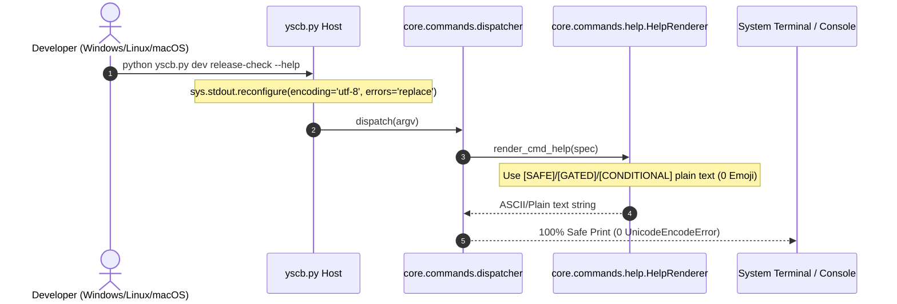

# 架構設計說明書 (Architecture Design)

> 功能名稱：終端編碼防護、舊版殘留清理、特殊字元徹底捨棄與測試狀態閉環 (sub_05)  
> 建立日期：2026-09-12  
> 所屬主計畫：2026_09_07_0831_quality_update  
> 狀態：Confirmed  
> 模板版本：v1.2  

---

## 1. 模組架構分層與職責邊界 (Layered Architecture)

```text
+-------------------------------------------------------------------------+
|                              yscb.py Host                               |
|   - Windows sys.stdout/stderr.reconfigure(encoding='utf-8', errors='replace')
|   - 0 Emoji pure ASCII banner / diagnostics                             |
+-------------------------------------------------------------------------+
                                    |
                                    v
+-------------------------------------------------------------------------+
|                        core.commands.dispatcher                         |
|   - Dispatcher UTF-8 stdout guard                                       |
|   - HelpRenderer: [SAFE] / [CONDITIONAL] / [GATED] plain text badges    |
+-------------------------------------------------------------------------+
                                    |
            +-----------------------+-----------------------+
            |                                               |
            v                                               v
+-----------------------+                       +-----------------------+
|  Ecosystem Cleanups   |                       | Test Mark Passed Loop |
| - Remove 3x legacy    |                       | - agents-workflow 44x |
|   contributes.format  |                       | - core 17x            |
| - Standardize config  |                       | - test_pt_01 perf     |
|   template naming     |                       |   threshold polish    |
+-----------------------+                       +-----------------------+
```

---

## 2. 核心資料流與循序圖 (Data Flow & Sequence Diagram)



---

## 3. 受影響檔案與新建檔案清單 (Impacted & New Files Inventory)

| 檔案路徑 | 類型 | 職責與變更說明 |
| :--- | :---: | :--- |
| `yscb.py` | Modify | 頂層加入 Windows 平台 `reconfigure` UTF-8 與容錯處理 |
| `source/core/core/commands/help.py` | Modify | 移除所有 Emoji（`🟢`, `🟡`, `🔴` 等），改為 `[SAFE]`, `[CONDITIONAL]`, `[GATED]` |
| `source/core/core/commands/dispatcher.py` | Modify | 防禦性編碼重組與純文字提示 |
| `source/core/contributes.format.md` | Delete | 刪除舊版殘留文檔 |
| `source/server/contributes.format.md` | Delete | 刪除舊版殘留文檔 |
| `source/knowledge-db/contributes.format.md` | Delete | 刪除舊版殘留文檔 |
| `source/knowledge-db/configurable/` | Rename | `contribute.json` 重新命名為 `config.project.json` |
| `source/agents-workflow/tests/test_publisher.py` | Modify | 補齊 11 處 `self.mark_passed()` |
| `source/agents-workflow/tests/test_roadmap.py` | Modify | 補齊 4 處 `self.mark_passed()` |
| `source/core/tests/test_guard.py` | Modify | 補齊 3 處 `self.mark_passed()` |
| `source/core/tests/test_platform.py` | Modify | 補齊 5 處 `self.mark_passed()` |
| `source/core/tests/test_vfs.py` | Modify | 補齊 9 處 `self.mark_passed()` |
| `source/core/tests/test_build_git_decoupling.py` | Modify | 微調 `test_pt_01_uri_resolve_perf` 門檻以相容 Windows 沙盒並發波動 |

---

## 4. 架構決策記錄 (Architecture Decision Records)

- **[P02:DR-01] 全面淘汰終端 Emoji 符號**：終端渲染輸出全面採用標準 ASCII 文字標籤（如 `[SAFE]`、`[GATED]`、`[CONDITIONAL]`），不依賴字型或終端 Code Page 支援。
- **[P02:DR-02] 靜態合規與測試狀態零容忍**：清理全部舊版 Ingress 檔案並補齊所有測試 `mark_passed`，達成 `dev check` 與 `dev test` 綠燈無 Warning 狀態。
