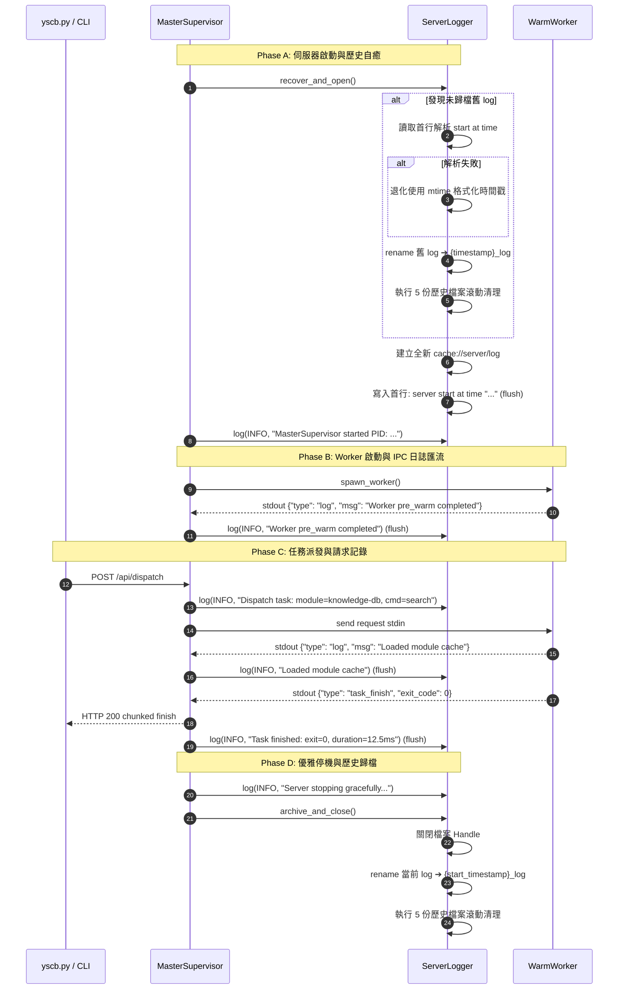

# 架構設計說明書 (Architecture Design)

> 功能名稱：server_realtime_logging  
> 建立日期：2026-09-07  
> 所屬主計畫：無 (獨立 Full Track)  
> 狀態：Confirmed  
> 模板版本：v1.2  

---

## 1. 模組架構分層與職責邊界 (Layered Architecture)

```text
+-------------------------------------------------------------------------+
|                           Master Supervisor                             |
|  - 持有 ServerLogger 實例 (單一寫入權威)                                  |
|  - 啟動前守門：recover_and_open() (舊日誌解析自癒 -> 輪轉 -> 開啟新日誌)      |
|  - 生命週期記錄：start / reload / shutdown / idle TTL / watcher 變更       |
+-------------------+---------------------------------+-------------------+
                    |                                 |
                    v                                 v
+-----------------------------+     +-------------------------------------+
|    DispatcherHTTPHandler    |     |             Warm Worker             |
| - 攔截 do_GET / do_POST     |     | - pre_warm / task 執行生命週期       |
| - 記錄 API 路徑、狀態碼與耗時 |     | - IPC stdout: {"type":"log",...}    |
+-----------------------------+     +------------------+------------------+
                                                       |
                                    (stdout ndjson)    v
                                    +-------------------------------------+
                                    | Master Worker Stream Interceptor    |
                                    | - 攔截 packet.type == 'log'         |
                                    | - 轉發至 ServerLogger.log()         |
                                    +------------------+------------------+
                                                       |
                                                       v
+-------------------------------------------------------------------------+
|                        ServerLogger (即時 Flush)                         |
|  - 檔案位址：cache://server/log                                         |
|  - 線程安全：threading.Lock() 保護寫入與 flush                            |
|  - 歷史輪轉：{YYYY}_{MM}_{DD}_{HH}.{MM}.{SS}_log (嚴格保留最新 5 份)       |
+-------------------------------------------------------------------------+
```

---

## 2. 核心資料流與循序圖 (Data Flow & Sequence Diagram)



---

## 3. 受影響檔案與新建檔案清單 (Impacted & New Files Inventory)

| 檔案路徑 | 類型 | 職責與變更說明 |
| :--- | :---: | :--- |
| `source/server/server/logger.py` | New | 實作 `ServerLogger`，封裝及時 flush、自癒解析、5 份滾動與格式化器 |
| `source/server/server/master.py` | Modify | 整合 `ServerLogger`，於啟停、HTTP 處理、Worker 串流攔截處記錄日誌 |
| `source/server/server/worker.py` | Modify | 於 `WarmWorker` 預熱與任務關鍵節點發送 `{"type": "log"}` 封包 |
| `source/server/tests/test_server_logging.py` | New | 編寫單元測試、滾動測試、異常中斷自癒測試與多進程 IPC 匯流測試 |

---

## 4. 架構決策記錄 (Architecture Decision Records)

- **[P02:DR-01] 權威單一寫入原則**：僅由 Master 擁有日誌檔案之寫入 Handle，子進程（Worker）嚴禁直接打開同一個 log 檔案進行 append。所有子進程日誌皆透過 IPC 協議送至 Master 集中落檔，消除 OS 等級的跨進程鎖開銷與交錯寫入風險。
- **[P02:DR-02] 雙重歷史歸檔防禦 (Graceful + Crash-Safe Recovery)**：
  - 常態模式：`stop()` 時呼叫 `archive_and_close()`，將當前 log 轉為歷史檔並保持 $\le 5$ 份。
  - 異常中斷自癒：若上次是非正常退出（如 SIGKILL、斷電），`start()` 前呼叫 `recover_and_open()`，主動檢查殘留 log 並完成歸檔輪轉。
- **[P02:DR-03] 正則約束與孤兒保護**：歷史檔名正則固定為 `^\d{4}_\d{2}_\d{2}_\d{2}\.\d{2}\.\d{2}_log$`。非符合該格式之檔案絕對不予觸動，保障其他快取資產安全。
