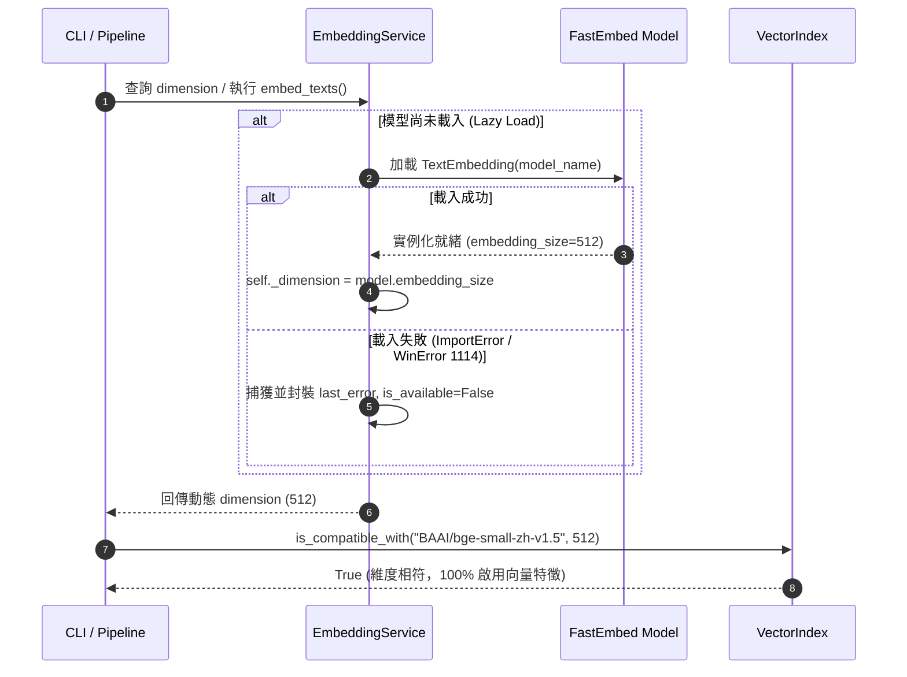

# 架構設計說明書 (Architecture Design)

> 功能名稱：sub_01_knowledge_db_embedding_and_diagnostics  
> 建立日期：2026-09-13  
> 所屬主計畫：2026_09_13_1648_downstream_feedback_remediation  
> 狀態：Confirmed  
> 模板版本：v1.2  

---

## 1. 模組架構分層與職責邊界 (Layered Architecture)

```text
+---------------------------------------------------------------+
|                       CLI Layer                               |
|   (scripts/cli.py: index, search, status)                     |
|   - 負責參數傳遞、使用者回饋與詳細錯誤日誌 (last_error) 渲染   |
+-------------------------------+-------------------------------+
                                |
                                v
+-------------------------------+-------------------------------+
|                     Pipeline Layer                            |
|   (pipeline.py: SearchPipeline, HybridSearchEngine)          |
|   - 向量快取相容檢核 (is_compatible_with: expected_model, dim)|
|   - BM25 + 向量特徵混合排序與優雅降級                         |
+-------------------------------+-------------------------------+
                                |
                                v
+-------------------------------+-------------------------------+
|                   Embedding Core Layer                        |
|   (embedding.py: EmbeddingService, VectorIndex)               |
|   - 完全淘汰 DEFAULT_EMBEDDING_DIM 常數                       |
|   - 實際模型屬性 self._model.embedding_size 為單一真理來源     |
|   - last_error 結構化異常保留與環境警告前置抑制               |
+-------------------------------+-------------------------------+
                                |
                                v
+-------------------------------+-------------------------------+
|                  Runtime & FastEmbed                          |
|   (FastEmbed / ONNX Runtime / HuggingFace Hub)                |
+---------------------------------------------------------------+
```

---

## 2. 核心資料流與循序圖 (Data Flow & Sequence Diagram)



---

## 3. 受影響檔案與新建檔案清單 (Impacted & New Files Inventory)

| 檔案路徑 | 類型 | 職責與變更說明 |
| :--- | :---: | :--- |
| `source/knowledge-db/knowledge_db/embedding.py` | Modify | 徹底移除 `DEFAULT_EMBEDDING_DIM`，實作以 `_model.embedding_size` 為單一來源之動態維度、`last_error` 結構化記錄與環境警告抑制 |
| `source/knowledge-db/knowledge_db/pipeline.py` | Modify | 修正 `expected_dim` 來源對齊 `self.embedding_service.dimension`，降級通知注入 `last_error` 診斷 |
| `source/knowledge-db/scripts/cli.py` | Modify | 在 `index` 與 `search` 輸出中暴露 FastEmbed 載入失敗原始例外訊息 |
| `source/knowledge-db/tests/test_retrieval.py` | Modify | 移除 `DEFAULT_EMBEDDING_DIM` 導入，改以 `service.dimension` 斷言，新增 FT-10~13 測試案例 |

---

## 4. 架構決策記錄 (Architecture Decision Records)

- **[P02:DR-01] 零常數動態維度解析**：嚴格落實零硬編碼，`EmbeddingService` 僅在模型載入後自 `_model.embedding_size` 讀取維度；Mock 模式下動態查詢模型類別規格或預設 512，徹底消滅跨檔案之 `DEFAULT_EMBEDDING_DIM`。
- **[P02:DR-02] last_error 輕量結構化**：`EmbeddingService` 保留 `last_error: Optional[Dict[str, Any]]`，包含 `error_type`、`message`、`timestamp`，供 Pipeline 與 CLI 在不拋出崩潰的前提下進行高可觀測性診斷輸出。
