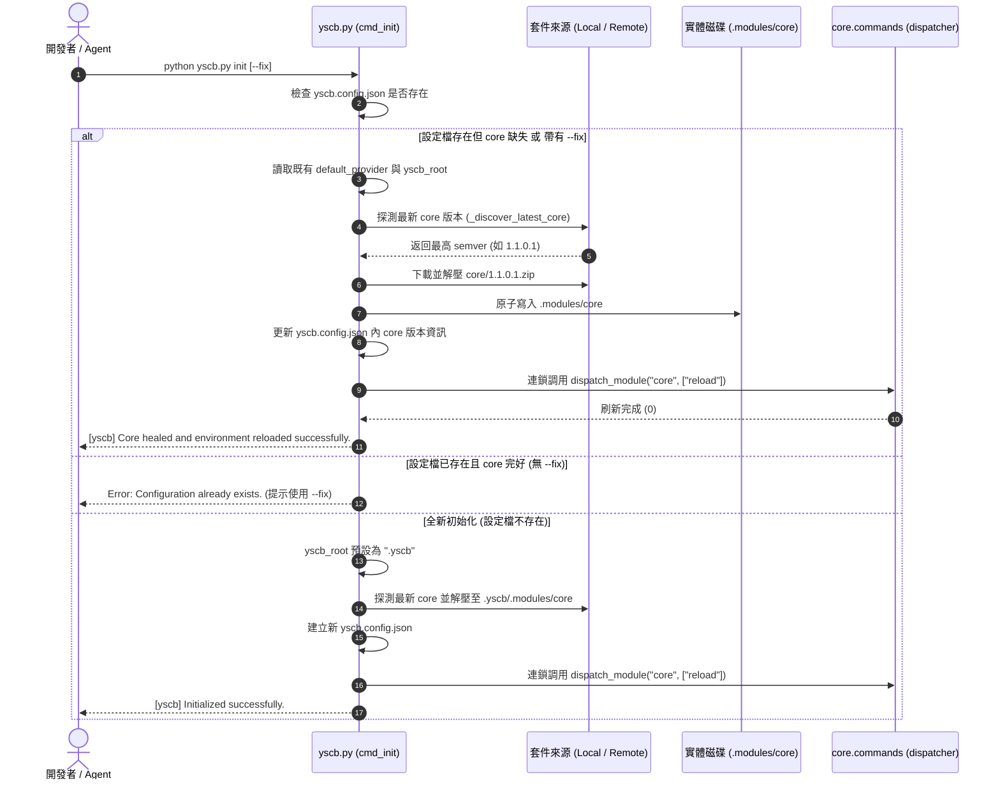
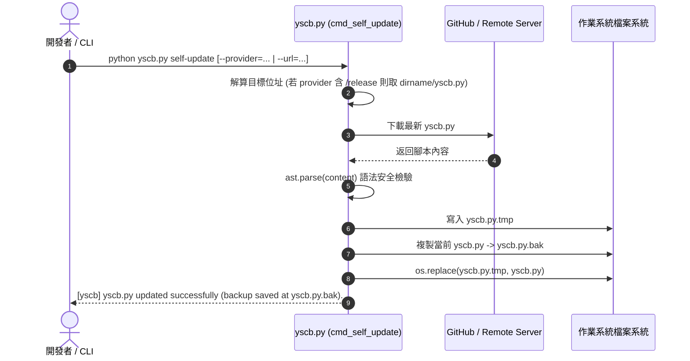

# 架構設計說明書 (Architecture Design)

> 功能名稱：sub_02_host_and_core_distribution_lifecycle  
> 建立日期：2026-09-13  
> 所屬主計畫：2026_09_13_1648_downstream_feedback_remediation  
> 狀態：Confirmed  
> 模板版本：v1.2  

---

## 1. 模組架構分層與職責邊界 (Layered Architecture)

```text
+-------------------------------------------------------------------------------+
|                      Host Bootstrapper Layer (yscb.py)                        |
|  - 官方 Provider 常數 (DEFAULT_PROVIDER_URL: .../ys-codebase/main/release)     |
|  - Self-Update 來源解算器 (_resolve_self_update_url: 智能錨定 repo 根目錄)      |
|  - 自包含 Version Discovery (_discover_latest_core: 本地/遠端 semver 探測)   |
|  - Init & Self-Healing 引擎 (cmd_init: 預設 .yscb 根目錄，--fix 自癒與連鎖 reload)|
|  - 內部忽略規則清冊 (INTERNAL_IGNORE_PATTERNS: 納入 yscb.py.bak, *.bak)         |
+-------------------------------------------------------------------------------+
                                      |
                                      v (物化 .modules/core 並分派)
+-------------------------------------------------------------------------------+
|                      Core Module Engine & Lifecycle Layer                     |
|  - core.installer:                                                            |
|      * generate_internal_gitignore: 同步 yscb.py.bak 忽略規則                  |
|      * cmd_install / cmd_update: 安裝完成後連動 UpdateChecker 快取失效          |
|  - core.update_checker:                                                       |
|      * invalidate_cache: 模組變更後及時清除已解決之更新快取項目                 |
+-------------------------------------------------------------------------------+
```

---

## 2. 核心資料流與循序圖 (Data Flow & Sequence Diagram)

### 2.1 `yscb init --fix` 自癒修復與連鎖 Reload 流程



### 2.2 `yscb self-update` 來源解析與安全原子替換流程



---

## 3. 受影響檔案與新建檔案清單 (Impacted & New Files Inventory)

| 檔案路徑 | 類型 | 職責與變更說明 |
| :--- | :---: | :--- |
| `yscb.py` | Modify | 修正 `DEFAULT_PROVIDER_URL`；實作 `_resolve_self_update_target_url` 與 `cmd_self_update`；實作自包含 `_discover_latest_core`；重構 `cmd_init` 支援 `--fix`、預設 `".yscb"` 與連鎖 reload；補齊 `INTERNAL_IGNORE_PATTERNS`。 |
| `source/core/core/installer.py` | Modify | 於 `INTERNAL_IGNORE_PATTERNS` 增加 `"yscb.py.bak"`、`"*.bak"`；在 `cmd_install` 與 `cmd_update` 成功後調用 `UpdateChecker.invalidate_cache()`。 |
| `source/core/core/update_checker.py` | Modify | 新增 `invalidate_cache(module_name: Optional[str] = None)` 方法，支援局部或全量清除過期快取項目。 |
| `source/core/tests/test_distribution_lifecycle.py` | New | 新增單元測試驗證自包含 semver 探測、`init --fix` 自癒、self-update 解析、gitignore 忽略模式與快取失效。 |

---

## 4. 架構決策記錄 (Architecture Decision Records)

- **[P02:DR-01] 宿主自舉自包含 Version Discovery**：
  - 在 `yscb.py` 尚未解壓 `core` 之前無法導入 `core.semver`。
  - 於 `yscb.py` 實作自包含純字串/元組輕量語意版本解析函式 `_parse_simple_semver(v_str)`，以 4-tuple `(major, minor, patch, revision)` 進行純數學比對，兼具零依賴自舉與準確性。
- **[P02:DR-02] 連鎖 Reload 剛性執行**：
  - `cmd_init`（無論初次或 `--fix`）在解壓 core 模組與寫回設定檔後，必須立即以 `return dispatch_module("core", ["reload"])` 結束，保證環境狀態刷新為同一進程原子操作。
