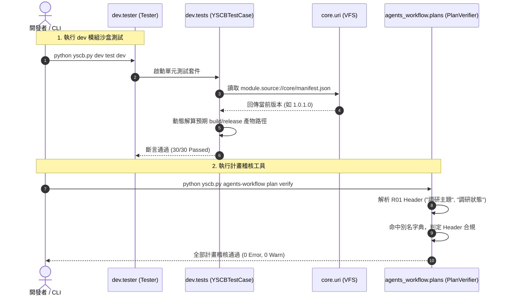

# 架構設計說明書 (Architecture Design)

> 功能名稱：工程健檢缺陷修復與治理 (Dev Tests, PlanVerifier & Docs Alignment)  
> 建立日期：2026-08-27  
> 所屬主計畫：2026_08_27_0412_dev_and_governance_health_fix  
> 狀態：Confirmed  
> 模板版本：v1.2  

---

## 1. 模組架構分層與職責邊界 (Layered Architecture)

```text
+-------------------------------------------------------------------------------+
|                             YS-Codebase System                                |
+-------------------------------------------------------------------------------+
| 1. dev.tests (測試套件架構層)                                                 |
|    - TestDevBuilder / TestReleasePipeline / TestSandboxArchitecture           |
|    - 引入動態版本解算輔助: core_ver = uri.read_json("module.source://core/...") |
|    - 動態計算 build_zip = f"module.build://core/{prefix}.build.zip"           |
|    - 徹底解耦靜態版本字串依賴                                                |
+-------------------------------------------------------------------------------+
| 2. agents_workflow.plans.verifier (計畫稽核引擎層)                            |
|    - parse_plan_header() 擴充合法 Header 別名矩陣                            |
|    - name_keys: ["功能名稱", "計畫名稱", "name", "title", "調研主題", "topic"] |
|    - status_keys: ["狀態", "status", "調研狀態", "research_status"]           |
+-------------------------------------------------------------------------------+
| 3. docs (知識庫鏡像層)                                                         |
|    - docs/README.md 補齊 agents-workflow 模組生態登記與全系統版本矩陣          |
+-------------------------------------------------------------------------------+
```

---

## 2. 核心資料流與循序圖 (Data Flow & Sequence Diagram)



---

## 3. 受影響檔案與新建檔案清單 (Impacted & New Files Inventory)

| 檔案路徑 | 類型 | 職責與變更說明 |
| :--- | :---: | :--- |
| `ys_codebase/source/dev/tests/test_builder.py` | Modify | 改用動態解算 `core` 模組版本號與建置產物路徑。 |
| `ys_codebase/source/dev/tests/test_release_pipeline.py` | Modify | 改用動態解算 `core` 模組版本號與在庫最高發布產物路徑。 |
| `ys_codebase/source/dev/tests/test_sandbox.py` | Modify | 改用動態解算 `core` 模組版本號驗證 `hook.dev.py` 保留性。 |
| `ys_codebase/source/agents-workflow/agents_workflow/plans/verifier.py` | Modify | 擴充 Header 欄位檢查之合法別名清單，支援 RXX 調研報告欄位。 |
| `docs/README.md` | Modify | 補齊 `agents-workflow` 模組登記與知識庫手冊連結，校準模組版本矩陣。 |

---

## 4. 架構決策記錄 (Architecture Decision Records)

- **[P02:DR-01] 測試動態讀取 Manifest 原則**：
  在 `dev` 測試中使用 `core.uri.read_json("module.source://core/manifest.json")["version"]` 取得當前真實版本，並透過 `.rsplit(".", 1)[0] + ".build"` 組裝 build tag。此設計確保日後任一模組 bump-minor/patch 時測試依然 100% 穩定通過。
- **[P02:DR-02] Verifier 宣告式別名映射**：
  在 `verifier.py` 內部定義常數別名集合 `VALID_NAME_KEYS`、`VALID_DATE_KEYS`、`VALID_STATUS_KEYS`，提升可維護性並預防未來新增模板類型時的硬編碼問題。
