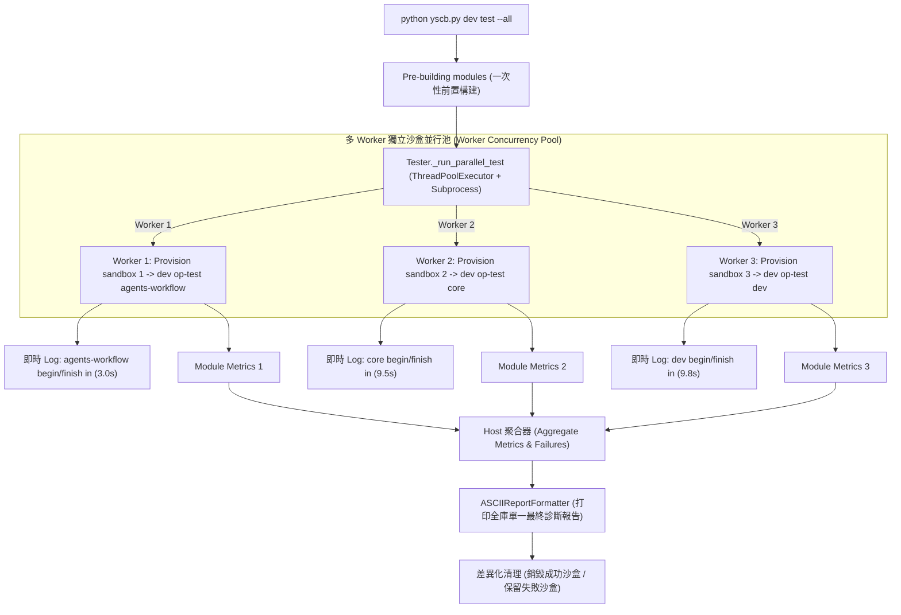

# 架構與模組設計說明書 (Architecture & Module Plan)

> 功能名稱：多進程多模組並行跑測 (Multi-Process Multi-Module Parallel Test Runner)  
> 建立日期：2026-08-27  
> 所屬主計畫：`plans://2026_08_27_1506_dev_test_architecture_optimization/`  
> 狀態：`Confirmed`  
> 模板版本：v1.3  

---

## 1. 系統架構與並行資料流 (System Architecture & Concurrency Flow)

---

## 2. 模組職責劃分 (Module Responsibilities)

| 模組 / 類別 | 核心職責 | 變更說明 |
| :--- | :--- | :--- |
| `dev.tester.Tester._run_parallel_test` | 多模組並行測試調度引擎。 | 負責 Worker 線程池派發、獨立沙盒建立、環境變數隔離與結果聚合。 |
| `dev.tester.Tester._run_single_module_worker` | 單模組 Worker 執行函式。 | 建立專屬沙盒、啟動子行程 `dev op-test`、捕獲即時日誌與維護生命週期。 |
| `dev.testing.runner.ASCIIReportFormatter` | 診斷報告聚合與格式化。 | 支援主進程將多 Worker 聚合之 `ModuleTestMetrics` 依照原始模組順序輸出單一整合報告。 |

---

## 3. 架構決策記錄 (Decision Records)

- **[P02:DR-01] 線程池驅動獨立子行程架構**：
  - 主進程採用 `ThreadPoolExecutor` 驅動多個獨立 `subprocess.run(sandbox_yscb dev op-test ...)`。
  - **優勢**：每個 Worker 運行在完全獨立的作業系統進程與微型沙盒中，零 Python GIL 限制、零記憶體共享污染，同時主進程可輕量監控與即時串流終端輸出。
- **[P02:DR-02] 報告聚合與 JSON IPC 協議**：
  - 各 Worker 在沙盒內執行 `dev op-test` 時，將單模組的結構化測試數據輸出至沙盒內暫存報告檔（或透過標準輸出結構化解析），由主進程在全部完成後組裝為完整的總結報告。
- **[P02:DR-03] 差異化沙盒清理生命週期**：
  - 各 Worker 完成後立即判斷：若自身模組測試通過且未指定 `--keep-sandbox`，即時銷毀該 Worker 的專屬沙盒並輸出 `Cleaned up sandbox <N>`；若失敗則保留沙盒並印出保留路徑供除錯。
