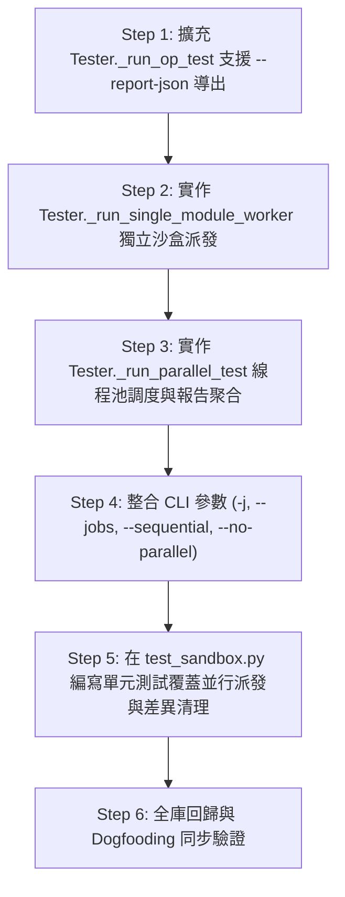

# 實作計畫與技術細節 (Implementation Plan)

> 功能名稱：多進程多模組並行跑測 (Multi-Process Multi-Module Parallel Test Runner)  
> 建立日期：2026-08-27  
> 所屬主計畫：`plans://2026_08_27_1506_dev_test_architecture_optimization/`  
> 狀態：`Confirmed`  
> 模板版本：v1.4  

---

## 1. 實作步驟與依賴拓撲 (Implementation Steps)

---

## 2. 檔案變更清單 (File Impact Analysis)

| 檔案路徑 | 變更類型 | 變更職責說明 |
| :--- | :---: | :--- |
| `source/dev/dev/tester.py` | Modify | 實作 `_run_parallel_test`、`_run_single_module_worker`、`--report-json` 導出與並行參數解析。 |
| `source/dev/scripts/cli.py` | Modify | 更新 CLI 說明與參數傳遞（支援 `-j`, `--jobs`, `--sequential`）。 |
| `source/dev/tests/test_sandbox.py` | Modify | 新增多 Worker 並行派發、獨立沙盒與報告聚合單元測試。 |
| `docs/dev/user_guide.md` | Modify | §4.1 新增並行跑測參數與使用說明。 |

---

## 3. 知識庫文檔衝擊預排 (Documentation Impact Assessment)

| 維度 | 文件路徑 | 衝擊評估 | 預計更新內容 |
| :---: | :--- | :---: | :--- |
| **維度 2** | `docs/dev/user_guide.md` | Modify | §4.1 新增 `-j, --jobs` 與 `--sequential` 參數用法說明。 |

---

## 4. 架構靈魂拷問 (Architecture Soul-Searching)

> **拷問問題 1**：為什麼採用「主進程 ThreadPoolExecutor + 驅動獨立 Subprocess」而不是「ProcessPoolExecutor 內部直接調用 Python 函式」？  
> **決策防禦**：因為 YS-Codebase 的模組在運行時依賴於獨立虛擬沙盒中的 `yscb.py` 宿主環境、環境變數與 `sys.modules` 命名空間。透過獨立的 OS 子行程（Subprocess），各 Worker 擁有乾淨獨立的 Python 直譯器進程，完全杜絕任何 GIL 阻塞、模組導入快取污染或全域變數競態，且與既有的沙盒架構 100% 契合。

> **拷問問題 2**：若多個 Worker 同時在終端輸出即時 Log，會不會發生文字行交錯撕裂（Interleaved Tearing）？  
> **決策防禦**：Python 的 `print(..., flush=True)` 在 C-level `stdout` 寫入單行時具備原子性（Line-buffered Atomic Write）；且各 Worker 輸出的進度字串結構短小標準（`Create sandbox N`, `begin`, `finish`），不會發生斷行撕裂。

---

## 5. 測試前置定稿 (Test-First Sign-off)

- `sub_05/P06_test_plan.md` 中所有測試案例（FT-01~05, ET-01~02, RT-01）均已完成需求覆蓋對齊，在此剛性定稿為 `Confirmed`。
