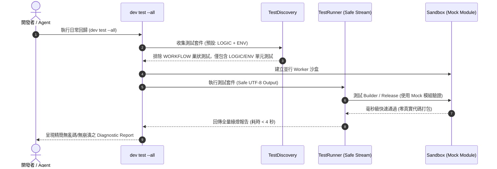

# 架構設計說明書 (Architecture Design)

> 功能名稱：Dev 模組測試效能瓶頸優化、Mock 模組建置隔離與 Windows Unicode/cp950 編碼異常修復  
> 建立日期：2026-08-27  
> 所屬主計畫：無（獨立計畫）  
> 狀態：Confirmed  
> 模板版本：v1.2  

---

## 1. 模組架構分層與職責邊界 (Layered Architecture)

```text
+-------------------------------------------------------------------------+
|                              CLI / Host Layer                           |
|       python yscb.py dev test [--all | --workflow | --all-types]       |
+-------------------------------------------------------------------------+
                                    │
                                    ▼
+-------------------------------------------------------------------------+
|                  Tester & Runner (dev.tester, dev.testing.runner)       |
|  - Safe Console Stream Handler: utf-8 / replace on Windows CP950         |
|  - Subprocess Worker Dispatcher: capture_output with safe decode        |
|  - 4-Tier Test Filtering: LOGIC + ENV (default) vs WORKFLOW (opt-in)    |
+-------------------------------------------------------------------------+
                                    │
                  ┌─────────────────┴─────────────────┐
                  ▼                                   ▼
+-----------------------------------+ +-----------------------------------+
|     Unit / Mock-Isolated Tests    | |      Workflow / E2E Tests         |
|  - test_builder (Mock Module)     | |  - test_dev_test_high_level       |
|  - test_release_pipeline (Mock)   | |  - test_single_module_worker      |
|  - test_tester (Mocked Subprocess)| |  (Marked Requirement.WORKFLOW)    |
|  - test_case (Sandbox Unit)       | |                                   |
+-----------------------------------+ +-----------------------------------+
```

---

## 2. 核心資料流與循序圖 (Data Flow & Sequence Diagram)



---

## 3. 受影響檔案與新建檔案清單 (Impacted & New Files Inventory)

| 檔案路徑 | 類型 | 職責與變更說明 |
| :--- | :---: | :--- |
| `ys_codebase/source/dev/dev/tester.py` | Modify | 增強子進程輸出日誌捕獲與 Windows 控制台輸出之編碼安全防禦 (`safe_print` / `errors="replace"`)。 |
| `ys_codebase/source/dev/dev/testing/runner.py` | Modify | 確保 `ASCIIReportFormatter` 與 `OutputCapturer` 輸出流在各平台下安全相容。 |
| `ys_codebase/source/dev/tests/test_builder.py` | Modify | 重構為使用動態 Mock Module 進行 `build_module`、`package_release` 與 `revision_purge` 測試。 |
| `ys_codebase/source/dev/tests/test_release_pipeline.py` | Modify | 重構為使用動態 Mock Module 測試發布管道與 release-check 閘門。 |
| `ys_codebase/source/dev/tests/test_tester.py` | Modify | 單元測試 `test_run_test_all_success_cleans_sandboxes` 改用 Mock 隔離子進程，消除遞迴跑測。 |
| `ys_codebase/source/dev/tests/test_sandbox.py` | Modify | 將純 E2E 多行程整合測試標記為 `Requirement.WORKFLOW`。 |

---

## 4. 架構決策記錄 (Architecture Decision Records)

- **[P02:DR-01] 控制台標準輸出流編碼安全化**：封裝控制台輸出，當檢測到 Windows stdout encoding (如 `cp950`) 無法編碼特殊字符時，自動以 `errors="replace"` 或安全字符降級處理，杜絕 `UnicodeEncodeError`。
- **[P02:DR-02] 測試分類邊界劃分**：凡是涉及「在測試中調用 `run_cli(["dev", "test", ...])` 或真實 fork 外部多進程 Worker 進行端到端調度驗證」者，一律劃入 `Requirement.WORKFLOW`；凡是內部邏輯、生命週期、參數判定與清理機制者，一律透過 Mock 劃入 `Requirement.LOGIC` 或 `Requirement.ENV`。
- **[P02:DR-03] Mock Package 骨架規範**：於 `YSCBTestCase` 既有之 `create_mock_package` 機制建立包含標準 `manifest.json` 與 mock 原始碼的輕量模組，提供 Builder 與 ReleasePipeline 進行標準生命週期測試。
