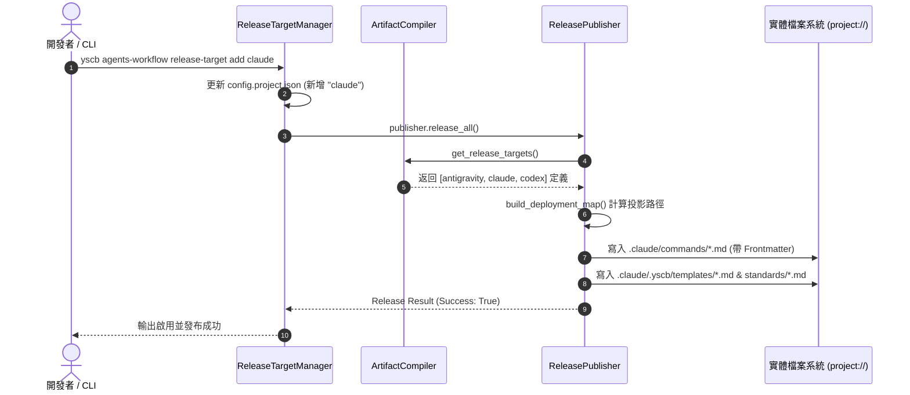

<!--

Phase 2 執行指引：
1. 目標：完成系統架構分層、模組職責劃分、依賴邊界與資料流/循序設計。
2. 架構視覺化：以結構文字圖呈現模組邊界；以 Mermaid sequenceDiagram 呈現關鍵資料與呼叫流向。
3. 受影響檔案盤點：精確列出所有預計新增 (New)、修改 (Modify) 或刪除 (Delete) 的檔案路徑與變更說明。
4. Test-First 測試前置初始化：同步建立/初始化 P06_test_plan.md (Draft)，預先將 FR/EC 映射為測試項目。
5. 決策留痕：記錄關鍵架構與設計決策於 [P02:DR-XX]。
6. Checkpoint 等待關卡：等待開發者明確確認 P02 內容（狀態更新為 Confirmed）後推進至 Phase 3。

-->

# 架構設計說明書 (Architecture Design)

> 功能名稱：agents-workflow 添加 codex 與 claude code release targets  
> 建立日期：2026-08-27  
> 所屬主計畫：無（獨立計畫）  
> 狀態：Confirmed  
> 模板版本：v1.2  

---

## 1. 模組架構分層與職責邊界 (Layered Architecture)

```text
+-------------------------------------------------------------------------------+
|                      CLI & Target Management Layer                            |
|  - yscb agents-workflow release-target list / add / remove                    |
|  - ReleaseTargetManager (targets.py)                                          |
+-------------------------------------------------------------------------------+
                                      │ (讀寫 config.project.json)
                                      ▼
+-------------------------------------------------------------------------------+
|                      Artifact Factory Compiler Layer                          |
|  - ArtifactCompiler (compiler.py)                                             |
|    - 掃描 manifest.json 中的 release_target 宣告 (`antigravity`, `claude`, `codex`) |
|    - 執行 Stage 1 內容編譯快取與 Stage 2 語意路徑解算                          |
+-------------------------------------------------------------------------------+
                                      │
                                      ▼
+-------------------------------------------------------------------------------+
|                      Multi-Target Release Publisher                           |
|  - ReleasePublisher (publisher.py)                                            |
|    - 依據 active release_targets 建立發布拓撲映射表                           |
|    - 渲染 YAML Frontmatter Header (workflows)                                 |
|    - 4 步原子發布交易：歷史清理 ➔ 目標物化 ➔ AGENTS.md 軟合併                   |
+-------------------------------------------------------------------------------+
                                      │
                                      ▼
+-------------------------------------------------------------------------------+
|                      Physical Workspace Projections                           |
|  - project://.agents/ (Antigravity workflows/templates/standards)             |
|  - project://.claude/ (Claude commands/templates/standards)                   |
|  - project://.codex/  (Codex workflows/templates/standards)                   |
+-------------------------------------------------------------------------------+
```

---

## 2. 核心資料流與循序圖 (Data Flow & Sequence Diagram)



---

## 3. 受影響檔案與新建檔案清單 (Impacted & New Files Inventory)

| 檔案路徑 | 類型 | 職責與變更說明 |
| :--- | :---: | :--- |
| `ys_codebase/source/agents-workflow/manifest.json` | Modify | 於 `contributes.agents-workflow.release_target` 新增 `claude` 與 `codex` 目標宣告與 projections 規則。 |
| `ys_codebase/source/agents-workflow/tests/test_targets.py` | Modify | 新增 `claude` 與 `codex` Target 清單查詢、啟用發布與路徑投影單元測試。 |
| `docs/agents-workflow/user_guide.md` | Modify | 補充 Claude Code 與 Codex 平台之 Release Target 支援與用法說明。 |

---

## 4. 架構決策記錄 (Architecture Decision Records)

- **[P02:DR-01]** 採用純宣告式架構：`ArtifactCompiler` 與 `ReleasePublisher` 本身具備高度泛化之投影機制，僅需於 `manifest.json` 中配置 projections 定義（`workflow`、`template`、`standard`）即可自動支援，零侵入核心程式碼。
- **[P02:DR-02]** Frontmatter 格式統一：`claude` 與 `codex` 之 workflow 均採用 `description: {export.description}` 之標準 YAML Frontmatter，與現有 `antigravity` 規格保持一致。
