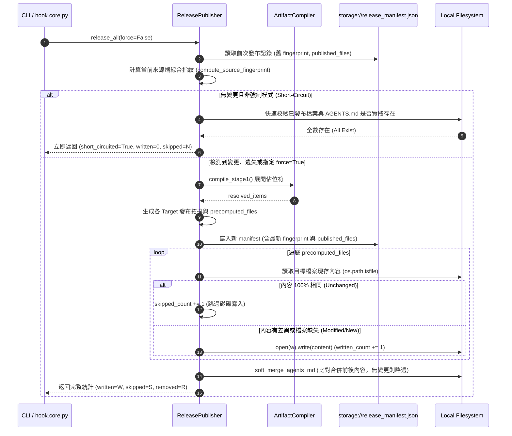

# 架構設計說明書 (Architecture Design)

> 功能名稱：agents-workflow 發布引擎來源 Diff 檢測與無效 File IO 優化 (agents-workflow Release Diff Optimization)  
> 建立日期：2026-08-28  
> 所屬主計畫：無（獨立計畫）  
> 狀態：Confirmed  
> 模板版本：v1.2  

---

## 1. 模組架構分層與職責邊界 (Layered Architecture)

```text
[Microkernel / CLI Caller] 
       │
       ├─► hook.core.py / cli.py
       │     │
       │     └─► ReleasePublisher.release_all(force: bool = False)
       │           │
       │           ├─► [Stage 0: 來源端綜合指紋比對 (Source Fingerprint Gate)]
       │           │     ├─► compute_source_fingerprint(assets, manifest, config, target_schemas)
       │           │     └─► 若 (not force) 且 (fingerprint 相符) 且 (已發布檔案實體皆存在)
       │           │           └─► 提前短路返回 (Short-Circuit: 0 I/O, ~1ms)
       │           │
       │           ├─► [Stage 1 & 2: 產物編譯與 URI 拓撲解析 (Artifact Compiler)]
       │           │     ├─► compile_stage1() ──► 展開佔位符與巨集
       │           │     └─► resolve_stage2_uri() ──► 生成 precomputed_files
       │           │
       │           ├─► [Stage 3: 持久化清單與新指紋寫入 (Manifest Sync)]
       │           │     └─► 寫入 storage://agents-workflow/release_manifest.json (含 fingerprint)
       │           │
       │           └─► [Stage 4: 落地端內容 Diff 比對與增量物化 (Incremental Materializer)]
       │                 ├─► 逐一比對 dst_abs 現存檔案內容 vs. 渲染產物
       │                 ├─► 內容相同 ──► 略過寫入 (skipped_count + 1)
       │                 ├─► 內容相異 ──► open(..., 'w').write() (written_count + 1)
       │                 └─► _soft_merge_agents_md ──► 標籤/內容相同時略過覆寫
```

---

## 2. 核心資料流與循序圖 (Data Flow & Sequence Diagram)



---

## 3. 受影響檔案與新建檔案清單 (Impacted & New Files Inventory)

| 檔案路徑 | 類型 | 職責與變更說明 |
| :--- | :---: | :--- |
| `source/agents-workflow/agents_workflow/publisher.py` | Modify | 實作 `compute_source_fingerprint()`、Stage 0 來源指紋提前短路檢查、Stage 4 檔案內容比對與跳過寫入、`_soft_merge_agents_md` Diff 檢查、支援 `force=True` 與詳細指標回傳。 |
| `source/agents-workflow/scripts/cli.py` | Modify | 為 `release` 指令擴充 `--force` 參數解析，並傳遞至 `publisher.release_all(force=args.force)`。 |
| `source/agents-workflow/scripts/hook.core.py` | Modify | 更新 `on_reload` 事件處理常式，根據 `short_circuited` 與計數輸出細緻化日誌。 |
| `source/agents-workflow/tests/test_publisher.py` | New | 建立針對發布引擎 Diff 檢測之全維度單元測試（驗證 Stage 0 短路、Stage 4 增量寫入、`--force` 覆寫、目標遺失自癒修復與軟合併 Diff）。 |

---

## 4. 架構決策記錄 (Architecture Decision Records)

- **[P02:DR-01] 綜合來源指紋計算範圍收斂**：指紋計算涵蓋所有 `assets/` 檔案之 mtime/size/SHA1、`manifest.json`、`config.project.json` 中之 `release_targets` 與各 Target 投影 Header 規則，確保任意模板、規範或組態修改皆能觸發指紋變更。
- **[P02:DR-02] 實體檔案存在性作為短路防守前提 (EC-01)**：即使來源指紋完全匹配，若磁碟上任一目標檔案或 `AGENTS.md` 遺失，第一階短路自動失效並降級為修復重建物化。
- **[P02:DR-03] 落地端內容 Diff 採用記憶體字串精準比對 (In-Memory String Comparison)**：由於生成產物已在記憶體中（`final_text`），直接以 `existing_text == final_text` 進行比較，免除計算目標端雜湊的額外開銷，速度最快且 100% 精準。
