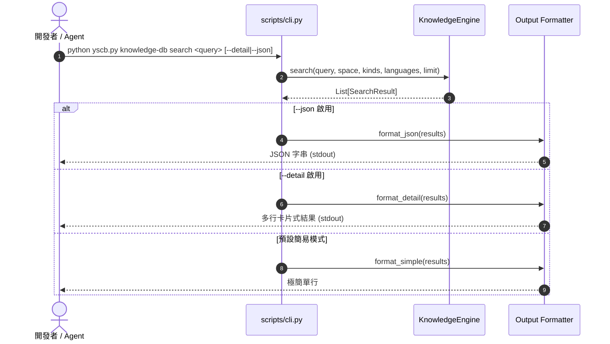

# 架構設計說明書 (Architecture Design)

> 功能名稱：優化 knowledge-db 輸出搜尋結果時的格式  
> 建立日期：2026-08-28  
> 所屬主計畫：`plans://2026_08_28_1754_module_toolchain_optimization/`  
> 狀態：Confirmed  
> 模板版本：v1.2  

---

## 1. 模組架構分層與職責邊界 (Layered Architecture)

```text
+-------------------------------------------------------------------------+
|                              CLI Layer                                  |
|  source/knowledge-db/scripts/cli.py                                     |
|    - 參數解析 (--detail / -d / --verbose, --json, --limit, --space)     |
|    - 模式分流器 (Output Dispatcher)                                      |
|        + Simple Mode Formatter: #01 path/to/file:line                   |
|        + Detailed Mode Formatter: 評分/符號/簽名/摘要/命中詞              |
|        + JSON Mode Formatter: json.dumps(payload, indent=2)             |
+-------------------------------------------------------------------------+
                                    |
                                    v
+-------------------------------------------------------------------------+
|                            Engine Layer                                 |
|  source/knowledge-db/knowledge_db/engine.py                             |
|    - search(query, space, kinds, languages, limit)                      |
+-------------------------------------------------------------------------+
                                    |
                                    v
+-------------------------------------------------------------------------+
|                           Retrieval Layer                               |
|  source/knowledge-db/knowledge_db/retrieval.py                          |
|    - List[SearchResult] (包含 symbol, score, matched_terms, snippet)     |
+-------------------------------------------------------------------------+
```

---

## 2. 核心資料流與循序圖 (Data Flow & Sequence Diagram)



---

## 3. 受影響檔案與新建檔案清單 (Impacted & New Files Inventory)

| 檔案路徑 | 類型 | 職責與變更說明 |
| :--- | :---: | :--- |
| `source/knowledge-db/scripts/cli.py` | Modify | 實作多模式分流輸出（簡易、詳細、JSON）、說明文字更新 |
| `source/knowledge-db/tests/test_cli.py` | Modify | 新增各模式輸出單元測試（Simple, Detail, JSON, 0 結果等） |

---

## 4. 架構決策記錄 (Architecture Decision Records)

- **[P02:DR-01] 零侵入分層架構**：所有格式化排版邏輯收斂於 CLI 入口層 (`scripts/cli.py`)，底層 `KnowledgeEngine` 與 `retrieval.py` 介面契約維持不變，達成 100% 零破壞向下相容。
- **[P02:DR-02] 輸出分流優先級**：優先級順序為 `--json` > `--detail` > 預設簡易模式。
