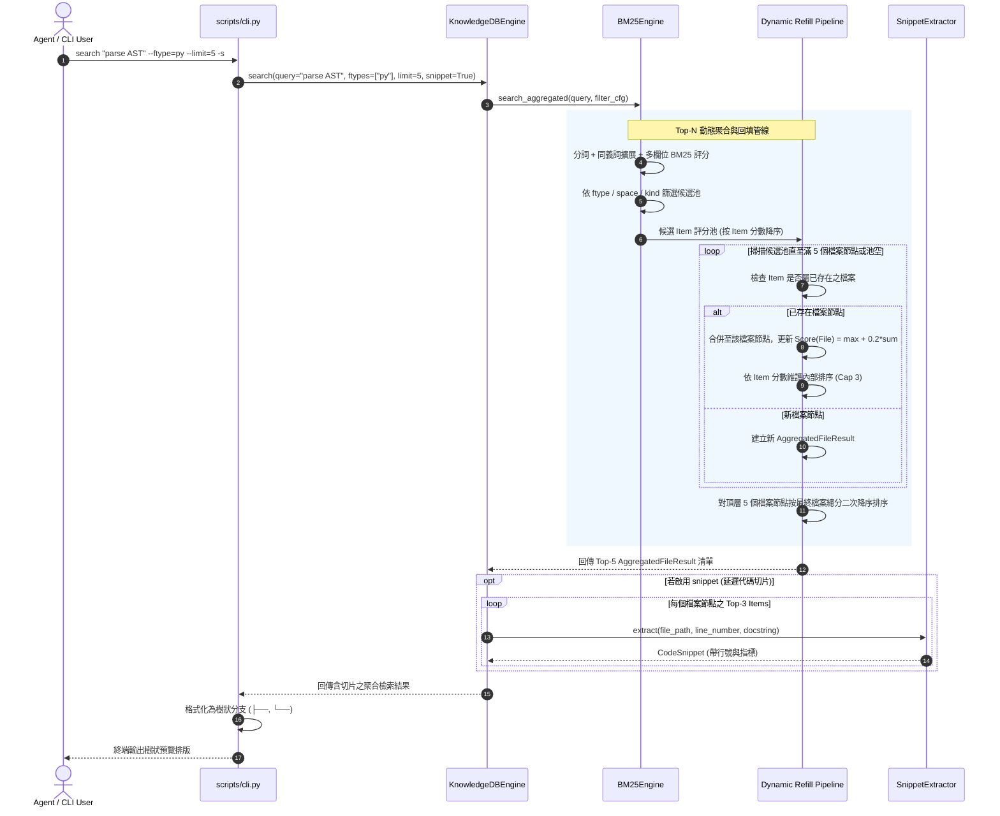

# 架構設計說明書 (Architecture Design)

> 功能名稱：knowledge_db_parser_and_search_optimization  
> 建立日期：2026-08-29  
> 所屬主計畫：2026_08_29_1049_knowledge_db_algorithm_optimization  
> 狀態：Confirmed  
> 模板版本：v1.2  

---

## 1. 模組架構分層與職責邊界 (Layered Architecture)

```text
+---------------------------------------------------------------------------------------+
|                                表現層 / CLI 調度 (scripts/cli.py)                     |
|  - CLI 參數解析: --ftype, --limit, --snippet, --detail, --json                       |
|  - 樹狀階層分支 ASCII 渲染器 (Tree Output Formatter, Top-3 Cap)                      |
+---------------------------------------------------------------------------------------+
                                           |
                                           v
+---------------------------------------------------------------------------------------+
|                             核心引擎層 (knowledge_db/engine.py)                      |
|  - JIT 自動變更感知與熱自愈 (Fingerprint Snapshot Check)                              |
|  - QueryFilter 參數組裝 (spaces, ftypes, kinds, languages, limit)                     |
|  - 延遲代碼切片提取 (SnippetExtractor on Top-3 items per File)                       |
+---------------------------------------------------------------------------------------+
                                           |
                                           v
+---------------------------------------------------------------------------------------+
|                          檢索與動態聚合層 (knowledge_db/retrieval.py)                 |
|  - BM25Engine: 多欄位 BM25 評分 + 精確匹配加權 (2.0x Boost)                          |
|  - `--ftype` 來源過濾器 (副檔名 O(1) 篩選)                                            |
|  - Top-N 動態聚合與回填管線 (Dynamic Refill Pipeline):                                |
|      • 候選池逐筆掃描 ➔ 依 file_path 聚合為 AggregatedFileResult                     |
|      • 積分合併公式: Score(File) = max(Si) + 0.2 * sum(Sj) (j != i)                   |
|      • 動態回填補滿 N 個頂層檔案節點 ➔ 二次總分降序穩定排序                           |
+---------------------------------------------------------------------------------------+
                                           |
                                           v
+---------------------------------------------------------------------------------------+
|                           解析器體系層 (knowledge_db/parsers/)                        |
|  - PythonParser: AST 解析，Method/Function 升格為一級 Symbol，精確 end_line           |
|  - CppParser: 多行簽名累積狀態機 + Namespace 堆疊 + Class 作用域追蹤                  |
|  - CSharpParser: Namespace 追蹤 + Method/Property end_line 近似邊界                  |
|  - MarkdownParser: Section/Heading/Table 精確 end_line 座標標定                       |
+---------------------------------------------------------------------------------------+
                                           |
                                           v
+---------------------------------------------------------------------------------------+
|                          資料模型層 (knowledge_db/schema.py)                          |
|  - UnifiedSymbol: 擴充 end_line (int)、parent_scope (str) 等標準欄位                  |
|  - AggregatedFileResult: 檔案聚合節點資料結構 (file_path, score, items: List)         |
|  - QueryFilter: 新增 ftypes: Optional[List[str]]                                      |
+---------------------------------------------------------------------------------------+
```

---

## 2. 核心資料流與循序圖 (Data Flow & Sequence Diagram)



---

## 3. 受影響檔案與新建檔案清單 (Impacted & New Files Inventory)

| 檔案路徑 | 類型 | 職責與變更說明 |
| :--- | :---: | :--- |
| `ys_codebase/source/knowledge-db/knowledge_db/schema.py` | Modify | 擴充 `UnifiedSymbol` 支援 `end_line` 欄位與 `parent_scope` 元資料；新增 `AggregatedFileResult` 與 `AggregatedItem` 資料模型；`QueryFilter` 擴充 `ftypes`。 |
| `ys_codebase/source/knowledge-db/knowledge_db/parsers/python_parser.py` | Modify | 重構 Python AST 遍歷：將 Class Methods 與 Functions 提升為獨立 `UnifiedSymbol`（`kind=method`/`function`），提取精確 `end_lineno`。 |
| `ys_codebase/source/knowledge-db/knowledge_db/parsers/cpp_parser.py` | Modify | 實作多行簽名累積狀態機、Namespace 作用域堆疊追蹤、Class 作用域識別（提取 Class Methods 並帶出所屬類別）。 |
| `ys_codebase/source/knowledge-db/knowledge_db/parsers/csharp_parser.py` | Modify | 完善 Namespace 堆疊與 Method/Property 之 `end_line` 座標邊界標記。 |
| `ys_codebase/source/knowledge-db/knowledge_db/parsers/markdown_parser.py` | Modify | 完善標題區塊、表格、段落之精確 `end_line` 計算與賦值。 |
| `ys_codebase/source/knowledge-db/knowledge_db/retrieval.py` | Modify | `BM25Engine` 支援 `ftypes` 副檔名過濾；實作 `search_aggregated` Top-N 動態聚合回填管線與 Max + 0.2·ΣRest 積分合併演算法。 |
| `ys_codebase/source/knowledge-db/knowledge_db/engine.py` | Modify | `KnowledgeDBEngine.search` 對接 `search_aggregated`，支援延遲提取聚合節點內部 Top-3 切片。 |
| `ys_codebase/source/knowledge-db/scripts/cli.py` | Modify | CLI 參數解析支援 `--ftype`；實作 Default/Detail/Snippet/JSON 四大模式之樹狀 ASCII 聚合渲染格式化。 |
| `ys_codebase/source/knowledge-db/tests/test_parsers_deep.py` | New | 深度單元測試：覆蓋 Python 方法物化、C++ 跨行簽名/Namespace 堆疊、C# 與 Markdown `end_line` 精確度。 |
| `ys_codebase/source/knowledge-db/tests/test_search_aggregation.py` | New | 檢索與聚合單元測試：覆蓋 `--ftype` 過濾、Top-N 回填閉環、積分累加公式與樹狀渲染。 |

---

## 4. 架構決策記錄 (Architecture Decision Records)

- **[P02:DR-01]** **分離式聚合資料結構**：新增 `AggregatedFileResult` 封裝頂層檔案節點，內部包含 `items: List[AggregatedItem]`，保持與既有 `SearchResult` 向後相容，同時清晰表達樹狀階層。
- **[P02:DR-02]** **副檔名正規化過濾原則**：`--ftype` 在 `BM25Engine` 候選階段透過 `os.path.splitext` 與正規化清單進行 $O(1)$ 快速比對，副檔名統一小寫且去除前綴 `.`。
- **[P02:DR-03]** **C++ 狀態機安全保護**：多行函式簽名累積器設置 `MAX_SIGNATURE_LINES = 30` 熔斷保護，遇到非預期未閉合結構自動安全復位，絕不影響後續代碼解析。

