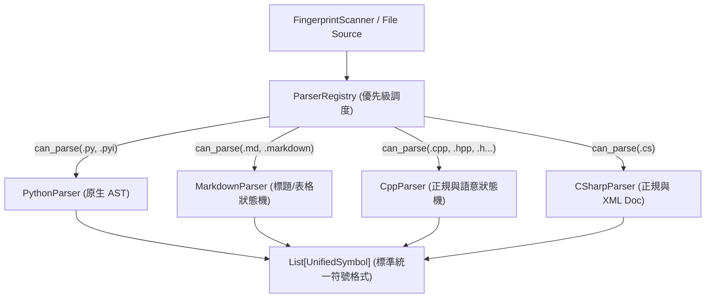
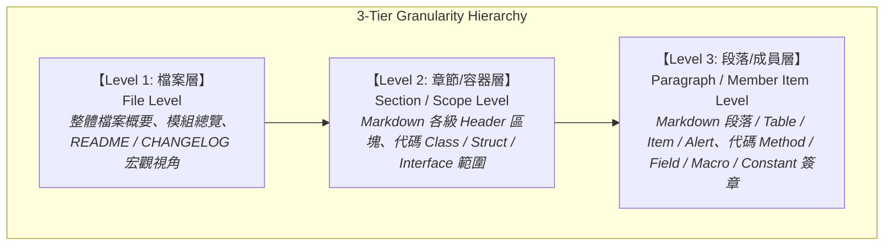
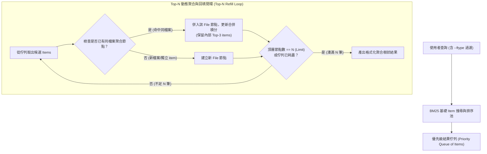

# 技術調研報告：Knowledge-DB 解析器架構現況與優化方向 (R01)

> 調研主題：Knowledge-DB 解析器體系 (Parsers Architecture)、邊界局限與潛在優化維度  
> 建立日期：2026-08-29  
> 所屬子計畫：`sub_03_parser_and_search_optimization`  
> 所屬主計畫：`2026_08_29_1049_knowledge_db_algorithm_optimization`  
> 調研狀態：In Discussion (Phase 0-R)  
> 模板版本：v1.0  

---

## 1. 現行解析器架構總覽 (Current Parsers Architecture)

`knowledge-db` 的代碼與文檔語意解析體系位於 `knowledge_db/parsers/`，採用**可擴充外掛式解析器架構 (Pluggable Parser Pipeline)**：



### 1.1 核心介面契約
- **`BaseParser`**（抽象基類）：
  - `can_parse(file_path: Union[str, Path]) -> bool`：副檔名與檔名特徵嗅探。
  - `parse(file_path: str, content: str, space: str) -> List[UnifiedSymbol]`：接收文字並提取統一符號。
- **`ParserRegistry`**（調度中心）：
  - 支援優先級權重註冊（`priority` 降序）。
  - 具備防禦機制（未匹配解析器或例外時優雅降級回傳 `[]`，不中斷整體索引建置）。

---

## 2. 各語言現行解析器實作與邊界分析 (Detailed Parser Analysis)

| 解析器 | 支援副檔名 | 核心底層技術 | 當前提取能力 | 現存邊界與技術局限 (Limitations) |
| :--- | :--- | :--- | :--- | :--- |
| **`PythonParser`** | `.py`, `.pyi` | Python 內建 `ast` 模組 | - 頂層 Class (含 bases, decorators, docstring)<br>- 類別成員方法與欄位 (收錄於 `members`)<br>- 頂層 Function (含 async, args 型別標註, returns, decorators) | 1. **類別方法非獨立符號**：方法收錄在 Class 的 `members` 清單中，未扁平產出為一級 `UnifiedSymbol`，可能影響方法名稱精準定位行號。<br>2. **僅解析頂層節點**：`tree.body` 僅迭代第 1 層，巢狀類別 (Nested Class)、函式內部閉包 (Closure / Inner Function) 無法被提取。<br>3. **常數與型別別名未提取**：模組層級的全域常數、變數賦值、`TypeAlias`、`NewType` 或 `Enum` 成員未獨立提取為符號。 |
| **`MarkdownParser`** | `.md`, `.markdown` | 正規表達式 + 狀態機 | - `#` ~ `####` 標題結構與對應區塊內文<br>- Markdown 表格 (Doc Table, 含表頭提取) | 1. **Docstring 截斷策略**：單一章節長度超過 4000 字元時直接截斷。<br>2. **程式碼區塊 (Fenced Code Blocks) 盲區**：內嵌代碼區塊未做語法標記或獨立子符號切分。<br>3. **特殊 Callout / Alert 語意未獨立提取**：GitHub 風格 `> [!NOTE]` / `> [!IMPORTANT]` 等強調區塊視為一般內文。 |
| **`CppParser`** | `.cpp`, `.hpp`, `.h`, `.c`, `.cc`, `.cxx`, `.hxx` | 正則表達式 + 單行狀態機 | - `#define` 巨集<br>- `class` / `struct` 定義與繼承<br>- 全域/成員函式簽名與回傳型別<br>- `enum` / `enum class`<br>- `//` 與 `///` 註解提取 | 1. **單行比對限制**：函式簽名或巨集若跨越多行（Multi-line signature / params），正則無法跨行匹配。<br>2. **作用域與命名空間 (Namespace) 丟失**：未維護命名空間堆疊（如 `namespace A { namespace B { ... } }`），符號名稱可能缺乏完整 qualified name。<br>3. **類別內部作用域扁平化**：類別成員函式直接以一般函式提取，未關聯所屬類別 `members`。 |
| **`CSharpParser`** | `.cs` | 正則表達式 + XML Doc 提取 | - `namespace` 追蹤<br>- `class`, `interface`, `struct`, `enum`<br>- 方法 (Method) 簽名與修飾詞<br>- 屬性 (Property) 與 get/set<br>- `/// <summary>` XML 註解清理與提取 | 1. **單層 Namespace**：依賴行首 `namespace X`，若採 C# 10 File-scoped namespace 或複雜巢狀可能存在邊界狀況。<br>2. **多行簽名與 Lambda 屬性**：跨行參數或複雜泛型約束 (`where T : class`) 匹配強韌度有提升空間。<br>3. **型別成員未階層歸屬**：方法與屬性雖獨立產出符號，但未反向聚合至所屬類別的 `members` 結構。 |

---

## 3. 解析器深度優化確認範疇 (Confirmed Parser Optimization Scope)

本次子計畫確認納入全部 4 大解析器之深度優化，分為兩個優先層級：

### 🔴 Type 1：必封優化 (與 Item 化強耦合，端線 `end_line` 完善)

所有解析器在 Item 物化後，`end_line` 必須精確才能使 `--snippet` 切片正確框定邊界：

| 解析器 | 當前 `end_line` 狀態 | 優化目標 |
| :--- | :--- | :--- |
| **PythonParser** | Class 有 `metadata["end_line"]`，但 **Method/Function 的 `end_lineno`（`ast.FunctionDef.end_lineno`）未帶出至 UnifiedSymbol** | 所有頂層 Function 與類別 Method 均帶出精確 `end_lineno` 作為 Item 物理邊界 |
| **MarkdownParser** | Header 區塊之 `end_line` 以「下一個同/高級標題前一行」隱性計算，但未顯式存入符號 | 標題/段落/表格各 Item 精確計算並儲存 `end_line` |
| **CppParser** | 函式符號完全**無 `end_line`**（單行正則，無法確定函式體結束位置） | 至少提供函式簽名行的 `end_line`（簽名閉合行，非函式體結束行） |
| **CSharpParser** | 方法/屬性符號完全**無 `end_line`** | 以下一個符號起始行 - 1 作為 `end_line` 近似值（因無 AST） |

### 🟠 Type 2：選封優化 (C++ 深度精準度強化，下游專案需求)

`CppParser` 當前基於純單行正規表達式，存在三大系統性技術債：

#### 技術債 1：多行函式簽名盲目 (Multi-line Signature Coverage Deficit)
```cpp
// 以下常見 C++ 函式宣告，FUNC_PATTERN 完全無法匹配：
EntityComponent* GetOrCreateComponent(
    EntityId id,
    ComponentType type,          // 跨行參數
    bool createIfMissing = true);
```
- **現行機制**：`FUNC_PATTERN` 的 `([^)]*)` 要求 `(...)` 必須在同一行閉合，跨行即完全漏失。
- **優化方向**：改為**多行累積狀態機 (Multi-line Accumulator)**，偵測到函式頭部後持續累積行，直到遇到 `)` 或 `{` 閉合為止。

#### 技術債 2：命名空間作用域丟失 (Namespace Scope Loss)
```cpp
namespace Engine {
    namespace Rendering {
        class Renderer { ... };  // 當前產出名稱："Renderer"
    }                            // 應為："Engine::Rendering::Renderer"
}
```
- **現行機制**：未維護 Namespace 堆疊，所有符號均以短名稱產出，無 Qualified Name。
- **優化方向**：維護 `namespace_stack: List[str]`，追蹤 `{` / `}` 深度以推入/彈出命名空間名稱，產出完整 Qualified Name。

#### 技術債 3：成員函式無法關聯所屬類別 (Class Member Scope Flat)
```cpp
class Parser {
    void parse();    // 當前以 kind=FUNCTION 獨立產出，未知所屬為 Parser::parse
};
```
- **現行機制**：類別內部的成員函式與全域函式以同一規則直接提取，無法識別其所屬類別作用域。
- **優化方向**：維護 `class_scope_stack`，結合 `{` 深度追蹤識別類別體範圍，將成員函式以 `kind=METHOD` 並附帶 `parent_scope=ClassName` 產出。


---

## 4. 搜尋產出與三級顆粒度模型 (3-Tier Output Granularity Hierarchy)

為了使搜尋結果在「宏觀架構理解」與「極致微觀精準跳轉」之間取得最佳平衡，確立三級階層顆粒度架構草案：



### 4.1 代碼 (Code) vs 文檔 (Doc) 具體對標映射矩陣

| 顆粒度層級 | 代碼體系 (Code: Python / C++ / C# / etc.) | 文檔體系 (Doc: Markdown / Docs) | 搜尋定位與 Snippet 預期行為 |
| :--- | :--- | :--- | :--- |
| **Level 1<br>(單檔案 File Level)** | - 模組文件整體（如 `python_parser.py`）<br>- 模組 Docstring / 頂層 Module Header<br>- 檔案級全域概念與職責 | - 完整 Markdown 文檔整體（如 `DevelopmentStandards.md`）<br>- 文件前言 / 簡介 / Frontmatter<br>- 全文主題與目錄綱要 | **宏觀定位**：回傳檔案路徑第 1 行或 Module Docstring，Snippet 呈現檔案摘要與核心職責。 |
| **Level 2<br>(單章節 Section Level)** | - `class`、`struct`、`interface`、`enum`<br>- 頂層獨立大型函式 / 模組命名空間<br>- 包含類別簽名、Bases、Docstring 與成員摘要 | - `#` ~ `####` 標題至下一個同級/高級標題前<br>- 邏輯章節 (Section Scope)<br>- 包含章節標題、導言與整體小節內容 | **中觀定位**：回傳 Class 定義或 Section Header 所在行號，Snippet 呈現類別簽名/章節導讀。 |
| **Level 3<br>(單段落 Item Level)** | - 類別成員方法 (`method` / `def`)<br>- 屬性與欄位 (`field` / `property`)<br>- 頂層全域常數 (`CONSTANT`)<br>- `#define` 巨集、列舉值 (`enum item`) | - 獨立內文段落 (Paragraph)<br>- 清單項目 (List item / Bullet block)<br>- Markdown 表格 (Doc Table)<br>- GitHub Alert / Callout 區塊<br>- 內嵌程式碼區塊 (Fenced Code) | **微觀精準定位**：回傳成員定義或段落起始的**精確行號**，Snippet 精準聚焦該函式簽名或段落切片。 |

---

## 5. 原子物化與自底向上動態語意組合演算法 (Atomic Materialization & Dynamic Composition)

為了徹底消滅跨層級重複索引引起的 BM25 評分失真與索引空間膨脹，確立**「底層 Item 唯一物化，上層語意邏輯組合」**的核心演算法架構：

```mermaid
graph TD
    subgraph Physical Tier: 物理物化層 (唯一 Token 池 SSOT)
        I1["Item: Header (# 2. 解析器) [L10-L10]"]:::item
        I2["Item: Paragraph (正文說明) [L11-L15]"]:::item
        I3["Item: Doc Table (表格對照) [L16-L25]"]:::item
        I4["Item: Class Def (class CppParser) [L30-L30]"]:::item
        I5["Item: Method (def can_parse) [L34-L36]"]:::item
        I6["Item: Method (def parse) [L38-L100]"]:::item
    end

    subgraph Logical Composition Tier: 邏輯語意組合層 (宣告式規則引擎)
        S_MD["【Section: Markdown 區塊】<br/><i>規則：同檔案 + 包含 Header Item + 區間內 Body Items</i>"]:::sec
        S_CODE["【Section: Class 類別作用域】<br/><i>規則：同檔案 + Class Def Item + 所屬 Method/Field Items</i>"]:::sec
        F_ALL["【File: 檔案級全景】<br/><i>規則：同檔案下所有 Items 聯集</i>"]:::file
    end

    I1 & I2 & I3 -->|動態組合| S_MD
    I4 & I5 & I6 -->|動態組合| S_CODE
    S_MD & S_CODE -->|動態組合| F_ALL

    classDef item fill:#1e3a8a,stroke:#3b82f6,stroke-width:2px,color:#fff;
    classDef sec fill:#14532d,stroke:#22c55e,stroke-width:2px,color:#fff;
    classDef file fill:#78350f,stroke:#f59e0b,stroke-width:2px,color:#fff;
```

### 5.1 核心演算法公理 (Algorithmic Axioms)
1. **物理物化唯一性 (Single Physical Materialization)**：
   - 倒排索引（Inverted Index / BM25）**100% 僅對最基底的原子 Item 進行分詞與物化建庫**。
   - 絕不單獨重複物化 Section 或 File 級別的重複 Token，保證 BM25 的文檔頻率 (DF)、文檔長度 ($avgdl$) 具備純淨的數學嚴謹性，且索引體積極致緊湊。
2. **宣告式語意組合規則 (Declarative Semantic Rules)**：
   - 上層的 Section（章節/類別）與 File（檔案）為**非物化的邏輯視圖 (Virtual Logical View)**，由宣告式規則動態組合：
     - **Markdown Section 規則**：`File(path) ∧ HasHeader(H) ∧ ItemsInRange(H.line, NextHeader.line)`。
     - **Code Class 規則**：`File(path) ∧ ClassDef(C) ∧ MemberItemsInASTScope(C.scope)`。
     - **File 規則**：`AllItems(file_path)`。
3. **靈活的檢索投影與分數聚合 (Adaptive Query Projection & Score Aggregation)**：
   - **微觀精準查詢**（如精確方法名 `parse`）：直接命中並投影為 Level 3 Base Item，返回精確行號與極小切片。
   - **宏觀語意查詢**（如「C++ 多行簽名狀態機」）：若多個相鄰/同 Scope 的 Item（如 Class Def + Comments + Methods）同時命中，規則引擎**自動向上聚合 (Bottom-Up Aggregation)**，將相關分數匯總至所屬 Section 或 File，並以單一高權重區塊呈現。

---

## 6. 架構演進與 Schema 衝擊評估 (Architecture & Schema Impacts)

### 6.1 各解析器內聚組合規則 (Parser-Encapsulated Composition Rules)
- **決策確認**：各語言解析器（如 `PythonParser`, `MarkdownParser`, `CppParser` 等）除了提取原子 `BaseItem` 之外，**自帶該語言的宣告式組合邏輯與 Scope 邊界識別器**。
- **好處**：高度內聚（High Cohesion），解析器最懂該語言的 AST 作用域層次，新增/擴充語言時無需侵入修改全域核心調度器。

### 6.2 `UnifiedSymbol` (Base Item) 模型精化
1. **物理邊界座標 (Physical Span)**：
   - 每個 Base Item 必須包含精確的 `start_line: int`, `end_line: int`。
2. **階層標籤與容器錨點 (Scope & Container Pointer)**：
   - `scope_path: str`（如 `CppParser::can_parse`、`DevelopmentStandards.md#2.1`）。
   - `parent_scope: Optional[str]`（指向所屬 Class/Section 名稱或 ID，供組合引擎進行高速 $O(1)$ 分組）。
   - `kind: SymbolKind`（標記為 `method`, `field`, `macro`, `doc_paragraph`, `doc_table`, `doc_heading` 等）。

---

## 7. 搜索機制與來源過濾演算法設計 (Search Mechanism & File-Centric Aggregation)

依據實作友善性、架構解耦與高內聚原則，確立**「檔案級動態聚合 + Top-N 回填閉環 + 來源副檔名過濾」**之搜索機制架構：



### 7.1 核心演算法規格 (Algorithm Specifications)

1. **來源副檔名/檔案類型過濾 (`--ftype`)**：
   - 支援參數：`--ftype=<ext1|ext2|ext3>` 或 `--ftype=<ext1,ext2>`（例如 `--ftype=c|cpp|h|hpp` 僅找 C/C++ 源碼，`--ftype=md` 僅找文檔）。
   - **架構解耦**：核心搜尋模組不預設任何解析器的私有欄位，透過副檔名進行 $O(1)$ 來源空間過濾，保持引擎通用性。
2. **Top-N 動態聚合與回填演算法 (Dynamic Refill Pipeline)**：
   - **步驟 a**：執行 BM25 Item 級搜尋，取得原始符號排序結果佇列。
   - **步驟 b**：依序從佇列頂部取出 Item。
   - **步驟 c**：若取出的 Item 與已取出的節點屬於**同一個檔案**，將其聚合至該檔案節點下，並合併/累加積分（Score Aggregation）。
   - **步驟 d**：若因 (c) 聚合折疊導致當前頂層有效節點數小於 $N$（limit），且排序佇列中仍有剩餘項目，則**持續向後取出回填**，直至湊滿 $N$ 個頂層節點或佇列清空。
3. **終端呈現排版 (Visual Tree Layout & Top-3 Cap)**：
   - **未聚合之獨立 Item**：維持原有極簡輸出格式（相容既有 Simple / Detail 模式）。
   - **聚合節點輸出**：採用 ASCII 樹狀分支呈現，且每個聚合節點內部**最多僅呈現排名前 3 名之最關鍵 Item**，防止單一檔案過度洗版：
     ```text
     #01 src/knowledge_db/parsers/python_parser.py: (Aggregated Score: 18.42)
     |- line  84 | class PythonParser(BaseParser)
     |- line  93 | def parse(self, file_path: str, content: str, space: str)
     \- line 128 | def _build_func_signature(node: Union[...])
     ```

---

## 8. 調研結論與後續落地建議 (Conclusion & Action Plan)

1. **解析器體系落地**：
   - 各解析器（Python, Markdown, C++, C#）維持原子 `BaseItem` 提取並完善精確行號邊界 `(start_line, end_line)`。
   - Python 解析器加強方法/函式/類別獨立 Item 物化；Markdown 解析器加強標題/段落/表格 Item 物化。
2. **搜索與檢索引擎落地**：
   - `retrieval.py` 實作 `--ftype` 檔案類型過濾。
   - `retrieval.py` / `engine.py` 實作 Top-N 動態聚合回填管線與積分合併。
   - CLI 輸出層實作樹狀分支渲染（聚合節點最多展開 Top 3 Items）。


