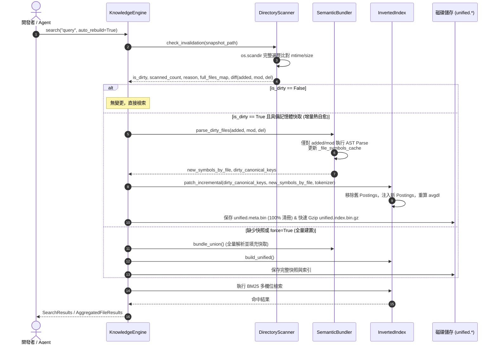

# 架構設計說明書 (Architecture Design)

> 功能名稱：Knowledge-DB Hot Reload 缺陷修復與增量效能優化  
> 建立日期：2026-08-30  
> 所屬主計畫：無 (獨立 Level 1 計畫)  
> 狀態：Confirmed  

> 模板版本：v1.2  

---

## 1. 模組架構分層與職責邊界 (Layered Architecture)

```text
┌─────────────────────────────────────────────────────────────────────────────┐
│                           KnowledgeEngine 檢索門面                           │
│  - 協調 JIT 嗅探、熱重載決策 (Incremental Patch vs Full Rebuild) 與持久化   │
│  - 維護記憶體 _unified_index 與 _bundler 實例                              │
└──────────────────────────────────────┬──────────────────────────────────────┘
                                       │
         ┌─────────────────────────────┼─────────────────────────────┐
         ▼                             ▼                             ▼
┌──────────────────┐          ┌──────────────────┐          ┌──────────────────┐
│ DirectoryScanner │          │ SemanticBundler  │          │  InvertedIndex   │
│ (scanner.py)     │          │ (bundler.py)     │          │ (retrieval.py)   │
├──────────────────┤          ├──────────────────┤          ├──────────────────┤
│ - check_         │          │ - _file_symbols_ │          │ - patch_         │
│   invalidation() │          │   cache 記憶體庫 │          │   incremental()  │
│   (os.scandir,   │          │ - bundle_union() │          │   (拔除舊Postings│
│   100% 完整清冊) │          │   (僅重新解析    │          │    注入新Postings│
│ - 產出 DiffResult│          │    Dirty Files)  │          │    更新 avgdl)   │
└──────────────────┘          └──────────────────┘          └──────────────────┘
```

---

## 2. 核心資料流與循序圖 (Data Flow & Sequence Diagram)



---

## 3. 受影響檔案與新建檔案清單 (Impacted & New Files Inventory)

| 檔案路徑 | 類型 | 職責與變更說明 |
| :--- | :---: | :--- |
| `source/knowledge-db/knowledge_db/scanner.py` | Modify | 重構 `check_invalidation()`，移除提前 return，加入 `os.scandir` 快速走訪，回傳 100% 完整 `full_files_map` 與 `dirty_diff`。 |
| `source/knowledge-db/knowledge_db/bundler.py` | Modify | 新增單檔符號記憶體快取池 `_file_symbols_cache`，新增 `parse_dirty_files()` 差量解析介面。 |
| `source/knowledge-db/knowledge_db/retrieval.py` | Modify | `InvertedIndex` 新增 `patch_incremental()` 與 `save_binary()` 支援 `compresslevel=1`。 |
| `source/knowledge-db/knowledge_db/engine.py` | Modify | 重構 `search()` 與 `build_unified_index()`，落實增量熱自愈管線與 100% 完整清冊保存。 |
| `source/knowledge-db/tests/test_incremental_hot_reload.py` | New | 建立增量熱自愈、死循環回歸防護、刪除/新增檔案與效能基準測試。 |

---

## 4. 架構決策記錄 (Architecture Decision Records)

- **[P02:DR-01] 嗅探與清冊保證分離**：`check_invalidation()` 保持單純無狀態，不修改磁碟，僅比對快照並回傳 `(is_dirty, scanned_count, reason, full_files_map, diff)`。
- **[P02:DR-02] 符號快取維護於 Bundler**：`SemanticBundler` 專注於檔案解析與符號抽取，由其維護 `_file_symbols_cache`，支援隨時對特定檔案重解或批次失效。
- **[P02:DR-03] 倒排修補就地操作**：`InvertedIndex.patch_incremental()` 在既有記憶體實例上操作，避免頻繁重新分發物件與垃圾回收。
