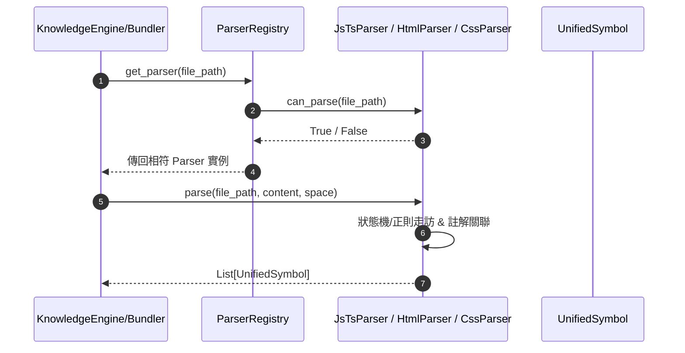

# 架構設計說明書 (Architecture Design)

> 功能名稱：knowledge-db 模組 Web 語言解譯器 (JS/TS/HTML/CSS Parsers)  
> 建立日期：2026-08-30  
> 所屬主計畫：無  
> 狀態：Confirmed  
> 模板版本：v1.2  

---

## 1. 模組架構分層與職責邊界 (Layered Architecture)

```text
[knowledge_db.parsers]
   ├── BaseParser (抽象介面)
   ├── PythonParser / CppParser / CSharpParser / SpiceParser (既有解譯器)
   ├── JsTsParser (NEW: JS/TS 類別、介面、型別、函式、箭頭函式、方法與 JSDoc 解析)
   ├── HtmlParser (NEW: HTML5 網頁標題、標題階層 h1~h6、ID 元素、區塊與註解解析)
   ├── CssParser  (NEW: CSS/SCSS/LESS Class/ID 選擇器、CSS/SASS/LESS 變數、Keyframes 解析)
   └── ParserRegistry (自動註冊中心 & 檔案類型匹配調度)

[knowledge_db.schema]
   └── LanguageType Enum (擴充 JAVASCRIPT, TYPESCRIPT, HTML, CSS)
```

---

## 2. 核心資料流與循序圖 (Data Flow & Sequence Diagram)



---

## 3. 受影響檔案與新建檔案清單 (Impacted & New Files Inventory)

| 檔案路徑 | 類型 | 職責與變更說明 |
| :--- | :---: | :--- |
| `source/knowledge-db/knowledge_db/schema.py` | Modify | 於 `LanguageType` Enum 新增 `JAVASCRIPT`, `TYPESCRIPT`, `HTML`, `CSS` |
| `source/knowledge-db/knowledge_db/parsers/js_ts_parser.py` | New | 實作 `JsTsParser` (支援 `.js`, `.jsx`, `.ts`, `.tsx` 等) |
| `source/knowledge-db/knowledge_db/parsers/html_parser.py` | New | 實作 `HtmlParser` (支援 `.html`, `.htm`) |
| `source/knowledge-db/knowledge_db/parsers/css_parser.py` | New | 實作 `CssParser` (支援 `.css`, `.scss`, `.less`) |
| `source/knowledge-db/knowledge_db/parsers/registry.py` | Modify | 於 `ParserRegistry.__init__` 註冊新 Parser |
| `source/knowledge-db/knowledge_db/parsers/__init__.py` | Modify | 匯出 `JsTsParser`, `HtmlParser`, `CssParser` |
| `source/knowledge-db/tests/test_web_parsers.py` | New | Web 解譯器單元測試套件 (涵蓋 FT-01~05, EC-01~04) |

---

## 4. 架構決策記錄 (Architecture Decision Records)

- **[P02:DR-01] 解析器封裝與相容性**：所有新解析器均繼承 `BaseParser`，完全相容既有 `ParserRegistry` 調度機制與 `SemanticBundler` 增量快取機制。
