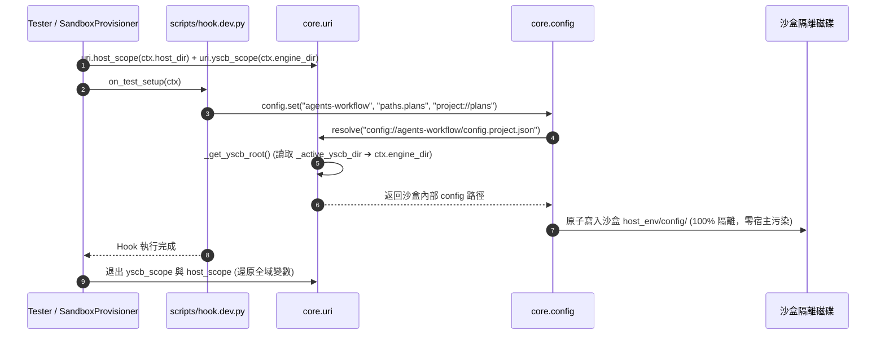

# 架構設計說明書 (Architecture Design)

> 功能名稱：core 核心拓撲注入 (yscb_root) 與全庫 Fallback 剛性收斂  
> 建立日期：2026-08-30  
> 所屬計畫：2026_08_30_1928_core_topology_injection_and_zero_fallback  
> 狀態：Confirmed  

> 模板版本：v1.2  

---

## 1. 模組架構分層與職責邊界 (Layered Architecture)

```text
+-------------------------------------------------------------------------+
|                  上層應用 / 測試層 (Sandbox & CLI & Tests)                |
|  - SandboxProvisioner: with host_scope(host_dir), yscb_scope(engine_dir)|
|  - Module Test Hooks: scripts/hook.dev.py (100% 沙盒化)                   |
+-------------------------------------------------------------------------+
                                     │ (呼叫 API / 注入作用域)
                                     ▼
+-------------------------------------------------------------------------+
|               核心 VFS 拓撲注入層 (core.uri & core.config)               |
|  - _active_host_dir / host_scope / get_host_dir                         |
|  - _active_yscb_dir / yscb_scope / get_yscb_root (新拓撲對稱注入)        |
|  - ConfigManager._get_yscb_root (100% 委任 uri，徹底清除 while/CWD)      |
+-------------------------------------------------------------------------+
                                     │ (語意 URI 物理映射)
                                     ▼
+-------------------------------------------------------------------------+
|                    實體檔案系統 (Filesystem & Sandboxes)                 |
|  - 宿主專案: /workspace/ys-codebase/ys_codebase                         |
|  - 沙盒隔離: .cache/dev/sandbox/<uuid>/host_env + engine_dir            |
+-------------------------------------------------------------------------+
```

---

## 2. 核心資料流與循序圖 (Data Flow & Sequence Diagram)



---

## 3. 受影響檔案與新建檔案清單 (Impacted & New Files Inventory)

| 檔案路徑 | 類型 | 職責與變更說明 |
| :--- | :---: | :--- |
| `source/core/core/uri.py` | Modify | 新增 `set_yscb_root`、`get_yscb_root`、`yscb_scope` 與 `_active_yscb_dir`，重構 `_get_yscb_root`。 |
| `source/core/core/config.py` | Modify | 移除 `ConfigManager._get_yscb_root` 中的 `while` 迴圈與 `os.getcwd()`，直接呼叫 `uri._get_yscb_root()`。 |
| `source/dev/dev/testing/sandbox.py` | Modify | 於 `_dispatch_test_hooks` 同時包覆 `host_scope` 與 `yscb_scope`。 |
| `source/agents-workflow/agents_workflow/plans/searcher.py` | Modify | 收斂 `archive_plans` 預設路徑為標準 `plans/archived`。 |
| `source/core/tests/test_uri.py` | Modify | 新增 `yscb_root` 注入與作用域測試案例。 |

---

## 4. 架構決策記錄 (Architecture Decision Records)

- **[P02:DR-01]**：`_active_yscb_dir` 與 `_active_host_dir` 採用相同的 `@contextmanager` + `try...finally` 設計模式，確保記憶體狀態生命週期可預測且無殘留。
- **[P02:DR-02]**：`_get_yscb_root()` 剛性保持三級優先順序（記憶體 > 環境變數 > 常數基準），杜絕任何基於當前工作目錄（CWD）的模糊推算。

