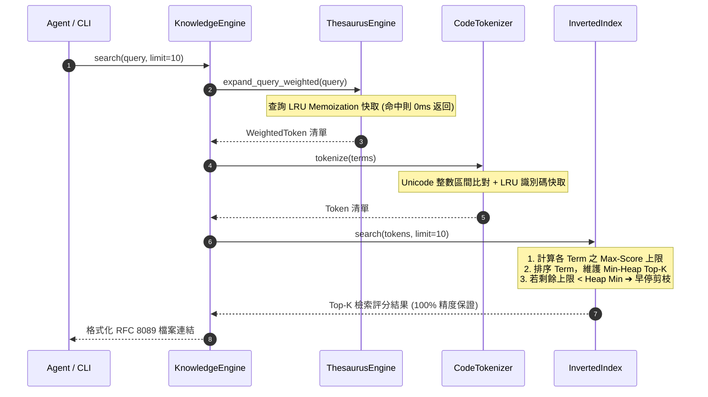
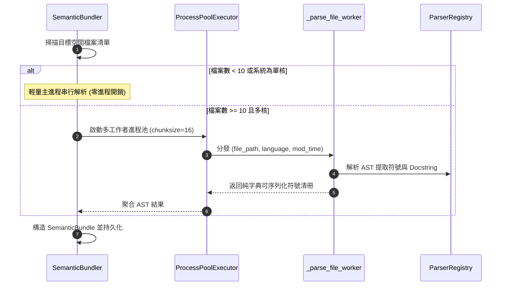

# 架構設計說明書 (Architecture Design)

> 功能名稱：knowledge-db 全棧運算提速、並發 AST 打包與倒排索引記憶體瘦身  
> 建立日期：2026-08-31  
> 所屬主計畫：2026_08_31_0533_knowledge_db_performance_and_memory_optimization  
> 狀態：Confirmed  

> 依據 P01：[P01_requirements_spec.md](./P01_requirements_spec.md)  
> 模板版本：v1.2  

---

## 1. 模組架構分層與職責邊界 (Layered Architecture)

```text
+---------------------------------------------------------------------------------+
|                              知識庫檢索與打包應用層                              |
|   +--------------------------+          +-----------------------------------+   |
|   |   ThesaurusEngine        |          |       SemanticBundler             |   |
|   |   - LRU 加權展開快取      |          |       - 動態門檻多進程並發解析     |   |
|   +--------------------------+          +-----------------------------------+   |
+---------------------------------------------------------------------------------+
                                      |
                                      v
+---------------------------------------------------------------------------------+
|                               核心檢索與分詞層                                  |
|   +--------------------------+          +-----------------------------------+   |
|   |     CodeTokenizer        |          |          InvertedIndex            |   |
|   | - Unicode 整數區間比對    |          | - doc_lengths 頂層共享池          |   |
|   | - @lru_cache 識別碼拆分   |          | - Max-Score Top-K 早停剪枝        |   |
|   | - 預編譯正則快取          |          | - Schema 自省向下相容加載          |   |
|   +--------------------------+          +-----------------------------------+   |
+---------------------------------------------------------------------------------+
                                      |
                                      v
+---------------------------------------------------------------------------------+
|                               資料結構與儲存模型層                               |
|   +-------------------------------------------------------------------------+   |
|   |   Posting: __slots__ = ('doc_id', 'tf', 'positions', 'field_tfs')       |   |
|   |   (移除內部 field_lengths 冗餘字典，節省 40%+ 節點記憶體)                 |   |
|   +-------------------------------------------------------------------------+   |
+---------------------------------------------------------------------------------+
```

---

## 2. 核心資料流與循序圖 (Data Flow & Sequence Diagram)

### 2.1 查詢檢索資料流 (Max-Score Pruned Search)



### 2.2 多工作者並發 AST 打包資料流 (Concurrent Bundler)



---

## 3. 受影響檔案與新建檔案清單 (Impacted & New Files Inventory)

| 檔案路徑 | 類型 | 職責與變更說明 |
| :--- | :---: | :--- |
| `ys_codebase/source/knowledge-db/knowledge_db/tokenizer.py` | Modify | 移除逐字元 `re.match`，改採 `ord(c)` 整數範圍比對；為 `split_identifier` 加入 `@lru_cache(maxsize=8192)` 與預編譯正則。 |
| `ys_codebase/source/knowledge-db/knowledge_db/schema.py` | Modify | 為 `Posting` 類別加上 `__slots__`，移除內部 `field_lengths` 欄位。 |
| `ys_codebase/source/knowledge-db/knowledge_db/retrieval.py` | Modify | 頂層維護 `doc_lengths`，`search()` 實作 Max-Score 剪枝，`load()` 支援 Schema 自省相容舊快取，`patch_incremental()` 維護 `doc_lengths`。 |
| `ys_codebase/source/knowledge-db/knowledge_db/thesaurus.py` | Modify | 為 `ThesaurusEngine.expand_query_weighted` 實作查詢簽章 LRU 快取。 |
| `ys_codebase/source/knowledge-db/knowledge_db/bundler.py` | Modify | 實作動態門檻多進程並發 AST 打包與頂層可 Pickle 工作者函式。 |
| `ys_codebase/source/knowledge-db/tests/test_benchmark_perf_and_memory.py` | New | 建立基準效能壓測與記憶體驗證測試套件。 |

---

## 4. 架構決策記錄 (Architecture Decision Records)

- **`[P02:DR-01]`**: `CodeTokenizer` Unicode 整數範圍判定採用模組級頂層純函式 `_is_cjk_ord(code: int)`，以純整數比對加速；識別碼拆分正則抽取為頂層常數，避免迴圈內反覆編譯。
- **`[P02:DR-02]`**: `InvertedIndex` 將 `field_lengths` 徹底移出 `Posting` 節點，改在 `InvertedIndex` 實例維護 `self.doc_lengths: Dict[str, Dict[str, int]]`，序列化時以頂層鍵值持久化，反序列化時若遇舊版格式則自動遷移。
- **`[P02:DR-03]`**: BM25 Max-Score 剪枝演算法：在評分前先對每個查詢 Term $t$ 計算其最大可能得分上限 $\text{MaxScore}(t) = \text{IDF}(t) \times \frac{\max(\text{TF}) \cdot (k_1 + 1)}{\max(\text{TF}) + k_1 \cdot (1 - b + b \cdot \frac{\min(\text{dl})}{\text{avgdl}})}$。遍歷文檔時若當前累積可能最大分數小於已獲取的第 K 名分數，即安全早停跳出。
- **`[P02:DR-04]`**: `SemanticBundler` 並發工作者設計為頂層純函式 `_parse_file_task(args)`，回傳輕量 AST 字典，主進程負責轉換為 `UnifiedSymbol` 並掛載快取，徹底杜絕多進程 Pickle 失敗風險。
