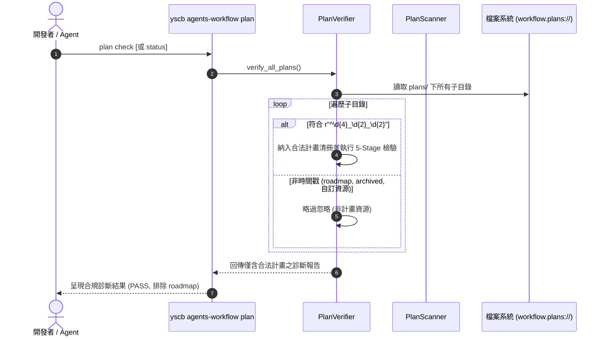
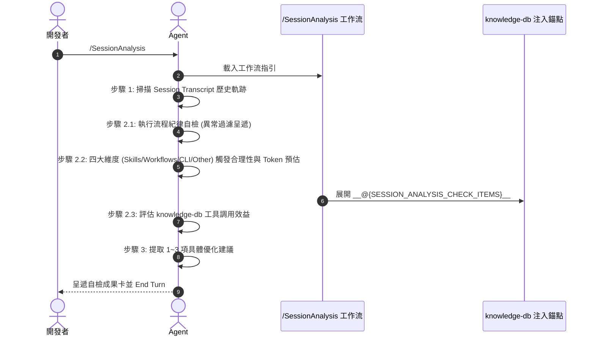

# 架構設計說明書 (Architecture Design)

> 功能名稱：Plan Filter Bug Fix 與 SessionAnalysis 工作流重構  
> 建立日期：2026-09-03  
> 所屬主計畫：無 (獨立計畫)  
> 狀態：Confirmed  
> 模板版本：v1.2  

---

## 1. 模組架構分層與職責邊界 (Layered Architecture)

```text
┌────────────────────────────────────────────────────────────────────────┐
│                        使用者與 Agent 互動介面                         │
│     Slash Command: /SessionAnalysis  |  CLI: yscb agents-workflow plan │
└──────────────────────────────────┬─────────────────────────────────────┘
                                   │
      ┌────────────────────────────┴────────────────────────────┐
      ▼                                                         ▼
┌───────────────────────────────┐     ┌─────────────────────────────────┐
│     Plans Toolchain (CLI)     │     │     Workflow Assets & Tokens    │
│  - verifier.py                │     │  - SessionAnalysis.md           │
│  - scanner.py                 │     │  - contributes/agents-workflow  │
│  - searcher.py                │     │    .json (Tokens & Workflows)   │
│  [統一正則 r"^\d{4}_\d{2}_\d{2}"]   │     └────────────────┬────────────────┘
└───────────────────────────────┘                      │ 宣告式注入
                                                       ▼
                             ┌──────────────────────────────────────────┐
                             │        Donor 模組 Contributes 協同       │
                             │  - core: 移除 CLI 審查注入               │
                             │  - knowledge-db: 注入工具使用率評測      │
                             └──────────────────────────────────────────┘
```

---

## 2. 核心資料流與循序圖 (Data Flow & Sequence Diagram)

### 2.1 計畫目錄掃描與合規檢驗資料流 (Plan Verification Flow)



### 2.2 SessionAnalysis 工作流執行與 Token 評測流程



---

## 3. 受影響檔案與新建檔案清單 (Impacted & New Files Inventory)

| 檔案路徑 | 類型 | 職責與變更說明 |
| :--- | :---: | :--- |
| `source/agents-workflow/agents_workflow/plans/verifier.py` | Modify | `verify_all_plans()` 增加 `r"^\d{4}_\d{2}_\d{2}"` 正則篩選，排除非時間戳目錄。 |
| `source/agents-workflow/agents_workflow/plans/scanner.py` | Modify | `scan_active_plans()` 統一收斂至正則篩選，取代硬編碼排除。 |
| `source/agents-workflow/agents_workflow/plans/searcher.py` | Modify | `find_all_plans()` 修正無參數時包含非時間戳目錄之瑕疵。 |
| `source/agents-workflow/contributes/agents-workflow.json` | Modify | 更新 workflow 導出 (`SessionAnalysis.md`) 與 token 宣告 (`WORKFLOW_SESSIONANALYSIS`, `SESSION_ANALYSIS_CHECK_ITEMS`)。 |
| `source/agents-workflow/assets/workflows/SessionAnalysis.md` | New | 全新重構之 SessionAnalysis 工作流，包含流程自檢、四維度觸發與 Token 估算、純淨下游視角。 |
| `source/agents-workflow/assets/workflows/Retro.md` | Delete | 移除舊版 Retro 工作流檔案。 |
| `source/core/contributes/agents-workflow.json` | Modify | 移除 `RETRO_CHECK_ITEMS` 注入。 |
| `source/core/assets/retro_check.md` | Delete | 清理廢棄之 core 檢核片段。 |
| `source/knowledge-db/contributes/agents-workflow.json` | Modify | 更新注入 token 為 `SESSION_ANALYSIS_CHECK_ITEMS`，指針指向 `session_analysis_check.md`。 |
| `source/knowledge-db/assets/session_analysis_check.md` | New | 重構後的 knowledge-db 工具效益與使用率評測片段。 |
| `source/knowledge-db/assets/retro_check.md` | Delete | 移除舊版 retro check 片段。 |
| `source/agents-workflow/tests/test_session_analysis_workflow.py` | New | 新增 SessionAnalysis 工作流、導出與 Token 解析專屬單元測試。 |
| `source/agents-workflow/tests/test_plans_toolchain.py` | Modify | 擴充驗證非時間戳目錄安全略過之測試案例。 |

---

## 4. 架構決策記錄 (Architecture Decision Records)

- **[P02:DR-01] 統一以正則 `r"^\d{4}_\d{2}_\d{2}"` 作為計畫目錄識別唯一 SSOT**：各工具鏈不再自行維護黑名單，凡目錄名稱不符合標準時間戳前綴者，全量檢驗與掃描一律不視為 Dev Plan。
- **[P02:DR-02] Token 與工作流雙向對稱更名**：`Retro` 升級為 `SessionAnalysis`，尾部佔位符改為 `WORKFLOW_SESSIONANALYSIS`，模組擴充錨點改為 `SESSION_ANALYSIS_CHECK_ITEMS`，全生態系同步物化。
- **[P02:DR-03] 職責純化與下游解耦**：core 模組不再強制介入對話歷程中的 CLI 審查；工作流全面剔除開發特化假設，確保下游專案使用者閱讀體驗流暢一致。
