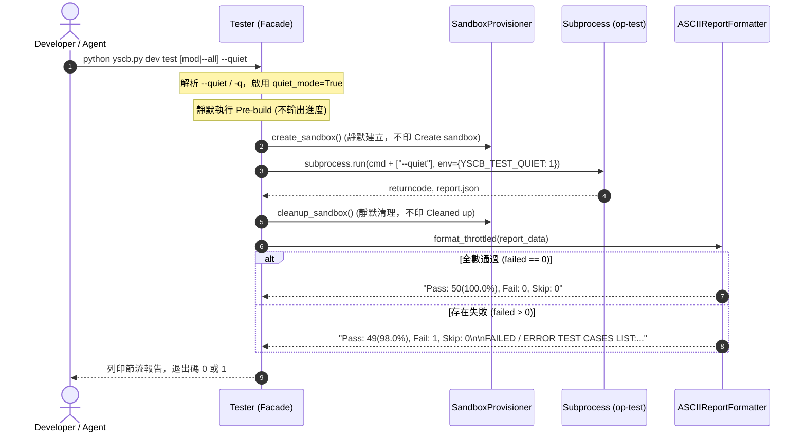

# 架構設計說明書 (Architecture Design)

> 功能名稱：dev test 輸出格式優化與節流模式 (Throttle Output)  
> 建立日期：2026-09-03  
> 所屬主計畫：2026_09_03_1227_agents_workflow_plan_filter_and_session_analysis  
> 狀態：Confirmed  
> 模板版本：v1.2  

---

## 1. 模組架構分層與職責邊界 (Layered Architecture)

```text
+-------------------------------------------------------------------------------+
| 1. CLI Dispatch & Options Layer (source/dev/dev/tester.py)                    |
|    - 解析 -q / --quiet 命令列參數與設定 quiet_mode                             |
|    - 透過 YSCB_TEST_QUIET="1" 環境變數與 args 穿透 sandbox 邊界               |
|    - 深度靜默閘門：抑制 [dev:test] Pre-building, Create sandbox, Cleaned up 日誌 |
+---------------------------------------+---------------------------------------+
                                        |
                                        v
+-------------------------------------------------------------------------------+
| 2. Test Execution & Sandbox Layer (source/dev/dev/tester.py)                  |
|    - _run_single_module_worker / _run_parallel_test                           |
|    - 子程序標準輸出捕獲與 quiet 模式抑制轉發                                   |
|    - 收集聚合 report_data (total, passed, failed, skipped, failures_list)    |
+---------------------------------------+---------------------------------------+
                                        |
                                        v
+-------------------------------------------------------------------------------+
| 3. Throttled Report Formatter (source/dev/dev/testing/runner.py)              |
|    - ASCIIReportFormatter.format_throttled(report_data) -> str                |
|    - Pass Only : "Pass: {passed}({pct:.1f}%), Fail: 0, Skip: {skipped}"       |
|    - Has Fails : 統計首行 + FAILED / ERROR TEST CASES LIST 明細與 Quick Re-run  |
+---------------------------------------+---------------------------------------+
                                        |
                                        v
+-------------------------------------------------------------------------------+
| 4. AI Guidelines & Workflows Alignment (source/dev, source/agents-workflow)   |
|    - yscb-module-dev: 全面更新為 dev test <mod> --quiet                       |
|    - Auto.md / Review.md / SOP: 回歸測試推薦指令一律對齊 --quiet               |
+-------------------------------------------------------------------------------+
```

---

## 2. 核心資料流與循序圖 (Data Flow & Sequence Diagram)



---

## 3. 受影響檔案與新建檔案清單 (Impacted & New Files Inventory)

| 檔案路徑 | 類型 | 職責與變更說明 |
| :--- | :---: | :--- |
| `source/dev/dev/tester.py` | Modify | 支援 `--quiet` / `-q` 參數解析，實作前置日誌深度靜默與節流報告調用。 |
| `source/dev/dev/testing/runner.py` | Modify | `ASCIIReportFormatter` 新增 `format_throttled` 專屬節流格式化方法。 |
| `source/dev/tests/test_tester_throttle.py` | New | 專屬單元測試，驗證 `--quiet` 下的單行輸出、失敗明細輸出與靜默行為。 |
| `source/dev/assets/skills/yscb-module-dev/SKILL.md` | Modify | 將所有推薦 AI 執行之 `dev test` 指令全面改為 `--quiet`。 |
| `source/agents-workflow/assets/workflows/Auto.md` | Modify | 自動化推進流程中的測試步驟指令改為 `--quiet`。 |
| `source/agents-workflow/assets/workflows/Review.md` | Modify | 驗收工作流中的全庫跑測指令改為 `--quiet`。 |
| `source/agents-workflow/assets/skills/development-sop/references/phase_06_test.md` | Modify | Phase 6 測試指引推薦指令改為 `--quiet`。 |
| `source/agents-workflow/assets/skills/development-sop/references/plan_modes.md` | Modify | 迅捷/修訂模式中的測試指令改為 `--quiet`。 |

---

## 4. 架構決策記錄 (Architecture Decision Records)

- **[P02:DR-01] 跨沙盒環境變數與參數雙軌穿透**：`Tester` 在外層偵測到 `--quiet` 時，除了將 `--quiet` 附加入沙盒子進程指令列外，亦注入 `YSCB_TEST_QUIET="1"` 環境變數，確保多進程沙盒內部與外層調度器能 100% 同步達成深度靜默。
- **[P02:DR-02] 報告格式化職責單一化**：在 `ASCIIReportFormatter` 內新增 `format_throttled(report_data: Dict[str, Any]) -> str`，完全解耦完整報告與節流報告，不破壞既有 `format_summary` 簽名與行為。
- **[P02:DR-03] AI 指引全面節流**：將生態系中所有面向 Agent 之技能手冊與工作流中的測試命令一律對齊 `--quiet`，使日常 Dogfooding 回歸測試的 Token 消耗自然縮減 95% 以上。
