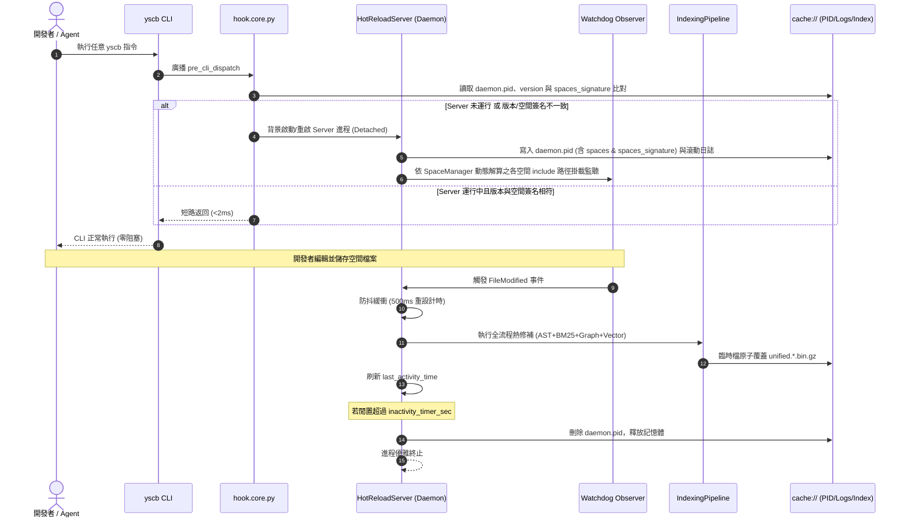

# 架構設計說明書 (Architecture Design)

> 功能名稱：knowledge_db_hot_reload_server_and_watcher  
> 建立日期：2026-09-05  
> 所屬主計畫：2026_09_05_1025_knowledge_db_refactor  
> 狀態：Confirmed  
> 依據 P01：[P01_requirements_spec.md](./P01_requirements_spec.md)  
> 模板版本：v1.2  

---

## 1. 模組架構分層與職責邊界 (Layered Architecture)

```text
+---------------------------------------------------------------------------------------+
|                                    CLI & Host Entry                                   |
|   python yscb.py <command>                      python yscb.py knowledge-db daemon    |
+---------------------------------------------------------------------------------------+
                                        │                                │
                                        ▼                                ▼
                 +-------------------------------+            +---------------------+
                 | core.events (broadcast)       |            | scripts/cli.py      |
                 | "pre_cli_dispatch"            |            | [start|stop|status] |
                 +-------------------------------+            +---------------------+
                                        │                                │
                                        ▼                                ▼
                         +------------------------------------------------------+
                         | scripts/hook.core.py (on_pre_cli_dispatch)           |
                         |  - 讀取 enable_hot_reload_server                     |
                         |  - 檢查 daemon.pid: 版本 (version) & 空間簽名 (space)|
                         |  - 若需啟動/重啟 ➔ 調用 HotReloadServer.ensure_running|
                         |    (版本失配 或 注入空間不一致 ➔ 強制終止舊進程並重啟) |
                         +------------------------------------------------------+
                                                    │ (Detached Background Process)
                                                    ▼
+---------------------------------------------------------------------------------------+
|                     HotReloadServer 常駐守護進程 (knowledge_db/daemon.py)             |
|                                                                                       |
|   +--------------------------+  500ms Debounce  +----------------------------------+  |
|   | Space-Driven Watcher     | ───────────────> | Worker Thread (Single Queue)     |  |
|   | 透過 SpaceManager 動態   |                  | 調用 IndexingPipeline:           |  |
|   | 解算注入空間 include 路徑 |                  |  1. AST 增量解析 (Tree-sitter)   |  |
|   +--------------------------+                  |  2. BM25 倒排索引修補            |  |
|                                                 |  3. CallGraph 拓撲更新 (NetworkX)|  |
|   +--------------------------+                  |  4. 向量嵌入推論 (FastEmbed)     |  |
|   | Inactivity Timer Thread  |                  +----------------------------------+  |
|   | 每 10s 檢查變更時間戳    |                                   │                    |
|   | 逾時 (>600s) ➔ 自殺退出  |                                   ▼ 原子替換 (os.replace|
|   +--------------------------+                  +----------------------------------+  |
|                                                 | 磁碟快取 (unified.*.bin.gz)      |  |
|   +------------------------------------------+  +----------------------------------+  |
|   | cache:// 空間隔離 (Git 零污染)           |                                        |
|   |  - PID: cache://knowledge-db/daemon.pid  |                                        |
|   |    (記錄 pid, ver, spaces, spaces_sig)   |                                        |
|   |  - Logs: cache://knowledge-db/logs/ (3代)|                                        |
+---------------------------------------------------------------------------------------+
```

---

## 2. 核心資料流與循序圖 (Data Flow & Sequence Diagram)



---

## 3. 受影響檔案與新建檔案清單 (Impacted & New Files Inventory)

| 檔案路徑 | 類型 | 職責與變更說明 |
| :--- | :---: | :--- |
| `ys_codebase/source/knowledge-db/manifest.json` | Modify | 在 `pip_dependencies` 新增 `"watchdog": ">=4.0.0"` 宣告。 |
| `ys_codebase/source/knowledge-db/knowledge_db/config.py` | Modify | 新增 `enable_hot_reload_server` 與 `hot_reload_server_inactivity_timer_sec` 組態及型態防禦。 |
| `ys_codebase/source/knowledge-db/knowledge_db/daemon.py` | New | 實作 `HotReloadServer`，包含 Space 動態解算 Watcher 監聽、防抖熱修補、PID(含空間簽名)/日誌滾動與閒置超時退出機制。 |
| `ys_codebase/source/knowledge-db/scripts/hook.core.py` | New | 實作 `on_pre_cli_dispatch` 生命週期勾點，自動偵測狀態、版本與空間簽名，按需喚醒/重啟 Server。 |
| `ys_codebase/source/knowledge-db/scripts/cli.py` | Modify | 擴充 `knowledge-db daemon` 子命令（`start`, `stop`, `status`, `watch`）。 |
| `ys_codebase/source/knowledge-db/tests/test_hot_reload_server.py` | New | 涵蓋 FT-01~11、動態空間解算、空間失配重啟與 EC-01~09 之單元與整合測試套件。 |
| `ys_codebase/source/core/core/engine.py` | Modify | 優化 `_deep_infill_dict`、`_seed_or_update_config` 與 `act_deploy_configs_from_modules`：local 軟合併時跳過 project 既有設定。 |
| `ys_codebase/source/core/tests/test_engine.py` | Modify | 新增 `test_local_config_infill_skips_project_keys` 驗證 local 軟合併跳過 project 既有設定邏輯。 |

---

## 4. 架構決策記錄 (Architecture Decision Records)

- **[P02:DR-01] 檔案層單向同步解耦模式**：
  - Server Daemon 作為「背景索引生產者」，透過臨時檔與 `os.replace` 原子寫入磁碟二進位快取；前台 CLI 作為「純快取消費者」，維持唯讀讀取。
  - 徹底免去 IPC Socket 連線、序列化與握手開銷，達成最高強韌性。
- **[P02:DR-02] PID 與日誌之 cache:// 空間隔離原則**：
  - 嚴格遵守全專案規範，PID 與日誌絕對不落檔於 Git 追蹤之 `storage/`，統一存放於 `cache://knowledge-db/`。
  - 日誌檔名採 `daemon_{start_time}_{pid}.log`，以完整 PID lifecycle 為單位，超過 3 代自動清理最舊日誌。
- **[P02:DR-03] 三重線程協同與執行緒防飢餓**：
  - 主線程處理事件防抖與訊號監控；Worker 線程序列化執行熱修補推論；Timer 線程每 10 秒評估閒置狀態。各線程互不干擾。
- **[P02:DR-04] 版本失配自動重啟守門**：
  - PID 寫入當前模組版本；Hook 在每次 CLI 觸發時探測版本，版本變更時強制停機舊進程並重啟，杜絕熱重載滯後。
- **[P02:DR-05] 動態 Space 監聽與 Space 簽名失配自動重啟**：
  - Watcher 監控目錄 100% 由注入之 `SpaceManager` 空間聯集定義動態解算（`resolve_space_include`），嚴禁寫死特定目錄。
  - PID 記錄 `spaces` 清單與 `spaces_signature`；當專案空間設定或路徑變更時，`ensure_running` 探測到空間簽名失配，強制停機舊進程並重新拉起新 Server 掛載最新空間目錄。
- **[P02:DR-06] Server 常駐接管與 JIT 旁路無效化公理**：
  - 當啟用 HotReloadServer 時，所有索引熱自愈與向量計算全權委由 Server 在背景常駐維護；組態中之 `jit_vector_timeout_seconds` 等 JIT 設定在邏輯與執行層全面失效。
  - 前台 CLI 運行時若探測到後台存在 Server，強制跳過 JIT 檢查並向 stderr 提示 `"Hot reload server(pid:<pid>) exist, skip JIT check."`，徹底杜絕前台 I/O 與推論阻塞。
  - Server 啟動時在掛載 Watcher 前強制執行 `_run_startup_check`，確保離線檔案異動即刻修補，不留下任何熱自愈盲區。
- **[P02:DR-07] Contributes 驅動副檔名解算與 Space 排除雙軌初篩**：
  - 嚴禁於 Watcher 寫死副檔名與排除目錄；支援副檔名 100% 由 `ParserRegistry.get_supported_extensions()` 動態彙整 `contributes.languages` 與各 Space `file_patterns`。
  - 事件過濾由 `HotReloadServer.is_path_watched` 動態比對所屬 Space，強制套用各 Space 之 `exclude` 與 `is_file_included`，達成與 FingerprintScanner 100% 一致之過濾標準。
  - `SpaceManager._load_contributes` 升級為支援 `config://` 專案覆蓋與 Core Contributes 階層合併雙軌架構。
- **[P02:DR-08] Core 組態 Local 軟合併跳過 Project 既有設定架構**：
  - 統一於 `AtomicEngine._deep_infill_dict` 引入 `project_data` 隔離參數。
  - 在執行 local 軟合併時，若 `project` 已存在對應設定鍵值，直接跳過填充（若兩者皆為巢狀字典則向下比對，僅填充 project 未定義之子鍵值）。
  - 保證專案層級組態優先權，避免本機模板預設值因 Local > Project 優先級意外反向掩蓋專案共享配置。


