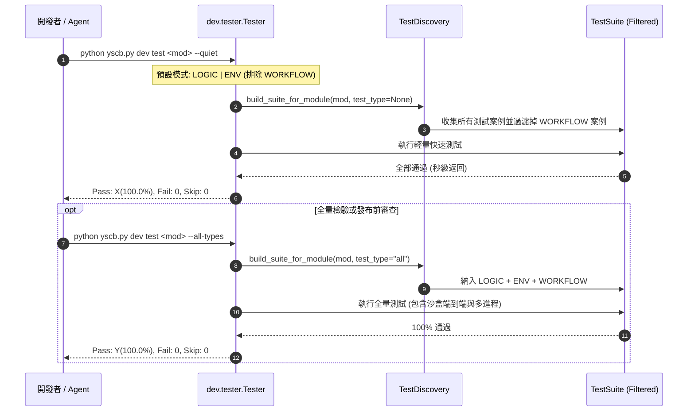

# 架構設計說明書 (Architecture Design)

> 功能名稱：core_dev_test_case_purification  
> 建立日期：2026-09-05  
> 所屬主計畫：2026_09_05_1300_core_dev_toolchain_upgrade  
> 狀態：Confirmed  
> 模板版本：v1.2  

---

## 1. 模組架構分層與職責邊界 (Layered Architecture)

```text
┌────────────────────────────────────────────────────────────────────────┐
│ 測試分類分流架構 (4-Tier Requirement Taxonomy)                         │
├────────────────────────────────────────────────────────────────────────┤
│ 【日常預設跑測 Default: LOGIC | ENV】 (目標: dev <= 4.5s, core <= 4.0s)│
│  ├── LOGIC : 純記憶體單元測試、演算法、正規化、純資料轉換               │
│  └── ENV   : 模組間 DI 注入、VFS 語意解析、輕量沙盒標識隔離測試        │
├────────────────────────────────────────────────────────────────────────┤
│ 【重型端到端驗證 WORKFLOW】 (日常排除，--workflow 或 --all-types 觸發) │
│  └── WORKFLOW : 實體虛擬沙盒全量拉起 (op-mksb)、多進程子命令派發、     │
│                 快照完整備份與還原、多模組平行排程調度                  │
└────────────────────────────────────────────────────────────────────────┘
```

---

## 2. 核心資料流與循序圖 (Data Flow & Sequence Diagram)



---

## 3. 受影響檔案與新建檔案清單 (Impacted & New Files Inventory)

| 檔案路徑 | 類型 | 職責與變更說明 |
| :--- | :---: | :--- |
| `source/dev/tests/test_tester.py` | Modify | 整合並吸收 `test_tester_sync.py` 與 `test_tester_throttle.py` 之核心斷言。 |
| `source/dev/tests/test_tester_sync.py` | Delete | 測試案例整併入 `test_tester.py` 後清理刪除。 |
| `source/dev/tests/test_tester_throttle.py` | Delete | 測試案例整併入 `test_tester.py` 後清理刪除。 |
| `source/dev/tests/test_sandbox.py` | Modify | 將涉及實體沙盒拉起、子進程多進程調度之長耗時案例標註為 `WORKFLOW`。 |
| `source/core/tests/test_cli_router.py` | New | 整合 `test_cli_help.py` 與 `test_cli_guild.py`，形成高內聚之 CLI 路由與指引測試。 |
| `source/core/tests/test_cli_help.py` | Delete | 併入 `test_cli_router.py` 後清理刪除。 |
| `source/core/tests/test_cli_guild.py` | Delete | 併入 `test_cli_router.py` 後清理刪除。 |
| `source/core/tests/test_contributes.py` | Modify | 整合吸收 `test_contributes_jit.py` 之 JIT 動態自癒案例。 |
| `source/core/tests/test_contributes_jit.py` | Delete | 併入 `test_contributes.py` 後清理刪除。 |
| `source/core/tests/test_engine.py` | Modify | 將跨進程檔案鎖、多模組快照還原等耗時沙盒測試標註為 `WORKFLOW`。 |
| `source/core/tests/test_pip_manager_sdk.py` | Modify | 合併細碎之空白/極值與資料型態解析測試為結構化案例，去除重複樣板。 |

---

## 4. 架構決策記錄 (Architecture Decision Records)

- **[P02:DR-01] 單一組件測試檔案凝聚原則**：
  - 消除 $<3$ 個測試案例的零碎單一目的檔案（如 `test_tester_sync.py`、`test_cli_help.py`），以檔案內的獨立 `TestCase` 類別保持語意隔離，大幅降低測試檔案數量與 Python 模組匯入開銷。
- **[P02:DR-02] 重型測試標註 WORKFLOW 之剛性裁決準則**：
  - 凡測試方法實質調用 `SandboxProvisioner.create_sandbox` 建立完整實體環境（耗時 $\ge 0.5\text{s}$）、執行多進程 `subprocess` 跑測、或產生複雜實體檔案快照與鎖競爭者，強制標註 `@require(Requirement.WORKFLOW)`。
  - 純 mock 或記憶體驗證測試嚴格維持 `Requirement.LOGIC` 或 `Requirement.ENV`。
