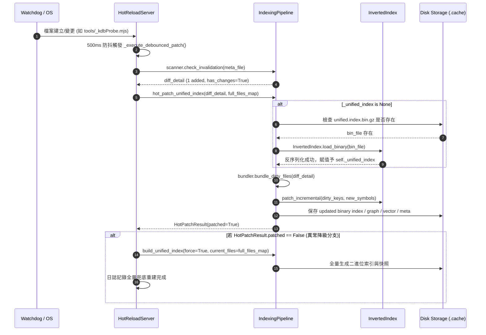

# 架構設計說明書 (Architecture Design)

> 功能名稱：knowledge-db 熱重載新增與修改檔案靜默 no-op 修復 (Hot Reload Silent No-op Fix)  
> 建立日期：2026-09-06  
> 所屬主計畫：無 (獨立標準計畫)  
> 狀態：Confirmed  

> 模板版本：v1.2  

---

## 1. 模組架構分層與職責邊界 (Layered Architecture)

```text
+-------------------------------------------------------------------------+
|                              CLI Client                                 |
|  - 探測 Hot reload server(pid:XXXX) exist -> 旁路 JIT 檢查，讀取磁碟快取   |
+-------------------------------------------------------------------------+
                                    ▲
                                    │ (二進位磁碟快取: unified.index / meta)
                                    ▼
+-------------------------------------------------------------------------+
|                  HotReloadServer (daemon.py)                            |
|  - Watchdog 事件監聽與 500ms 防抖緩衝                                   |
|  - _execute_debounced_patch 呼叫 pipeline.hot_patch_unified_index        |
|  - 🚨 [P02:DR-02] 剛性兜底：若熱修補失敗，自動呼叫 build_unified_index    |
+-------------------------------------------------------------------------+
                                    │
                                    ▼
+-------------------------------------------------------------------------+
|                 IndexingPipeline (pipeline.py)                          |
|  - hot_patch_unified_index 執行增量修補                                 |
|  - 🚨 [P02:DR-01] 磁碟懶加載：若 _unified_index 為空，自動由磁碟還原     |
|  - 調度 InvertedIndex.patch_incremental / CallGraph / Vector            |
+-------------------------------------------------------------------------+
```

---

## 2. 核心資料流與循序圖 (Data Flow & Sequence Diagram)



---

## 3. 受影響檔案與新建檔案清單 (Impacted & New Files Inventory)

| 檔案路徑 | 類型 | 職責與變更說明 |
| :--- | :---: | :--- |
| `ys_codebase/source/knowledge-db/knowledge_db/pipeline.py` | Modify | 在 `hot_patch_unified_index` 補齊 `_unified_index` 自 `unified.index.bin.gz` 磁碟懶加載邏輯；`clean()` 移除對 `fingerprints.json` 之依賴。 |
| `ys_codebase/source/knowledge-db/knowledge_db/daemon.py` | Modify | 在 `_execute_debounced_patch` 與 `_run_startup_check` 實作熱修補失敗時回退全量重建之剛性兜底，並強化 diff 統計與原因日誌。 |
| `ys_codebase/source/knowledge-db/knowledge_db/scanner.py` | Modify | 廢除 `fingerprints.json` 實體檔案與序列化；`scan_space`、`scan_all_spaces` 與 `load_fingerprints` 全面收斂至 `unified.meta.bin` (`BinarySnapshotManager`)。 |
| `ys_codebase/source/knowledge-db/knowledge_db/engine.py` | Modify | `status()` 改自 `unified.meta.bin` 動態反查各空間快取檔案數，徹底終結指紋檔時間差分裂。 |
| `ys_codebase/source/knowledge-db/tests/test_hot_reload_server.py` | Modify | 新增冷啟動懶加載單元測試與熱修補失敗全量兜底重建測試。 |
| `ys_codebase/source/knowledge-db/tests/test_scanner.py` | Modify | 移除過時的 `fingerprints.json` 序列化與 SHA1 測試，改為驗證 `unified.meta.bin` 二進位快照。 |

---

## 4. 架構決策記錄 (Architecture Decision Records)

- **[P02:DR-01] 磁碟二進位倒排索引對等懶加載**：`_unified_index` 載入邏輯與現有 `_call_graph_index` 及 `vector_index` 完全對齊；進入 `hot_patch_unified_index` 時，若記憶體中無快取但磁碟存在 `unified.index.bin.gz`，即時反序列化至記憶體後再進行差量修補。
- **[P02:DR-02] Daemon 雙重剛性自癒兜底**：在 Daemon 進程中，若增量修補回傳 `False` 或因任何原因拋出異常，絕不靜默略過，強制呼叫 `build_unified_index(force=True)` 兜底重建，確保磁碟二進位快照 100% 反映工作區最新狀態。
- **[P02:DR-03] 物理級 SSOT（廢除 JSON 指紋）**：徹底廢除 `fingerprints.json`，全系統快取狀態唯一委任 `unified.meta.bin` (`BinarySnapshotManager`)，徹底消除手動 scan 與背景 hot reload / JIT 之間的狀態撕裂。
