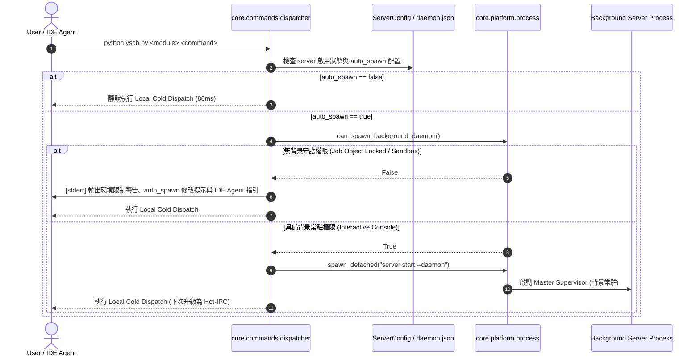

# 架構設計說明書 (Architecture Design)

> 功能名稱：Server 自動喚醒環境自適應降級與 Agents 導引提示 (Server Auto Spawn Adaptive Degrade & Agent Guidance)  
> 建立日期：2026-09-12  
> 所屬主計畫：無  
> 狀態：Confirmed  
> 模板版本：v1.2  

---

## 1. 模組架構分層與職責邊界 (Layered Architecture)

```text
+────────────────────────────────────────────────────────────────────────+
|                             CLI Dispatcher                             |
|  (core.commands.dispatcher: _maybe_auto_spawn_server)                  |
|                                                                        |
|  1. 讀取 Server Config (enable != false && auto_spawn != false)        |
|  2. 呼叫 can_spawn_background_daemon() 探針                             |
|       ├─ [Pass: True] ──> spawn_detached([sys.executable, ...])        |
|       └─ [Fail: False] ─> 輸出 stderr 警告與 Agent 指引 ➔ 靜默冷派發   |
+────────────────────────────────────────────────────────────────────────+
                               │
            ┌──────────────────┴──────────────────┐
            ▼                                     ▼
+──────────────────────────+        +──────────────────────────+
|  core.platform.process   |        |      server.config       |
|                          |        |                          |
| - can_spawn_background_  |        | - ServerConfig           |
|   daemon() (含記憶體快取) |        |   .auto_spawn (預設: True)|
| - IsProcessInJob / Probe |        |                          |
+──────────────────────────+        +──────────────────────────+
```

---

## 2. 核心資料流與循序圖 (Data Flow & Sequence Diagram)



---

## 3. 受影響檔案與新建檔案清單 (Impacted & New Files Inventory)

| 檔案路徑 | 類型 | 職責與變更說明 |
| :--- | :---: | :--- |
| `source/core/core/platform/process.py` | Modify | 實作 `can_spawn_background_daemon()` 探針與記憶體快取機制。 |
| `source/core/core/commands/dispatcher.py` | Modify | 升級 `_maybe_auto_spawn_server` 整合 `auto_spawn` 檢查、探針判斷與防洗頻 `stderr` 提示。 |
| `source/server/server/config.py` | Modify | 新增 `DEFAULT_AUTO_SPAWN = True` 與 `ServerConfig.auto_spawn` 欄位解析。 |
| `source/server/configurable/config.project.json` | Modify | 預置 `"auto_spawn": true` 預設範本。 |
| `source/core/tests/test_platform_process.py` | Modify | 新增 `can_spawn_background_daemon` 探針與快取單元測試。 |
| `source/core/tests/test_dispatcher.py` | Modify | 新增 `_maybe_auto_spawn_server` 自適應降級與 `auto_spawn` 測試。 |
| `source/server/tests/test_config.py` | Modify | 新增 `auto_spawn` 組態載入測試。 |

---

## 4. 架構決策記錄 (Architecture Decision Records)

- **[P02:DR-01] 探針檢測雙層階梯設計**：優先檢查環境變數 `YSCB_NO_DAEMON`；Windows 平台使用 `ctypes.windll.kernel32.IsProcessInJob` 檢測是否處於 Job Object。若處於 Job 內則執行 1 次輕量無害探針判斷 Breakaway 權限，結果持久快取於 `_CAN_SPAWN_DAEMON_CACHE`。
- **[P02:DR-02] 提示格式與頻道隔離**：提示訊息一律寫入 `sys.stderr`，格式標準化為 `[yscb:server] [WARN] ...`，並包含具體配置路徑與 Agent `IsDaemon` 指引。
