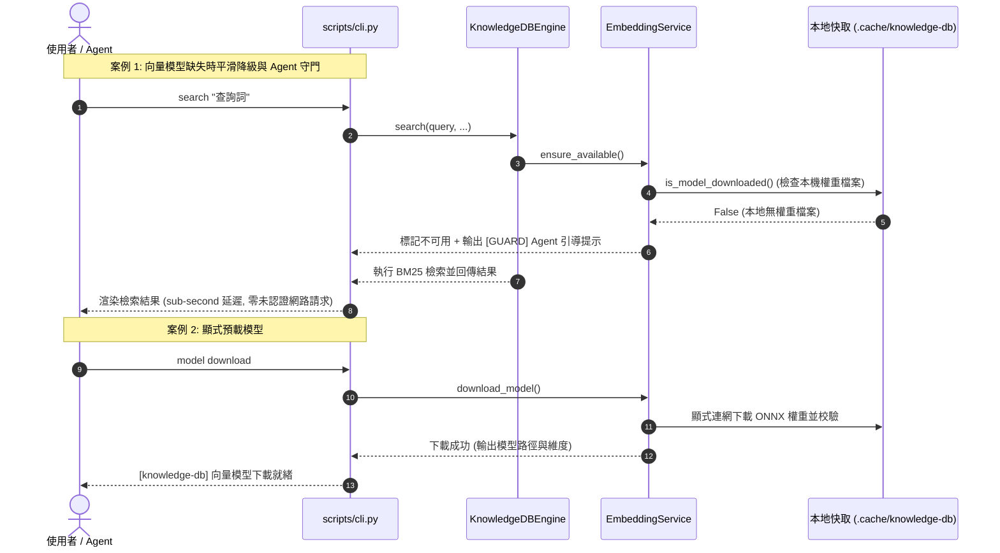

# 架構設計說明書 (Architecture Design)

> 功能名稱：sub_03_knowledge_db_cli_consolidation_and_model_management  
> 建立日期：2026-09-14  
> 所屬主計畫：2026_09_14_0455_downstream_feedback_remediation  
> 狀態：Draft  
> 模板版本：v1.2  

---

## 1. 模組架構分層與職責邊界 (Layered Architecture)

```text
+-----------------------------------------------------------------------------------+
|                            CLI Layer (scripts/cli.py)                             |
|  status (--scan) | index (--export) | search | callers | callees | impact | clean |
|                               model (status / download)                           |
+-----------------------------------------------------------------------------------+
                                         │ (dispatch)
+----------------------------------------▼------------------------------------------+
|                       Engine Layer (knowledge_db.engine)                          |
|  - status(scan=bool)                  - build_index(export_path=str)              |
|  - search(query, ...)                 - callers / callees / impact                |
+-----------------------------------------------------------------------------------+
             │                                              │
+------------▼-------------+                  +-------------▼-----------------------+
| InvertedIndex & Pipeline |                  |      EmbeddingService (embedding)   |
| (TF-IDF / BM25 Ranking)  |                  |  - is_model_downloaded() (Probe)    |
|                          |                  |  - download_model() (Explicit DL)   |
|                          |                  |  - _ensure_model() (Fallback Guard) |
+--------------------------+                  +-------------------------------------+
```

---

## 2. 核心資料流與循序圖 (Data Flow & Sequence Diagram)



---

## 3. 受影響檔案與新建檔案清單 (Impacted & New Files Inventory)

| 檔案路徑 | 類型 | 職責與變更說明 |
| :--- | :---: | :--- |
| `source/knowledge-db/contributes/core.json` | Modify | 刪除 `scan` 與 `bundle` 指令；在 `status` 擴充 `--scan`；在 `index` 擴充 `--export`；新增 `model` 指令群組（`status`、`download`）。 |
| `source/knowledge-db/scripts/cli.py` | Modify | 移除 `scan`、`bundle` 進入點；擴充 `status` 支援差異掃描；擴充 `index`；實作 `model` 指令群組路由與處理函式。 |
| `source/knowledge-db/knowledge_db/embedding.py` | Modify | 實作本地權重檔案探針 `is_model_downloaded()`；重構 `_init_model()` 平滑降級與 `[GUARD]` 引導輸出；新增 `download_model()` 方法。 |
| `source/knowledge-db/knowledge_db/engine.py` | Modify | 於 `status()` 支援 `scan` 差異整合，提供 `model` 操作轉發。 |
| `source/knowledge-db/tests/test_cli.py` | Modify | 淘汰舊指令測試，更新為 8 大新指令測試、`model` 指令測試與平滑降級測試。 |

---

## 4. 架構決策記錄 (Architecture Decision Records)

- **[P02:DR-01] 8 大正交指令集收斂**：徹底移除 `scan` 與 `bundle`，確立 `status`, `index`, `search`, `callers`, `callees`, `impact`, `clean`, `model` 為系統唯一標準指令集。
- **[P02:DR-02] 本地探針先行機制 (Local Probe First)**：在調用 `TextEmbedding` 前，先以純本機路徑檢測模型檔案是否存在。若不存在立即判定為不可用，從根本上切斷 Hugging Face Hub 的未認證外部請求。
- **[P02:DR-03] 剛性引導雙層通道**：當檢索發生降級且 `enable_vector_search: true` 時，提示訊息強制輸出至 `sys.stderr`，確保與檢索結果 (stdout) 分離，同時保障 Agent 能夠清晰感知。
