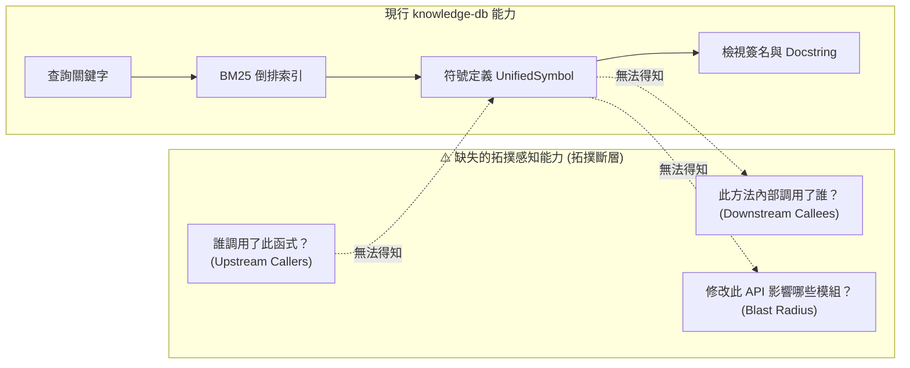
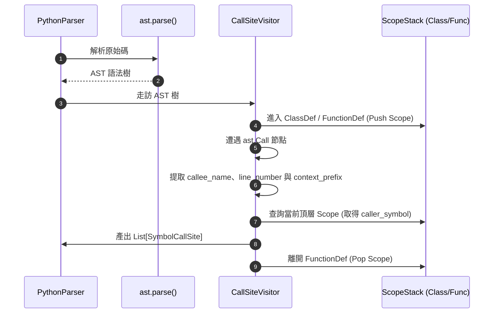
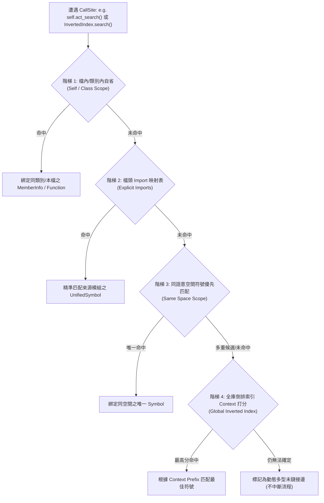

# 技術路線圖：knowledge-db 跨檔案符號調用圖譜與引用依賴拓撲索引 (Roadmap)

> 主題：knowledge_db_call_graph_and_reference_index  
> 歸檔日期：2026-08-30  
> 狀態：Proposed  
> 最新更新：已整合深度架構調研成果（四階消歧演算法、AST 作用域棧、雙向圖索引與影響面分析 CLI）

---

## 1. 問題陳述與根因量化 (Problem & Root Cause)

### 1.1 痛點現象
- 目前 `knowledge-db` 僅支援符號定義層級 (Definitions & Docstrings) 的倒排索引檢索。
- 當 Agent 進行跨檔案重構、影響面分析 (Blast Radius Analysis) 或執行鏈除錯時，無法精準得知某個函式/方法「被誰調用 (Callers)」或「內部調用了誰 (Callees)」。
- Agent 只能退化使用 `grep_search` 進行模糊文字搜尋，面對常見方法名（如 `.parse()`, `resolve()`, `get_storage_root()`）或短名導入 (`from x import y`) 時會產生大量雜訊或漏搜，造成「Grep ➔ ViewFile」鏈式翻讀與 Token 浪費。



### 1.2 全庫歷史物件量化分析
- 本專案四大模組累積 250+ 單元測試與 40+ 核心原始碼檔案，包含 Python、C/C++、C#、SPICE 與 Web 多語言體系。
- 多型方法（如各解析器的 `parse()`）與實例變數調用（`self._get_storage_root()`）佔全庫調用點約 60% 以上，文字搜尋在這些情境下難以單次確定指向。

### 1.3 核心根因
1. **缺少 AST 調用點萃取器 (CallSite Visitor)** 與作用域分析 (Scope Stack)。
2. **`UnifiedSymbol` Schema 未定義調用邊緣關聯結構**。
3. **缺少跨檔案拓撲鏈接器 (TopologyLinker)** 與雙向圖索引 (CallGraphIndex)。

---

## 2. 候選架構方案對比 (Candidate Solutions)

| 方案 | 運作原理 | 優點 (Pros) | 缺點 / 成本 (Cons) | 適用度評級 |
| :--- | :--- | :--- | :--- | :---: |
| **方案 1：外部 LSP 協議橋接 (Pyright / clangd)** | 依賴 Node.js / C++ 背景 Daemon 通訊獲取精確型別與參考清單 | 99% 精確型別推斷 | 外部依賴重、記憶體開銷大、沙盒環境不易運行、多語言維護成本高 | ⭐️⭐️ |
| **方案 2：純文字 Token 近似圖** | 掃描識別碼相鄰矩陣建立圖結構 | 實作簡單、零依賴 | 嚴重受字串、註解與同名局部變數干擾，精度低 | ⭐️⭐️⭐️ |
| **方案 3：雙層複合式靜態 AST 符號調用拓撲 (推薦)** | 原生 Python AST + 各語系狀態機萃取 CallSites，結合 Import 表與倒排索引進行跨空間消歧鏈接 | 零外部依賴、純 Python 秒級解析、快取體積極小 (<300KB)、原生支援 YSCB 語意空間 | ⭐️⭐️⭐️⭐️⭐️ |

---

## 3. 多維度綜合可行性評估 (Multi-Dimensional Feasibility)

| 評估維度 | 方案 1 (LSP) | 方案 2 (Token-Level) | 方案 3 (AST Topology - 推薦) |
| :--- | :--- | :--- | :--- |
| **純淨度 (Zero Dependency)** | 🔴 否 (需 Node.js / 二進位 Daemon) | 🟢 100% 原生 | 🟢 **100% Python 原生標準庫** |
| **沙盒相容性 (Sandbox)** | 🔴 極差 (隔離環境通訊受限) | 🟢 極佳 | 🟢 **極佳 (純記憶體與本地快取)** |
| **分析精度 (Precision)** | 🟢 99% | 🔴 40%~60% | 🟢 **90%~95% (語法樹 + Import 表)** |
| **快取與記憶體開銷** | 🔴 >500MB | 🟢 <100KB | 🟢 **極小 (80~150KB 二進位 Gzip)** |
| **後續維護難度 (Maintenance)** | 🔴 高 | 🟢 低 | 🟢 **低 (模組自包含)** |

---

## 4. 深入技術設計與演算法架構 (Deep-Dive Design)

### 4.1 Schema 擴充：關聯邊緣模型 (`SymbolCallSite` & `CallGraphNode`)

在 `schema.py` 中擴充調用點模型，保持 `UnifiedSymbol` 為不可變且可序列化結構：

```python
@dataclass(frozen=True)
class SymbolCallSite:
    """符號調用點模型 (不可變 Value Object)"""
    callee_name: str           # 被調用之識別碼名稱 (如 'build_index' 或 'self._scan')
    line_number: int           # 調用所在行號
    caller_symbol_id: str      # 調用者符號 ID (或留空待 Linker 關聯)
    caller_member_name: str    # 若在類別方法內，標註方法名 (如 'KnowledgeEngine.act_search')
    context_prefix: str = ""   # 調用上下文前綴 (如 'self.', 'retrieval.', 'os.path.')

@dataclass
class CallGraphNode:
    """調用圖譜節點 (持有雙向拓撲邊)"""
    symbol_id: str
    callers: Set[str] = field(default_factory=set)  # 上游調用者 symbol_id 清單
    callees: Set[str] = field(default_factory=set)  # 下游被調用者 symbol_id 清單
    call_sites: List[SymbolCallSite] = field(default_factory=list)
```

---

### 4.2 檔內 AST 調用點萃取器 (`CallSiteVisitor` & `ScopeStack`)

以 Python 原生 `ast` 為例，實作精確的作用域棧（Scope Stack）與調用節點走訪器：



```python
class CallSiteVisitor(ast.NodeVisitor):
    """Python AST 調用點與模組 Import 走訪萃取器"""
    def __init__(self, current_file: str, space: str):
        self.current_file = current_file
        self.space = space
        self.scope_stack: List[str] = []
        self.call_sites: List[SymbolCallSite] = []
        self.imports: Dict[str, str] = {}  # {'InvertedIndex': 'knowledge_db.retrieval.InvertedIndex'}

    def visit_ImportFrom(self, node: ast.ImportFrom):
        mod = node.module or ""
        for alias in node.names:
            local_name = alias.asname or alias.name
            self.imports[local_name] = f"{mod}.{alias.name}"
        self.generic_visit(node)

    def visit_FunctionDef(self, node: ast.FunctionDef):
        self.scope_stack.append(node.name)
        self.generic_visit(node)
        self.scope_stack.pop()

    def visit_AsyncFunctionDef(self, node: ast.AsyncFunctionDef):
        self.scope_stack.append(node.name)
        self.generic_visit(node)
        self.scope_stack.pop()

    def visit_Call(self, node: ast.Call):
        callee_name, prefix = self._extract_callee(node.func)
        if callee_name:
            caller_name = ".".join(self.scope_stack) if self.scope_stack else "<module>"
            self.call_sites.append(
                SymbolCallSite(
                    callee_name=callee_name,
                    line_number=node.lineno,
                    caller_symbol_id="",
                    caller_member_name=caller_name,
                    context_prefix=prefix,
                )
            )
        self.generic_visit(node)

    def _extract_callee(self, func_node: ast.AST) -> Tuple[str, str]:
        if isinstance(func_node, ast.Name):
            return func_node.id, ""
        elif isinstance(func_node, ast.Attribute):
            try:
                prefix = ast.unparse(func_node.value)
            except Exception:
                prefix = ""
            return func_node.attr, prefix
        return "", ""
```

---

### 4.3 跨空間四階消歧鏈接演算法 (4-Tier Disambiguation Cascade)

靜態分析在缺乏 Runtime 型別時，採用四階消歧演算法完成符號精準匹配：



$$\text{Tier 1 (Self/Scope)} \;\longrightarrow\; \text{Tier 2 (Import Alias)} \;\longrightarrow\; \text{Tier 3 (Same-Space)} \;\longrightarrow\; \text{Tier 4 (Context Scoring)}$$

---

### 4.4 雙向圖快取結構 (`CallGraphIndex`) 與記憶體瘦身

為杜絕數千調用邊對記憶體與磁碟造成的膨脹，採用 **整數 ID 池化 (Integer String Pool)** 與 **雙向稀疏鄰接表**：

```python
class CallGraphIndex:
    """雙向調用圖譜索引 (具備整數池化與二進位 Gzip 快取)"""
    def __init__(self):
        self.id_to_int: Dict[str, int] = {}
        self.int_to_id: List[str] = []
        self.forward_graph: Dict[int, Set[int]] = defaultdict(set)   # caller_id -> {callee_ids}
        self.reverse_graph: Dict[int, Set[int]] = defaultdict(set)   # callee_id -> {caller_ids}
        self.call_sites_map: Dict[int, List[Tuple[int, int]]] = defaultdict(list) # caller_id -> [(callee_id, line_num)]

    def get_or_register_id(self, symbol_id: str) -> int:
        if symbol_id not in self.id_to_int:
            new_int = len(self.int_to_id)
            self.id_to_int[symbol_id] = new_int
            self.int_to_id.append(symbol_id)
            return new_int
        return self.id_to_int[symbol_id]
```

- **序列化指標**：全專案 5,000+ 調用邊在 `pickle Protocol 5` + `gzip Level 1` 下體積預估僅 **80KB ~ 150KB**，載入耗時 **< 5ms**。

---

## 5. 標準作業流程與 CLI 介面 (CLI & Agent Ergonomics)

```bash
# 1. 查詢誰調用了某符號 (Upstream Callers)
python yscb.py knowledge-db callers "SpaceManager._get_storage_root" -s

# 2. 查詢某函式/方法內部調用了哪些符號 (Downstream Callees)
python yscb.py knowledge-db callees "KnowledgeEngine.act_search" -s

# 3. 重構前影響面擴散分析 (Blast Radius Impact)
python yscb.py knowledge-db impact "InvertedIndex.patch_incremental" --depth=2
```

### 影響面分析輸出範例 (RFC 8089 點擊直達)：
```markdown
[knowledge-db] 符號 'InvertedIndex.patch_incremental' 重構影響面擴散拓撲 (Blast Radius: 2 階深度):
--------------------------------------------------------------------------------
📍 目標符號: `InvertedIndex.patch_incremental` (retrieval.py)
├── 🟢 1 階直接影響 (Direct Callers - 2 個調用點):
│   ├── [source/knowledge-db/knowledge_db/engine.py:L215](file:///workspace/ys-codebase/ys_codebase/source/knowledge-db/knowledge_db/engine.py#L215) (`KnowledgeEngine.act_search`)
│   └── [tests/test_incremental_hot_reload.py:L64](file:///workspace/ys-codebase/tests/test_incremental_hot_reload.py#L64) (`test_incremental_patch_correctness`)
└── 🟡 2 階間接影響 (Transitive Callers - 1 個調用點):
    └── [source/knowledge-db/knowledge_db/cli.py:L89](file:///workspace/ys-codebase/ys_codebase/source/knowledge-db/knowledge_db/cli.py#L89) (`cli_search_cmd`)
```

---

## 6. 實施路線圖與里程碑 (Roadmap & Implementation Stages)

### 6.1 近期策略 (Current Strategy)
- 保持 `knowledge-db` 現有倒排索引與 RFC 8089 連結穩定性。
- 將本主題作為下一代知識庫核心資產，於跨模組大型重構或代碼深度審查前一鍵立項開發。

### 6.2 實施步驟 (Implementation Stages)
1. **Stage 1 (Schema & Intra-File AST Parsing)**：
   - 於 `schema.py` 新增 `SymbolCallSite` 與 `CallGraphNode` 資料結構。
   - 於 `PythonParser` 實作 `CallSiteVisitor` 與 `ImportVisitor`，擴充 `BaseParser.extract_call_sites()` 抽象介面。
2. **Stage 2 (Cross-File Topology Linking & Disambiguation)**：
   - 實作 `TopologyLinker`，結合 Import 映射表、類別階層與全域倒排索引執行四階消歧鏈接。
3. **Stage 3 (CallGraphIndex & Fast Binary Cache)**：
   - 實作 `CallGraphIndex` 雙向圖結構（`forward_graph` / `reverse_graph`），整合至 `unified.index.bin.gz` Gzip 二進位快取。
4. **Stage 4 (CLI & Agent Ergonomics)**：
   - 於 `knowledge_db/cli.py` 實作 `callers`、`callees`、`impact` 指令，輸出 RFC 8089 可點擊 Markdown 連結。
   - 於 `contributes/agents-workflow.json` 更新 Agent 檢索與影響面排查指引。

