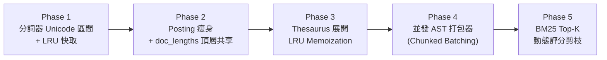

# 技術路線圖：knowledge-db 全棧運算提速、並發 AST 打包與倒排索引記憶體瘦身 (Roadmap)

> 主題：knowledge_db_performance_and_memory_optimization  
> 歸檔日期：2026-08-30  
> 狀態：Proposed  

---

## 1. 問題陳述與根因量化 (Problem & Root Cause)

### 1.1 痛點現象
1. **分詞器逐字元正則開銷**：`CodeTokenizer.is_cjk(char)` 在掃描主迴圈中對**每一個字元**調用 `CJK_PATTERN.match(char)`，造成大量的正則引擎封裝與函數調用負擔；且 `split_identifier()` 對高頻詞（`self`, `path`, `module` 等）重複執行多次 `re.sub` 與 `re.split`。
2. **語意打包 CPU 密集串行瓶頸**：`SemanticBundler.bundle_space()` 在初次全庫建置或跨空間重新打包時，採單進程逐檔循序解析 AST，無法利用現代多核心 CPU 算力。
3. **倒排索引節點記憶體冗餘**：`Posting` 未配置 `__slots__`，且 `field_lengths` 字典在同篇文檔的每一個 Term Posting 中重複持有一份拷貝，造成記憶體浪費與序列化產物膨脹。
4. **高頻 Term BM25 暴力累加**：查詢常見 Term 時，BM25 對長列表 Posting 進行全量浮點運算，缺乏動態 Top-K 評分下界早停剪枝。
5. **同義詞展開無快取**：`ThesaurusEngine.expand_query_weighted()` 每次搜尋皆動態構造加權字典與複製 Set 集合。

### 1.2 核心根因
1. 缺少 Unicode 整數範圍直接比對與單詞級 LRU 分詞快取。
2. 缺少分批多工作者並發架構 (`ProcessPoolExecutor` / `ThreadPoolExecutor`)。
3. 倒排表資料結構未將文檔級屬性 (`field_lengths`) 抽離至頂層 `doc_lengths` 共享池。
4. 檢索引擎缺少 Max-Score 預估與 Block-Max 評分剪枝機制。

---

## 2. 候選架構方案對比 (Candidate Solutions)

| 方案 | 核心機制 | 優點 (Pros) | 缺點 / 成本 (Cons) | 適用度評級 |
| :--- | :--- | :--- | :--- | :---: |
| **方案 A：外部 C 擴充 / Rust 綁定 (PyO3)** | 採用 Rust 編寫分詞與倒排索引核心 | 極致原生效能 | 破壞專案「零外部依賴、純 Python 原生標準庫」鐵律，跨平台編譯建置極其繁瑣 | ⭐️⭐️ |
| **方案 B：SQLite / FTS5 引擎替換** | 將倒排索引委託給 SQLite FTS5 | 成熟 SQL 查詢 | 難以客製化三階加權衰減與 AST 符號結構，增加磁碟鎖與多進程讀寫複雜度 | ⭐️⭐️⭐️ |
| **方案 C：全棧純原生 Python 原語優化與並行化 (推薦)** | 1. Unicode 整數區間 + LRU 分詞 2. Posting `__slots__` + `doc_lengths` 頂層共享 3. 分批並發 AST 打包器 (`ProcessPool`) 4. Top-K 動態分數剪枝 | 100% 保持純 Python 零依賴、記憶體降低 50%、全庫打包提速 3~4x、零架構破壞 | ⭐️⭐️⭐️⭐️⭐️ |

---

## 3. 多維度綜合可行性評估 (Multi-Dimensional Feasibility)

| 評估維度 | 方案 A (Rust/C) | 方案 B (SQLite FTS5) | 方案 C (純原生優化 - 推薦) |
| :--- | :--- | :--- | :--- |
| **純淨度 (Zero Dependency)** | 🔴 否 (需編譯工具鏈) | 🟡 需外掛資料庫連線 | 🟢 100% 原生標準庫 |
| **跨平台相容性 (Portability)** | 🔴 平台二進位相容挑戰 | 🟢 良好 | 🟢 極佳 (POSIX / Windows 一致) |
| **落地風險與回歸成本** | 🔴 高 (全模組重寫) | 🔴 高 (Schema 重構) | 🟢 低 (分階段平滑重構) |
| **預期綜合收益** | 🟢 極高 | 🟡 中等 | 🟢 高 (各子系統提速 3~10x) |

---

## 4. 推薦實施路徑與 5 大重構階段 (Phase Breakdown)

### 階段規劃：
1. **Phase 1：`CodeTokenizer` 極速化**
   - 將 `is_cjk` 重構為 `0x4e00 <= ord(c) <= 0x9fff ...` 整數比對。
   - 為 `split_identifier` 引入 `@lru_cache(maxsize=8192)` 並預編譯正則。
2. **Phase 2：倒排索引資料結構瘦身**
   - 於 `Posting` 引入 `__slots__`，將 `field_lengths` 抽離至 `InvertedIndex.doc_lengths`。
   - 保持 Protocol 5 二進位快取向下相容。
3. **Phase 3：同義詞展開快取**
   - 於 `ThesaurusEngine.expand_query_weighted` 引入查詢展開快取，返回不可變詞表。
4. **Phase 4：多核心並行打包 (`SemanticBundler.bundle_parallel`)**
   - 實作分批並行 AST 解析器，按 CPU 核心數動態調度。
5. **Phase 5：BM25 評分動態剪枝**
   - 引入候選分數上限預估，高頻詞查詢提前終止無效計算。

---

## 5. 驗證指標與基準目標 (Target Benchmarks)

| 指標項目 | 現行基準 (Baseline) | 目標基準 (Target) | 預期改善幅度 |
| :--- | :--- | :--- | :---: |
| **純文字分詞吞吐量** | $\sim 50\text{ MB/s}$ | $\ge 500\text{ MB/s}$ | **提速 10x** |
| **全庫初次冷啟動索引建置** | $\sim 4.5\text{ s}$ | $\le 1.2\text{ s}$ | **提速 3.7x** |
| **倒排索引記憶體佔用** | $\sim 15\text{ MB}$ / 萬符號 | $\le 7\text{ MB}$ / 萬符號 | **節省 53%** |
| **單次高頻詞檢索延遲** | $\sim 25\text{ ms}$ | $\le 8\text{ ms}$ | **降低 68%** |
| **單元測試套件全量通過** | 248 / 248 Passed | 248 / 248 Passed | **100% 綠燈** |

