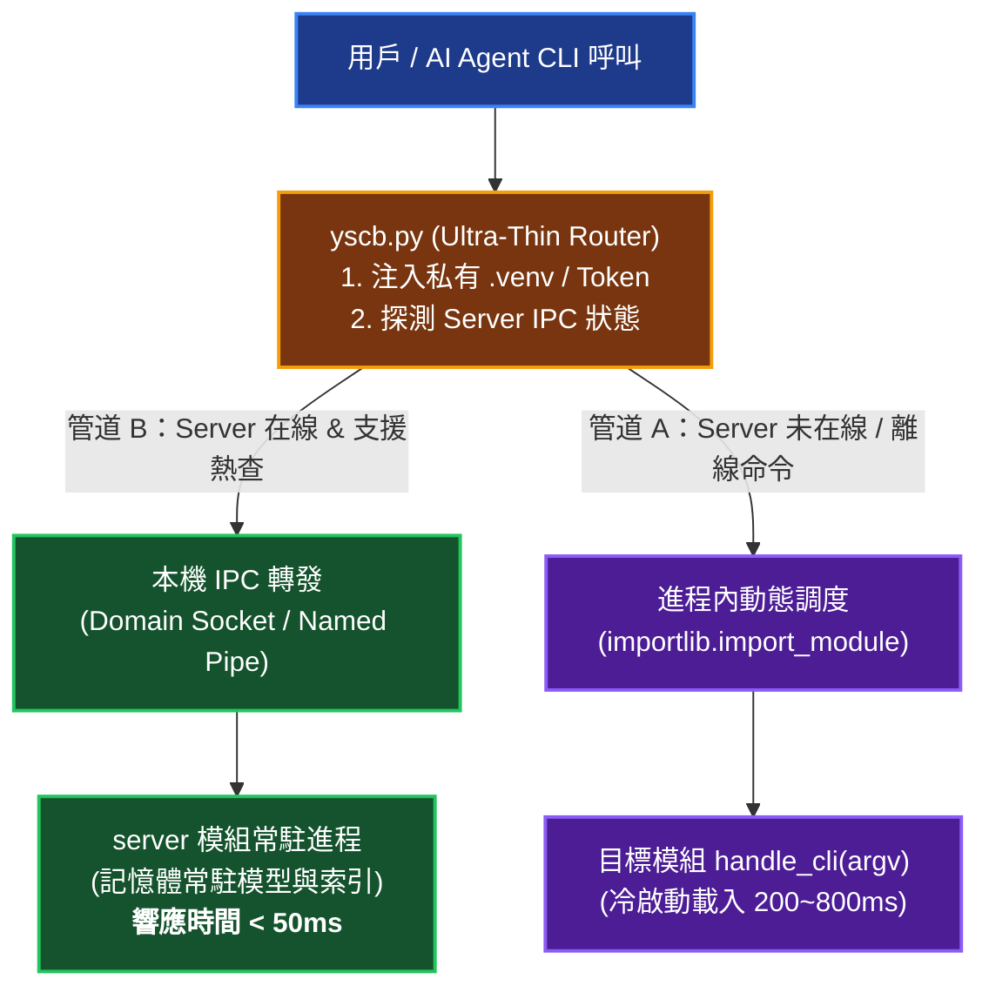

# 技術路線圖：宿主入口極簡瘦身與雙管道派發架構 (Roadmap)

> 主題：宿主入口極簡瘦身與雙管道派發架構  
> 歸檔日期：2026-09-06  
> 狀態：Implemented (已於 sub_07_yscb_host_slimming_and_dual_channel_dispatch 全面實作並落地)  

---

## 1. 問題陳述與職責收斂 (Problem & Responsibility Boundary)

### 1.1 痛點現象
`yscb.py` 原本定位為 **Ultra-Thin Single-File Host Bootstrapper & CLI Router**（零第三方依賴、純 Python 標準庫）。然而隨著專案演進，目前已膨脹至 **960 行**，吸收了大量本應屬於 `core` 模組的業務邏輯：
1. **套件批量還原邏輯** (`cmd_restore` / `_restore_module_package`，約 160 行)：本質是套件管理器職責，應由 `core` 統一處理。
2. **Git 忽略規則維護** (`_generate_internal_gitignore`，約 55 行)：應下沉至 `core` 的環境初始化與自愈生命週期。
3. **全域 Help 遍歷** (`_get_installed_module_commands` / `_print_global_help`，約 85 行)：手動解析各模組 `manifest.json`，侵犯了 `core` 的 `contributes` 聚合引擎職責。
4. **事件清冊查詢** (`cmd_event`，約 45 行)：硬編碼於宿主腳本，實質上只是 `core.events` 的代理。
5. **更新檢查與提示** (`_check_and_show_update_tips`，約 30 行)：應作為 `core` 的後置鉤子。

### 1.2 預期核心職責收斂 (Target Responsibilities)
`yscb.py` 預期徹底瘦身至 **200 ~ 250 行**，僅保留以下 3 大核心職責與安全護欄：
1. **唯一入口與執行環境注入**：
   - 探測並動態注入私有微虛擬環境搜尋路徑 (`sys.path.insert(0, site_pkg)`)。
   - 注入環境變數 `YSCB_HOST_DIR`、`PYTHONUNBUFFERED=1`。
   - **安全認證標記注入**：注入 `YSCB_HOST_DISPATCH_TOKEN`，為模組入口剛性防繞道守衛提供防偽簽名。
2. **初始化時特例自舉拉取 core 模組**：
   - 僅在 `python yscb.py init <root>` 時，因環境尚無任何模組，保留最小限度之 zip 解壓/下載能力拉取 `core`。
   - 一旦 `core` 就位，所有其餘包管理（`install`、`update`、`remove`、`restore`）全面委託給 `core`。
3. **雙管道 CLI 指令分派 (Dual-Channel Dispatch)**：
   - **管道 A (冷啟動進程內派發)**：若 `server` 未啟動或為離線指令，以 `importlib` 動態載入目標模組之 `handle_cli` 介面。
   - **管道 B (熱轉發至 server 模組)**：若後台 `server` 守護進程在線且指令適配熱轉發，透過極速本機 IPC（Domain Socket / Named Pipe）轉發請求並串流回傳，實現 sub-50ms 響應。
   - **退出碼剛性透傳 (Exit Code Passthrough)**：保證任何管道的 exit code 原樣回傳給 Shell。
4. **極簡全域說明與拼寫建議**：
   - 保留標準庫 `difflib` 給出未知指令的模糊建議。
   - `python yscb.py --help` 直接委託給 `dispatch_module("core", ["help"])` 輸出全域格式化說明。

---

## 2. 雙管道派發架構拓撲 (Dual-Channel Dispatch Topology)

---

## 3. 多維度綜合可行性評估 (Multi-Dimensional Feasibility)

| 評估維度 | 現狀 (960 行單體) | 瘦身後雙管道架構 (250 行) |
| :--- | :--- | :--- |
| **代碼體積與維護性** | 960 行，責任混雜，排查困難 | **~250 行，純淨路由，職責極其專一** |
| **CLI 響應延遲 (UX)** | 每次皆冷啟動載入 (1500~3000ms) | **熱轉發通道下達到 sub-50ms 極速體驗** |
| **微核心純粹度** | 宿主腳本侵入包管理與 Git 規則 | **所有業務下沉至 core，符合微核心分層** |
| **跨平台相容性** | 依賴單進程 runpy | **支援 IPC 轉發與進程內 fallback 雙保險** |

---

## 4. 業務下沉對應清冊 (Logic Offloading Matrix)

| 現有 `yscb.py` 邏輯區塊 | 預估行數 | 下沉目標模組與位置 | 說明 |
| :--- | :---: | :--- | :--- |
| `cmd_restore` / `_restore_module_package` | ~160 行 | `core.package` | 模組批量還原應由 core 套件管理中樞負責 |
| `_generate_internal_gitignore` | ~55 行 | `core.vfs` / `core.env` | 環境初始化與自癒時自動維護 |
| `_get_installed_module_commands` / 全域 Help | ~85 行 | `core.contributes` | 透過 core contributes 聚合引擎動態產出 Help |
| `cmd_event` | ~45 行 | `core.events` | `yscb.py` 僅派發 `core event list` |
| `_check_and_show_update_tips` | ~30 行 | `core` (post-dispatch hook) | 模組更新檢查屬於 core 運行期鉤子 |

---

## 5. 實施路線圖與里程碑 (Roadmap & Stages)

### 5.1 近期策略 (Current Strategy)
於全生態系整體重構模式下，先完成 `core` 模組的業務承接能力（VFS、package、contributes），隨後對 `yscb.py` 進行安全重構。

### 5.2 實施步驟 (Implementation Stages)
1. **Stage 1 (Core 承接層擴充)**：於 `core` 實現 `restore`、`help` 格式化與 `gitignore` 維護命令。
2. **Stage 2 (yscb.py 瘦身重構)**：剝除冗餘邏輯，將 `yscb.py` 壓縮至 250 行以內，注入安全 Token。
3. **Stage 3 (雙管道調度實裝)**：串接 `server` 模組的 IPC 接口，實現熱轉發與進程內調度自動切換。
4. **Stage 4 (全系統回歸驗證)**：驗證冷啟動與熱轉發的 Exit Code 透傳與相容性。
