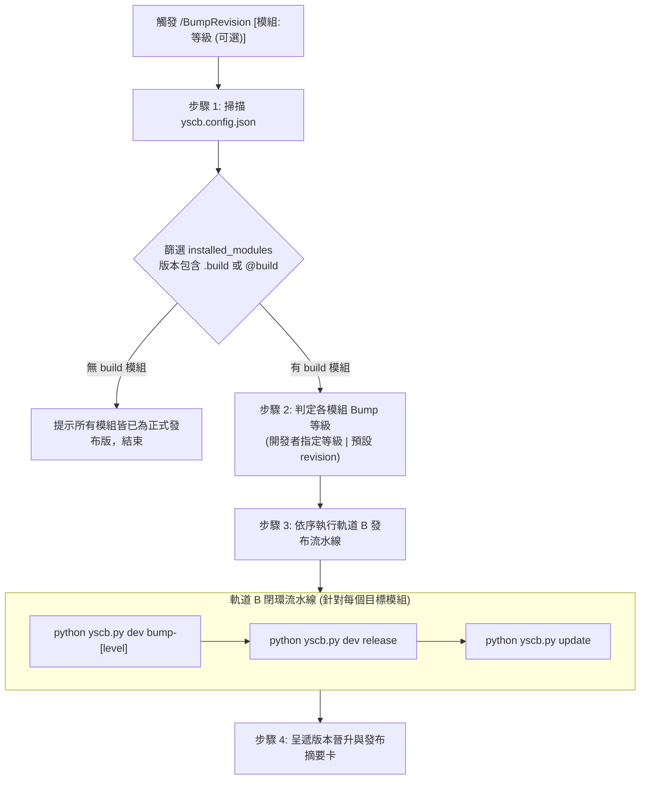

# 專案版本晉升與發布工作流 (BumpRevision)

本 Workflow 為專案特化工作流，用於掃描 [yscb.config.json](`__${project://yscb.config.json}__`) 中的已安裝模組清單 (`installed_modules`)，自動篩選所有處於 `@build` 本機開發狀態的模組，並依序執行版本晉升 (Version Bump)、正式打包 (Release) 與自部署更新 (Update)。

---

## 🎯 核心原則與適用情境 (Scope & Axioms)

1. **專案特化發布自動化 (Automated Track B Pipeline)**：
   - 快速收斂日常 `@build` 模組，完成版本遞增、產出發布包並更新環境。
2. **靈活版本升級策略 (Flexible Bump Hierarchy)**：
   - 預設升級等級為 `revision` (`python yscb.py dev bump-revision <module>`)。
   - 支援開發者於指令中顯式指定特定模組之升級等級（如 `/BumpRevision core:patch knowledge-db:minor`）。
3. **安全發布與免測部署 (No Redundant Post-Install Tests)**：
   - 打包發布後直接調用 `python yscb.py update <module>` 進行物化同步，無需且嚴禁重複調用測試。

---

## 🚀 執行步驟 (4-Step Execution Pipeline)



### 步驟 1：掃描 `yscb.config.json` 與篩選目標模組 (Scan & Filter)

1. 檢視專案根目錄之 [yscb.config.json](`__${project://yscb.config.json}__`)。
2. 檢查 `installed_modules` 物件中的各模組 `version` 欄位。
3. 篩選所有版本包含 `.build` 或 `@build` 的模組清單（例：`"core": { "version": "1.0.2.build" }`）。
4. 若無任何 `@build` 模組，向開發者呈報：「目前所有模組皆已為正式發布版本，無需執行版本晉升」，並結束流程。

---

### 步驟 2：判定各模組 Bump 等級 (Bump Level Decision)

1. 檢查開發者調用 `/BumpRevision` 時所提供的參數。
2. 比對是否有指定特定模組之升級等級：
   - 支援等級：`revision`、`patch`、`minor`、`major`。
   - 格式範例：`/BumpRevision core:patch knowledge-db:minor`
3. 規則：
   - 若開發者有指定特定模組等級 ➔ 採用指定等級。
   - 未指定之模組 ➔ 預設採用 `revision` (`dev bump-revision <mod>`)。

---

### 步驟 3：依序執行版本晉升、發布與更新 (Bump, Release & Update)

依模組依賴拓撲順序（`core` ➔ `knowledge-db` ➔ `agents-workflow` ➔ `dev`）依序對每一個目標模組執行以下指令：

1. **版本遞增**：
   ```bash
   python yscb.py dev bump-[revision|patch|minor|major] <module>
   ```
2. **正式打包發布**：
   ```bash
   python yscb.py dev release <module>
   ```
3. **本機自部署更新**：
   ```bash
   python yscb.py update <module>
   ```

---

### 步驟 4：呈遞版本晉升成果摘要卡 (Summary & Output)

向開發者呈遞結構化更新摘要表：

```markdown
# 🚀 模組版本晉升與發布完成報告 (Bump & Release Summary)

| 模組名稱 | 升級前版本 (@build) | 晉升等級 | 發布後正式版本 | 更新狀態 |
| :--- | :---: | :---: | :---: | :---: |
| `[module_1]` | `[old_version]` | `[revision|patch|...]` | `[new_version]` | `✅ 已發布並更新` |
| `[module_2]` | `[old_version]` | `[revision|patch|...]` | `[new_version]` | `✅ 已發布並更新` |

- **發布通道**：正式發布通道 (`ys_codebase/release/`)
- **環境狀態**：已同步更新至 `yscb.config.json`
```
