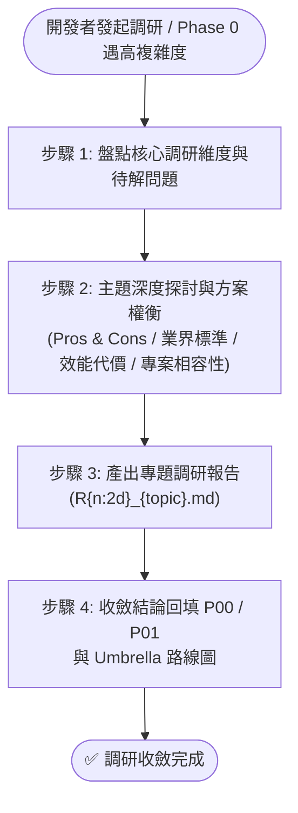

> [!NOTE]
> ### 🧭 專案語意 URI 即時解析地圖 (JIT Dynamic Context)
> 本專案已註冊之語意 URI 實體路徑如下：
> 
> | 語意 URI 協議 | 當前專案實體路徑 (相對於專案根目錄) | 狀態 |
> | :--- | :--- | :--- |
> | **`project://`** | `./` | `[ACTIVE]` |
> | **`yscb://`** | `./ys_codebase` | `[ACTIVE]` |
> | **`plans://`** | `./plans` | `[!UNDEFINED]` |
> | **`archive://`** | `./archive` | `[!UNDEFINED]` |
> | **`docs://`** | `./docs` | `[!UNDEFINED]` |
> 
> 🛠️ **CLI 動態解析指令**：`python yscb.py uri resolve <uri>`（例：`python yscb.py uri resolve project://AGENTS.md`）

# 深度技術調研工作流 (Research)

本 Workflow 用於針對高複雜度、新技術選型、演算法可行性或跨模組大型架構演進進行深度論證與客觀對比。所有階段的執行規範請嚴格遵循 [標準開發作業流程 (NewPlan)](`__#{module://agents-workflow/assets/workflows/NewPlan.md}__`)。

---

## 🎯 核心原則與雙軌生命週期

1. **觸發紀律（防 Agent 越權）**：
   - **僅被動觸發**：獨立前置調研**僅能在開發者主動提出探討需求或下達顯式指令（如 `/Research [主題]`）時方可進行**，Agent 嚴禁在未經要求下擅自脫離當前任務發起調研。
2. **雙軌生命週期 (Transient 快取 vs. Persistent 建檔)**：
   - **情境 A：獨立前置調研 (Pre-research)**：未開立 Idea 或 Plan 前，隨問隨答、方案對比論證**僅保留於對話與 IDE 快取中，不主動在磁碟建立檔案**。
   - **情境 B：正式固化建檔 (Promoted to File)**：唯有開發者明確指示「開立 Idea」或「開立 Dev Plan 進入 SOP」時，才將調研內容結構化寫入磁碟：
     - 若已開立 Dev Plan ➔ 寫入計畫目錄下的 `R{n:2d}_{topic}.md`（如 `R01_architecture_reference.md`）。
     - 若開立 Idea ➔ 整合進 `workflow.plans://ideas/` 對應的構想文檔中。
3. **免除死板模板束縛 (Freedom from Rigid Templates)**：
   - 依標準模板 [`RXX_research_report.md`](`__#{module://agents-workflow/assets/templates/RXX_research_report.md}__`) 建立檔案，維持頂部標準元數據 Header，正文格式依主題特性自由排版論述（對比表、拓撲/時序圖、PoC 範例、明確結論）。
4. **標準前綴命名規範**：
   - 調研報告統一採用標準前綴：**`R{n:2d}_{topic}.md`**。

---

## 🚀 執行步驟

### 步驟 1：盤點核心調研維度 (Problem Statement & Dimensions)
- 與開發者共同梳理出本次調研需要攻堅的具體核心問題與技術維度。

---

### 步驟 2：主題深度探討與方案權衡 (In-Depth Exploration)
- Agent 作為架構顧問展開開放式探討：
  - 橫向比對業界成熟實踐與既有方案。
  - 客觀分析不同方案的優缺點 (Pros & Cons)、資源代價與已知坑點。
  - 結合專案現況給出客觀評價。

---

### 步驟 3：產出專題調研報告 (`R{n:2d}_{topic}.md`)
- 達成共識後，若處於 Dev Plan 流程中，依標準模板 [`RXX_research_report.md`](`__#{module://agents-workflow/assets/templates/RXX_research_report.md}__`) 建立 `R01_{主題簡稱}.md`。
- **報告核心要素**：
  1. 標準 Header 元數據。
  2. 背景痛點與調研目標。
  3. 候選方案評估矩陣 (Candidate Options Matrix)。
  4. 關鍵維度深入分析（Mermaid 圖、PoC 程式碼或 Benchmark）。
  5. 明確結論與推薦落地方案。
- **產出約束**：嚴禁將模板開頭的 HTML 導引註解輸出至目標文件中。

---

### 步驟 4：收斂結論與回填 (Synthesis)
- 將調研形成的**核心公理、不可破壞之約束與架構決策**收斂回填：
  1. 回填至 [`P00_semantic_requirements.md`](`__#{module://agents-workflow/assets/templates/P00_semantic_requirements.md}__`) 與 [`P01_requirements_spec.md`](`__#{module://agents-workflow/assets/templates/P01_requirements_spec.md}__`)。
  2. 若為大型任務，作為 [`umbrella_overview.md`](`__#{module://agents-workflow/assets/templates/umbrella_overview.md}__`) 子計畫拆分與依賴路線圖的依據。

---

