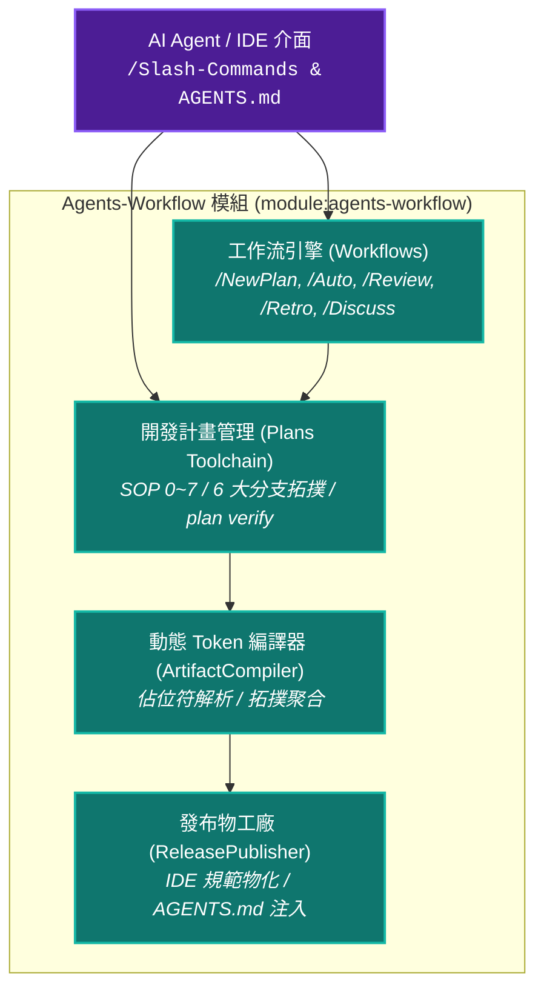
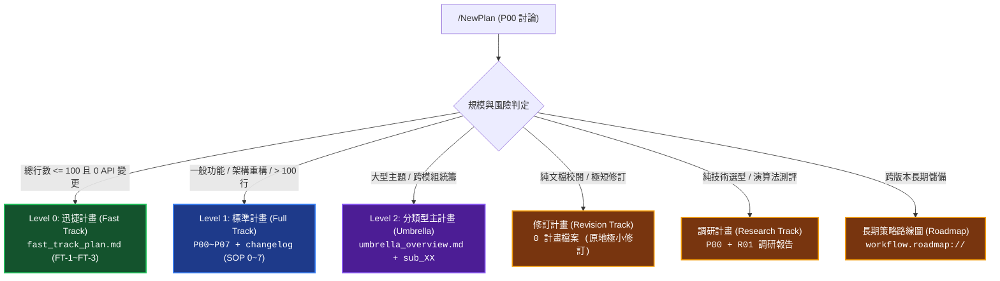

# YS-Codebase Agents-Workflow 工作流與規範模組 (AI Agent Workflow Engine)

> 模組名稱：`agents-workflow`  
> 職責定位：AI Agent 工作流框架。提供 Slash Commands 工作流、SOP 0~7 開發流程、計畫管理、行為規範與動態 Token 注入機制。

---

## 1. 模組架構全景 (Architecture Overview)

`agents-workflow` 模組提供 AI Agent 協同開發工作流與規範體系：



---

## 2. 核心工作流與 Slash Commands 導航 (Workflows Guide)

模組官方提供以下標準化 Slash Commands，引導 Agent 與開發者在不同場景下進行精準協同：

| Slash 指令 | 工作流名稱 | 核心職責與適用情境 |
| :--- | :--- | :--- |
| **`/ContextInit`** | 上下文熱啟動 | 全新對話開始時，快速加載專案行為準則、變更歷史、CLI 權限手冊與進行中計畫大綱。 |
| **`/NewPlan`** | 標準開發作業流程 | 開啟新功能或重構任務。採**延遲建檔守門**，討論 P00 確定分流後自動開立對應計畫目錄。 |
| **`/Auto`** | 自動連續推進模式 | 於 Phase 01~05 授權 Agent 跳過中間 Checkpoint 連續推進，直至 P06 手動/UX 驗證絕對阻斷。 |
| **`/Review`** | 開發完成品質審查 | 代碼完成後進行五維度品質矩陣驗收（功能、邊界、效能、知識庫 1:1 交付與代碼整潔度）。 |
| **`/Retro`** | 開發歷程自檢評測 | 稽核當前對話歷史之紀律合規性（三大原則、問答 $\neq$ 推進、檢索效益、CLI 守門查核）。 |
| **`/Discuss`** | 深度歸因與範疇保護 | 實作遇阻、連續修復失敗或涉及跨模組時強制暫停，啟動 5-Whys 根因分析與範疇防護。 |
| **`/Continue`** | 中斷現場斷點接續 | 接手既有計畫或中斷任務，自動讀取 `handoff.md` 與最新 Phase 狀態恢復開發現場。 |
| **`/Pause`** | 暫停開發與現場凍結 | 需暫停工作或切換對話時，自動產出 `handoff.md` 達成零斷層交接。 |
| **`/Research`** | 深度技術調研工作流 | 適用於高複雜度技術探索、方案選型對比與 R01 專題調研報告產出，可無縫升級實作計畫。 |
| **`/Idea`** | 構想與靈感孵化池 | 支援自由發想、What/Why/How/Related 提案產出與一鍵立項流轉。 |
| **`/Roadmap`** | 長期路線圖智能推薦 | 掃描 `workflow.roadmap://` 長期技術儲備，客觀匹配情境並一鍵轉化為 Dev Plan。 |

---

## 3. 全景 6 大計畫分支拓撲 (Plan Taxonomy & Archetypes)

系統依據任務規模與技術風險，嚴格劃分 6 大計畫分支拓撲：



---

## 4. Agent 核心行為準則與防呆紀律 (Core Axioms & Guardrails)

凡安裝本模組之環境，AI Agent 必須嚴格遵守以下三大公理與執行鐵律：

### 4.1 核心三大公理 (Core Axioms)
1. **零臆測 (Zero Speculation)**：任何不確定的技術細節，必須與開發者釐清後才能推進，嚴禁自行假設。
2. **剛性追溯 (Traceability)**：從需求到測試 100% 具備可回溯鏈條（`P00` ➔ `FR/EC` ➔ `[{Phase}:DR-XX]` ➔ `API 簽名` ➔ `程式碼` ➔ `FT/ET 測試`）。
3. **分級管控 (Graduated Control)**：依任務屬性精確匹配 Level 0、Level 1、Level 2 或專題分流。

### 4.2 執行與推進紀律（絕對禁止條款）
- **嚴禁連發**：單次 Turn 最多執行一個 Phase 或獨立動作，產出階段文件後強制 End Turn 等待確認。
- **Checkpoint 強制等待**：產出 Phase 文件後，必須等待開發者明確給出推進指令，嚴禁自行假設通過。
- **「問答 $\neq$ 推進」防呆條款**：
  - 開發者提供局部解答/意見回饋 ➔ Agent **僅可更新當前 Phase 文件**，呈遞修改摘要並二次確認，**絕對禁止直接跨入下一階段**。
  - 只有接收到明確定稿指令（如「確認」、「通過」、「進入 Phase X」）方可推進。
- **除錯範疇保護**：堅持「由近及遠、本體優先」，連續 2 次修復失敗或涉及跨模組時強制停步發起 `/Discuss` 進行 5-Whys 根因分析。
- **確定性讀檔阻斷**：當讀取規範指定之確定性檔案失敗時，**絕對禁止**自主發起模糊搜尋來掩蓋缺陷，必須直接暴露真實報錯。
- **CLI 指令 Default-Deny**：查核權限等級（🟢 自主安全 / 🟡 階段條件 / 🔴 授權守門），未列情境一律禁止執行。

---

## 5. CLI 指令集速查與範例 (CLI Reference)

### 5.1 開發計畫管理 (Dev Plans Management)

```bash
# 查詢所有進行中與已完成計畫之狀態大綱
python yscb.py agents-workflow plan status

# 檢核指定計畫之 Markdown 結構完整性、追溯鏈合規性與註解剝除狀態
python yscb.py agents-workflow plan verify 2026_08_29_2035_my_feature
python yscb.py agents-workflow plan check 2026_08_29_2035_my_feature

# 依關鍵字搜尋歷史與進行中計畫
python yscb.py agents-workflow plan search "CLI 權限"

# 封存已完成之開發計畫至 workflow.archived:// (依年/月歸檔)
python yscb.py agents-workflow plan archive 2026_08_29_2035_my_feature

# 一鍵初始化工作流目錄與語意空間協議
python yscb.py agents-workflow plan --init-default
```

### 5.2 長期策略路線圖 (Roadmap Management)

```bash
# 列出所有長期策略路線圖摘要表格
python yscb.py agents-workflow roadmap --list

# 檢視特定主題路線圖詳細內容
python yscb.py agents-workflow roadmap caching_strategy
```

### 5.3 工作流編譯與發布 (Compiler & Publisher)

```bash
# 執行 Stage 1 佔位符解析與工作流資產編譯
python yscb.py agents-workflow compile

# 執行多目標 IDE 發布物 4 步原子發布流水線 (物化 AGENTS.md 與 workflows)
python yscb.py agents-workflow release

# 檢視所有已註冊的動態 Token 錨點
python yscb.py agents-workflow tokens

# 列出當前匯出的標準規範、工作流與模板清單
python yscb.py agents-workflow list

# 查詢可用工作環境 Target 清單 (如 antigravity, claude, codex 等)
python yscb.py agents-workflow release-target --list

# 啟用指定工作環境 Target (加 --proj 寫入專案共享設定，預設為本機設定)
python yscb.py agents-workflow release-target --add antigravity --proj

# 停用指定工作環境 Target
python yscb.py agents-workflow release-target --remove claude --proj
```

---

## 6. 常見情境操作指南 (Cookbook)

### 💡 情境 1：全新專案接入 Agent 工作流
```bash
# 1. 確保 project:// 已綁定宿主專案根目錄 (注意：路徑必須為「相對於 yscb.host (yscb.py 所在目錄)」之路徑，例：位於同層則為 ./)
python yscb.py config set core project_root ./

# 2. 一鍵初始化工作流目錄結構 (plans/, docs/, plans/roadmap/, plans/archived/)
python yscb.py agents-workflow plan --init-default

# 3. 啟用目標 IDE / 工作環境 (如 Google Antigravity)
python yscb.py agents-workflow release-target --add antigravity --proj

# 4. 發布標準規範與工作流至專案根目錄與目標環境 (生成 AGENTS.md 與 .agents/)
python yscb.py agents-workflow release
```

### 💡 情境 2：推進計畫與結案前合規驗證
```bash
# 1. 在對話中輸入 /NewPlan 啟動需求討論與分流

# 2. 隨時透過 CLI 掌握當前進行中計畫進度
python yscb.py agents-workflow plan status

# 3. Phase 7 / FT-3 結案交付前執行剛性合規檢核
python yscb.py agents-workflow plan verify 2026_08_29_2035_my_feature
```
