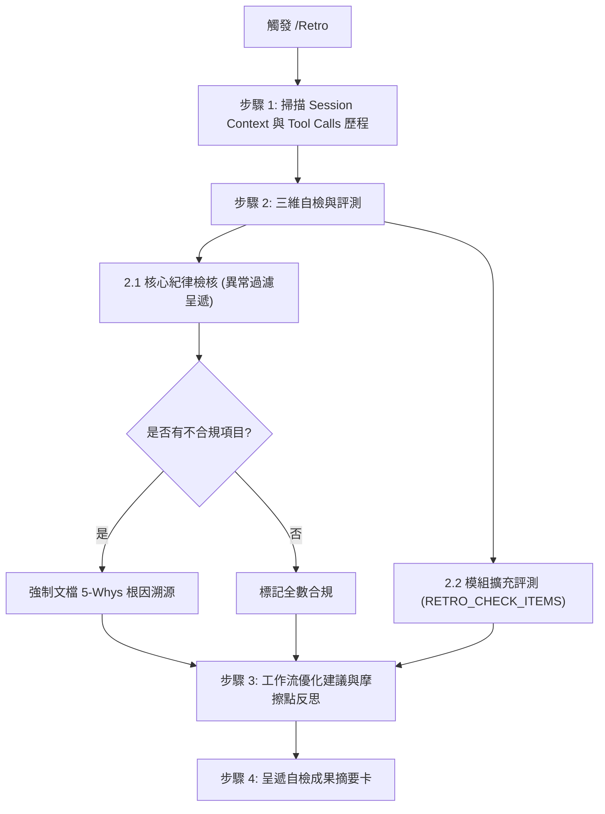

# 開發歷程自檢工作流 (Retro)

本 Workflow 用於任何開發或對話情境（含日常除錯、零散提問、探索研究或標準 Dev Plan 開發），以當前對話 Session 之 Context / Transcript 歷史為對象，回顧開發過程、稽核紀律合規性、執行模組擴充自檢，並產出工作流優化建議。所有階段的執行規範請嚴格遵循 [標準開發作業流程 (NewPlan)](`__#{module://agents-workflow/assets/workflows/NewPlan.md}__`)。

---

## 🚨 頂部剛性紀律：不合規文檔溯源分析 (Documentation-Root-Cause Traceability)

> [!CAUTION]
> **文檔根因溯源鐵律**：  
> 若自檢中發現任何不合規、違規或行為偏差項目，Agent **必須強制執行 5-Whys 根因溯源**，明確定位：「**是因閱讀了哪一份實體文檔（檔案路徑、章節或行號）或指示，導致延伸做出此錯誤決策**」，直接暴露文檔缺陷、過期指引或理解偏差，嚴禁表面敷衍或歸咎於隨機失誤！

---

## 🎯 核心原則與適用情境 (Scope & Axioms)

1. **普適任何對話歷史 (Session Transcript Driven)**：
   - 不限於標準 Dev Plan 目錄，適用於任何 Session 進行中的對話、除錯或任務。
2. **異常過濾呈遞原則 (Exception-Only Filtering)**：
   - 核心通用紀律採「全量自我比對，但僅呈報異常」原則。僅在發現不符合項目時詳細呈報並附帶文檔溯源；若 100% 全數合規，僅需一行簡要聲明，避免膨脹 Token。
3. **宣告式模組擴充 (Declarative Modular Extensibility)**：
   - 核心工作流保持純粹通用，領域專屬之指標評測、工具效能分析或特化檢核 100% 透過 Token 錨點由各 Donor 模組宣告注入。

---

## 🚀 執行步驟 (Execution Steps)



### 步驟 1：掃描當前對話歷史與上下文軌跡 (Session Context & Transcript Scan)

1. 檢視當前 Session 之對話歷程、使用者指令與問題。
2. 盤點 Agent 調用之工具歷程（檢索工具、檔案操作、終端指令等）與傳參。
3. 盤點讀取的文檔、修改的檔案與做出的架構/技術決策。

---

### 步驟 2：三維自檢與評測 (Three-Tier Audit & Evaluation)

#### 2.1 `agents-workflow` 通用核心紀律自檢（異常過濾呈遞模式）

Agent 自我核對以下通用核心紀律清單，但**在報告中僅列出未通過/有瑕疵之條目與其文檔根因溯源**（若全數通過，僅標記 `✅ agents-workflow 核心紀律全數合規`）：

- **三大核心原則 (Core Axioms)**：
  - [ ] **零臆測 (Zero Speculation)**：是否杜絕自行假設需求、猜測 API 行為或臆測解法？
  - [ ] **剛性追溯 (Traceability)**：需求到程式碼的每一步決策是否具備文件記錄可回溯？
  - [ ] **分級管控 (Graduated Control)**：是否依任務性質正確選擇適當流程（Level 0/1/2、修訂、調研等）？
- **執行與推進紀律 (Execution Discipline)**：
  - [ ] **單 Turn 限制與嚴禁連發**：一次回應是否最多僅執行一個 Phase 或一個獨立動作？
  - [ ] **Checkpoint 強制等待**：產出階段文件後是否明確提問並立即 End Turn 等待回覆？
  - [ ] **「問答 $\neq$ 推進」防呆**：開發者局部解答/回饋時，是否嚴格二分法，未擅自跨 Phase？
  - [ ] **嚴禁空降實作**：未經規劃定稿並獲確認前，是否杜絕直接編寫或修改原始碼？
- **除錯排查與範疇保護 (Scope & Debugging Guardrails)**：
  - [ ] **本體優先 / 由近及遠**：遇到異常是否徹底排查當前組件本體與傳參，未擅自深入/修改外部模組？
  - [ ] **範疇越界阻斷**：發現問題超出承諾範疇時，是否停止動作發起 `/Discuss` 由開發者判定？
  - [ ] **防淺層修補**：同一問題連續 2 次修復失敗時是否強制停手進行 5-Whys 根因分析？
- **文檔與工具紀律 (Documentation & Tool Discipline)**：
  - [ ] **確定性文檔讀取失效阻斷**：指定標準文檔讀取失敗時，是否立即呈報阻斷，未擅自同義詞/模糊探勘隱藏缺陷？
  - [ ] **模板註解剝除**：落檔時是否 100% 徹底移除模板引導註解（`<!-- ... -->`）？
  - [ ] **嚴禁主動歸檔**：計畫目錄是否預設留存於 plans 原位，未擅自搬移？

#### 2.2 模組擴充自檢與特化評測 (Contributed Modular Evaluations)

> 以下自檢與評測項目由各已安裝之 Donor 模組宣告注入（透過 `RETRO_CHECK_ITEMS` 錨點）：

`__@{RETRO_CHECK_ITEMS}__`

---

### 步驟 3：工作流優化建議與摩擦點反思 (Workflow Optimization Insights)

回顧開發過程中是否有反覆溝通、工具調度摩擦、可自動化腳本化或文檔指引不清之處，提出 1~3 項具體改進建議：
1. **工具與命令體驗**：是否有繁瑣的手動操作可封裝為 CLI 指令？
2. **規範與指引精準度**：是否有指引語意模糊導致理解成本增加？
3. **流程阻斷與流暢度**：是否有非必要的摩擦點可進一步優化？

---

### 步驟 4：呈遞自檢成果卡 (Summary Card & Exit)

向開發者呈遞以下結構化自檢成果卡，並結束當前 Turn：

```markdown
# 🔍 開發歷程自檢報告 (Retrospective Audit Report)

### 📌 核心紀律稽核 (Core Guardrails)
- [✅ 全部合規 | ⚠️ 發現 X 項不合規項目]
- **不合規項目與文檔根因溯源**（若有）：
  - **項目**：[不合規描述]
  - **文檔根因溯源**：閱讀 `[檔案路徑#Lxx]` 中的 [章節/描述]，延伸做出了 [錯誤決策/行為]。

### 📊 模組評測與擴充自檢 (Contributed Evaluations)
- [依各 Donor 模組注入之自檢與評測項目呈現]

### 💡 工作流優化建議 (Workflow Insights)
1. [優化建議 1]
2. [優化建議 2]
```

---

`__@{WORKFLOW_RETRO}__`
