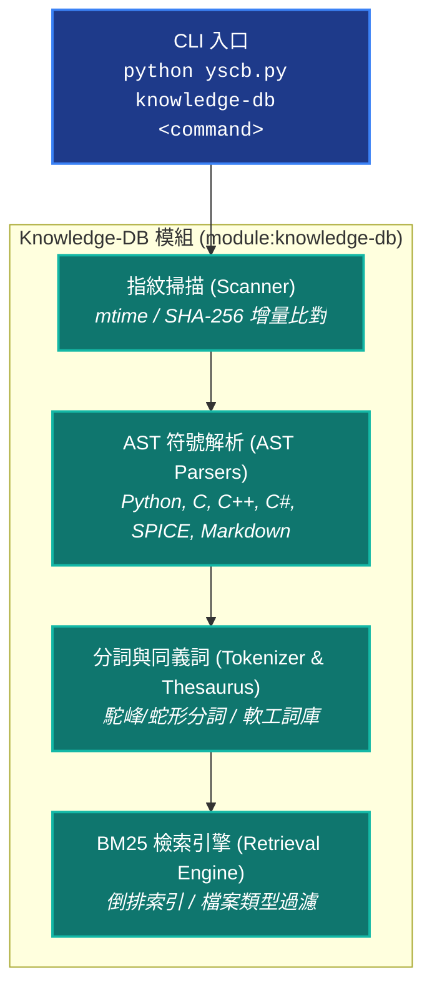
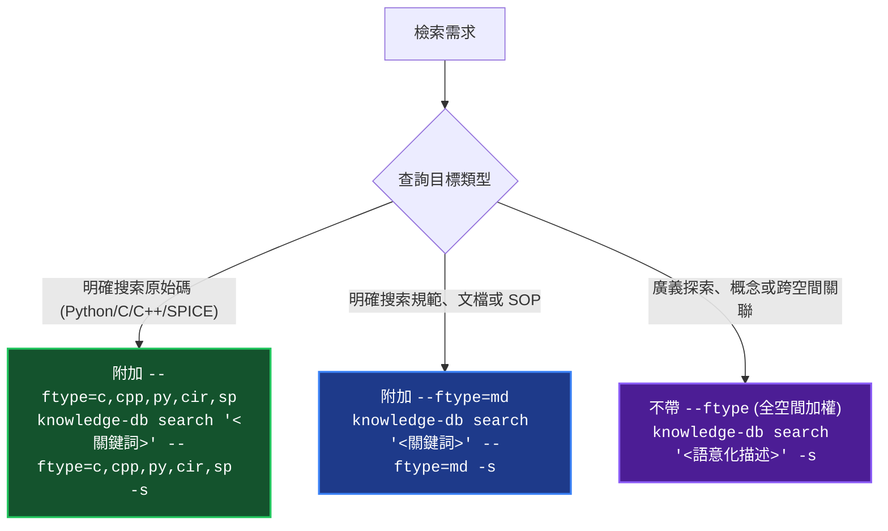

# YS-Codebase Knowledge-DB 知識庫與語意檢索模組 (Knowledge Database & Retrieval Engine)

> 模組名稱：`knowledge-db`  
> 職責定位：知識庫與符號檢索引擎。提供多語言 AST 符號解析、增量指紋比對、多欄位 BM25 檢索、軟工同義詞庫與代碼切片預覽。

---

## 1. 模組架構全景 (Architecture Overview)

`knowledge-db` 模組提供代碼與文檔的解析與檢索流水線：



---

## 2. 日常檢索決策樹與 `--ftype` 路由規範 (Search Decision Tree)

為了避免盲目搜尋造成 Token 浪費與效率低下，Agent 與開發者在日常代碼與文檔檢索時，應強制依循以下決策樹：



### 🚨 執行紀律：強制工具替代原則 (Search Tool Substitution)
- **第一反射工具**：在日常任何任務、問題排查、符號定位或架構查詢時，**第一動作強制調用 `knowledge-db search -s`**。
- **消滅盲目探索**：嚴禁在未知精確符號全名前，使用 `grep_search` 發起全專案正則遍歷或用 `list_dir` / `view_file` 盲目翻找目錄。
- **切片即時預覽 (`-s` / `--snippet`)**：檢索一律強制附加 `-s`，直接獲取帶行號之上下文代碼切片與 Docstring 摘要，實現「定位 ➔ 切片即時理解」並消滅 80%+ 的無效二次檔案讀取。

---

## 3. CLI 指令集速查與範例 (CLI Reference)

### 3.1 多欄位語意檢索 (Search Engine)

```bash
# 基礎檢索 (顯示命中清單與分數)
python yscb.py knowledge-db search "ExecutionContext"

# 帶代碼切片預覽檢索 (推薦日常使用，包含行號、簽名與上下文代碼)
python yscb.py knowledge-db search "ExecutionContext" -s

# 代碼專屬定向檢索 (過濾 Python 與 C/C++ 檔案)
python yscb.py knowledge-db search "resolve_uri" --ftype=c,cpp,py -s

# 文檔專屬定向檢索 (過濾 Markdown 檔案)
python yscb.py knowledge-db search "SOP 0~7" --ftype=md -s

# 指定 Top-K 返回數量
python yscb.py knowledge-db search "SemVer" -n 5 -s

# 輸出結構化 JSON (供自動化腳本或工具鏈整合)
python yscb.py knowledge-db search "ThesaurusEngine" --json
```

### 3.2 知識庫狀態、掃描與索引管理 (Index Management)

```bash
# 查詢全系統註冊空間、快取檔案數與倒排索引狀態
python yscb.py knowledge-db status

# 執行增量檔案指紋掃描 (自動感應 mtime 與 SHA-256 變更)
python yscb.py knowledge-db scan

# 強制全量重新掃描
python yscb.py knowledge-db scan --force

# 建立或更新倒排索引快取
python yscb.py knowledge-db index

# 強制全量重建倒排索引
python yscb.py knowledge-db index --rebuild

# 打包空間符號為 SemanticBundle 快照
python yscb.py knowledge-db bundle

# 清理指定空間或全空間快取檔案
python yscb.py knowledge-db clean --all
```

---

## 4. Python SDK 公開 API 速查 (Python SDK Reference)

下游自訂模組或腳本可在 Python 代碼中直接調用門面引擎 `KnowledgeEngine`：

```python
from knowledge_db.engine import KnowledgeEngine

# 初始化門面引擎 (自動載入同義詞庫與已註冊空間)
engine = KnowledgeEngine()

# 1. 執行多欄位 BM25 檢索
results = engine.search(
    query="ExecutionContext",
    top_k=5,
    file_types=["py"],   # 指定副檔名過濾
    include_snippet=True # 包含上下文代碼切片
)

for r in results:
    print(f"檔案: {r['file_path']} (Score: {r['score']})")
    for hit in r.get("hits", []):
        print(f"  - [{hit['symbol_type']}] {hit['name']} (Lines {hit['start_line']}~{hit['end_line']})")
        if "snippet" in hit:
            print(f"    代碼預覽:\n{hit['snippet']}")

# 2. 獲取知識庫空間狀態
status = engine.status()
print(f"總註冊空間數: {status['total_spaces']}")

# 3. 觸發增量掃描與索引構建
engine.scan_all()
engine.build_index_all()
```

---

## 5. 常見情境操作指南 (Cookbook)

### 💡 情境 1：新專案初次建立知識庫索引
```bash
# 1. 掃描專案檔案與提取 AST 符號
python yscb.py knowledge-db scan

# 2. 構建 BM25 倒排索引
python yscb.py knowledge-db index

# 3. 檢查知識庫狀態確保索引已建立
python yscb.py knowledge-db status
```

### 💡 情境 2：排查問題時秒級定位函式與切片確認
```bash
# 秒級搜尋目標函式定義，直接查看行號與周邊代碼
python yscb.py knowledge-db search "check_project_protocol" --ftype=py -s
```

### 💡 情境 3：探索特定架構規範或 SOP 指引
```bash
# 定向檢索 Markdown 文檔中的規範章節
python yscb.py knowledge-db search "Dogfooding 雙軌閉環" --ftype=md -s
```
