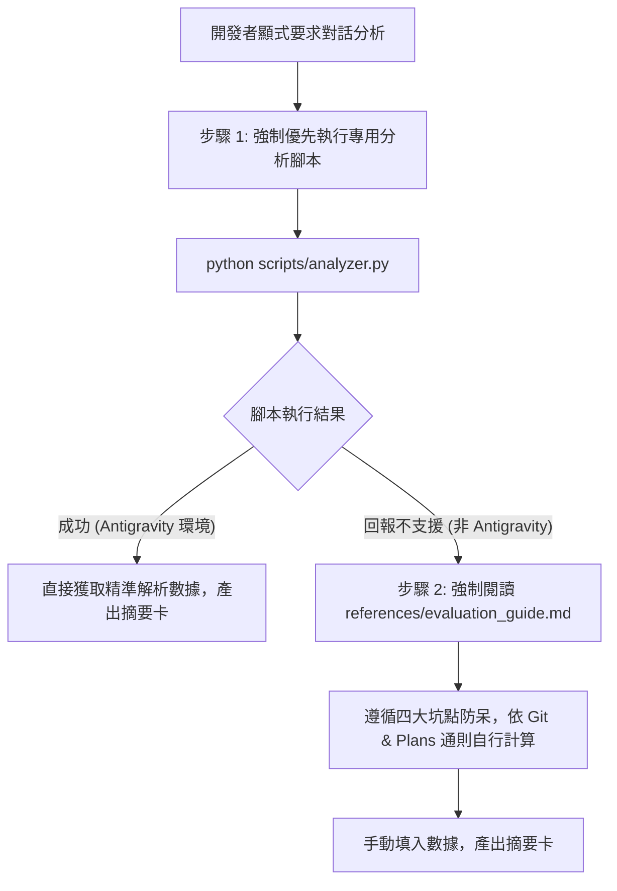

# 對話階段歷程分析技能指南 (Session Analysis Skill)

本技能定義對話歷程自檢、行為統計、Token 視窗分佈評估與改進建議提取的標準規範。

> [!CAUTION]
> **🚨 授權守門鐵律 (Authorization Gatekeeper)**  
> **本技能完全禁止 Agent 主動觸發！** 僅限開發者顯式要求進行歷程分析、對話評測或統計自檢時方可手動執行。

---

## 🎯 1. 核心原則與分析範圍

1. **嚴格禁止主觀性評論 (Strictly Objective Statistics)**：
   - 除最後「優化建議」外，全篇報告**嚴禁任何主觀形容詞、褒貶或吹捧評語**（如「良好」、「優異」、「適宜」等），僅允許客觀數據、次數、百分比與事實描述。
2. **分析範圍精確界定 (Strict Slicing Boundary)**：
   - **法定範圍**：**`上次分析後 (不包含) ~ 本次分析前 (不包含)`**。
   - 若為首次分析，範圍為對話初始至本次分析指令前；若存在前次分析，嚴格排除前次分析之報告輸出與本次觸發分析之對話指令自身。
3. **異常過濾呈遞 (Exception-Only Reporting)**：
   - 流程紀律自檢全數合規時僅輸出單行確認卡；僅在存在偏差時呈遞未通過項與文檔根因。

---

## 🚀 2. 執行步驟與工具優先序



### 步驟 1：強制優先執行分析工具腳本 (Tool-First)

Agent 收到分析指令後，**必須優先執行內建分析腳本**：
```bash
python __${module://agents-workflow/assets/skills/session-analysis/scripts/analyzer.py}__
```
- 腳本專為 Antigravity 環境打造，自動定位 `transcript.jsonl` 並依照「上次分析後~本次分析前」進行切片，嚴格過濾真實模型輪次（`PLANNER_RESPONSE`）並計算實時視窗與 Prompt Cache 命中率。
- 若腳本成功執行，直接呈遞其輸出或引用其客觀數據填入下方標準卡片。

### 步驟 2：環境降級與手動計算通則 (Fallback)

- 若腳本輸出：`[session-analysis] 錯誤：目前環境非 Antigravity IDE 或未檢測到有效 transcript 日誌`：
- **Agent 必須強制閱讀 [`references/evaluation_guide.md`](./references/evaluation_guide.md)**，遵循四大坑點防呆（防步驟誤計、防浮誇乘算、防範圍混淆、防主觀評語），依據 `git status`、`git diff` 與 `plans/` 微觀日誌進行客觀自檢與手動填報。

---

## 📋 3. 核心評估項目大綱

### 3.1 流程與紀律自檢 (Guardrails Audit)
- 零臆測公理（不確定細節向開發者釐清，無主觀發散）。
- SSOT 檔案真理與對話極簡節流公理（嚴禁對話全文重複、代碼傾倒）。
- CLI 權限分級（🟢 自主安全 / 🟡 階段條件 / 🔴 授權守門，無越界操作）。
- Checkpoint 停步與單 Turn 邊界紀律。

### 3.2 行為與 Token 視窗分佈 (Dimension Breakdown)
- 實時 Context 視窗規模與 System Prompt 佔比（標明 Prompt Cache 命中機制）。
- 模型真實推論輪次 (Planner Steps)。
- 工具調用（Read / Write / CLI）頻次與字元吞吐。
- 技能與工作流觸發清冊。

### 3.3 模組特化評測 (Modular Evaluations)
`__@{SESSION_ANALYSIS_CHECK_ITEMS}__`

### 3.4 優化建議 (Optimization Insights)
提出 1~3 項具體可行的工作流、指引或工具改進建議。

---

## 🛑 4. 成果摘要卡標準格式 (Summary Card Template)

向開發者呈遞以下結構化卡片並結束當前 Turn：

```markdown
# 🔍 對話階段歷程分析報告 (Session Analysis Report)

> **分析範圍**：[上次分析後 (Step X) ~ 本次分析前 (Step Y) / 對話開頭 ~ 本次分析前]  
> **評估方式**：[Antigravity 專用腳本解析 / 通用產物降級手動評估]

### 📌 流程與紀律自檢 (Guardrails Audit)
[全數合規：✅ 核心紀律全數合規 (0 異常) / 存在偏差：條列異常項、客觀事實與文檔根因]

### 📊 行為統計與 Token 視窗分佈 (Dimension Breakdown)
- **實時 Context 視窗預估**：約 `[N]` Tokens
  - **系統固定上下文 (System Prompt)**：約 `[S_fixed]` Tokens (`[S_pct]%`) *(Prompt Cache 命中率 ~99%+)*
  - **動態累積上下文 (Dynamic Context)**：約 `[S_dynamic]` Tokens
- **模型實際推論輪次 (Planner Steps)**：`[count]` 輪
- **使用者輸入 (User Inputs)**：`[count]` 次
- **外部指令調用 (CLI)**：約 `[C_tok]` Tokens | 執行 `[count]` 次
- **Skills 觸發**：`[count]` 項：`[清單]`
- **細部操作吞吐**：
  - **Read (檔案檢視)**：約 `[R_tok]` Tokens | 調用 `[count]` 次
  - **Write (代碼寫入/編輯)**：約 `[W_tok]` Tokens | 產出 `[count]` 次
  - **Thinking (思考推導估算)**：約 `[T_tok]` Tokens
  - **Dialogue (對話互動)**：約 `[D_tok]` Tokens

### 🧩 模組特化評測 (Modular Evaluations)
- [模組特化指標 / 若無填「無模組特化指標」]

### 💡 工作流優化建議 (Optimization Insights)
1. [優化建議 1]
2. [優化建議 2]
```
