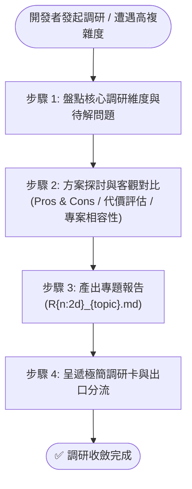

# 深度技術調研工作流 (Research)

本工作流用於高複雜度、新技術選型、演算法可行性或架構演進之深度論證與客觀對比。執行規範遵循 [NewPlan](`__#{module://agents-workflow/assets/workflows/NewPlan.md}__`)。

---

## 🎯 核心原則與雙軌生命週期

1. **僅被動觸發**：獨立前置調研僅在開發者提出探討需求或下達顯式指令（如 `/Research [主題]`）時進行，嚴禁擅自發起。
2. **雙軌生命週期**：
   - **獨立前置調研**：未開立計畫前，隨問隨答與方案對比保留於對話與快取中，不主動在磁碟建檔。
   - **正式固化建檔**：開發者指示立項或需正式留痕時，寫入計畫目錄下的 `R{n:2d}_{topic}.md`（如 `R01_architecture_reference.md`）。
3. **免除死板模板束縛**：依標準模板 [`RXX_research_report.md`](`__#{module://agents-workflow/assets/templates/RXX_research_report.md}__`) 建立，維持標準元數據標頭，正文依主題自由排版論述。
4. **標準命名前綴**：調研報告統一採用 `R{n:2d}_{topic}.md`。

---

## 🚀 執行步驟



### 步驟 1：盤點核心調研維度
與開發者梳理本次調研攻堅的具體核心問題、指標與技術邊界。

---

### 步驟 2：方案深度探討與客觀權衡
作為架構顧問展開開放式探討：
- 橫向比對業界成熟實踐與方案。
- 客觀分析候選方案優缺點 (Pros & Cons)、資源代價與潛在坑點。
- 結合專案現況給出客觀分析，嚴禁主觀吹捧。

---

### 步驟 3：產出專題調研報告 (`R{n:2d}_{topic}.md`)
若需正式落檔，讀取標準模板 [`RXX_research_report.md`](`__#{module://agents-workflow/assets/templates/RXX_research_report.md}__`)，徹底移除導引註解後落檔：
1. 標準元數據標頭。
2. 背景痛點與調研目標。
3. 候選方案評估矩陣 (Candidate Options Matrix)。
4. 關鍵維度深入分析（架構圖、PoC 驗證或 Benchmark 數據）。
5. 客觀結論與推薦落地方案。

---

### 步驟 4：呈遞極簡調研卡與三大出口分流

對話 Session **嚴禁全文重複、圖表傾倒或代碼傾倒**，強制僅呈遞以下極簡調研卡，並**立即 End Turn 等待確認**：

```markdown
### 🔬 /Research 技術調研成果卡
- **產出文件**：[RXX_{topic}.md](__${project://plans/}__/{plan_name}/RXX_{topic}.md)
- **調研主題**：[1 行調研核心命題]
- **方案結論**：推薦採取 [候選方案名稱]（核心優勢：[1 行客觀說明]）
- **出口路徑**：
  1. 立項開發 ➔ 升級為實作型 Plan（回填至 P00/P01）
  2. 沉澱儲備 ➔ 登載至長期路線圖 [`roadmap.md`](`__${workflow.roadmap://}__`)
  3. 存檔留痕 ➔ 留存於當前目錄或封存於 `__${project://plans/archived/}__`
- **待確認事項**：請確認推薦結論或選擇後續出口路徑？
```

---

`__@{WORKFLOW_RESEARCH}__`
