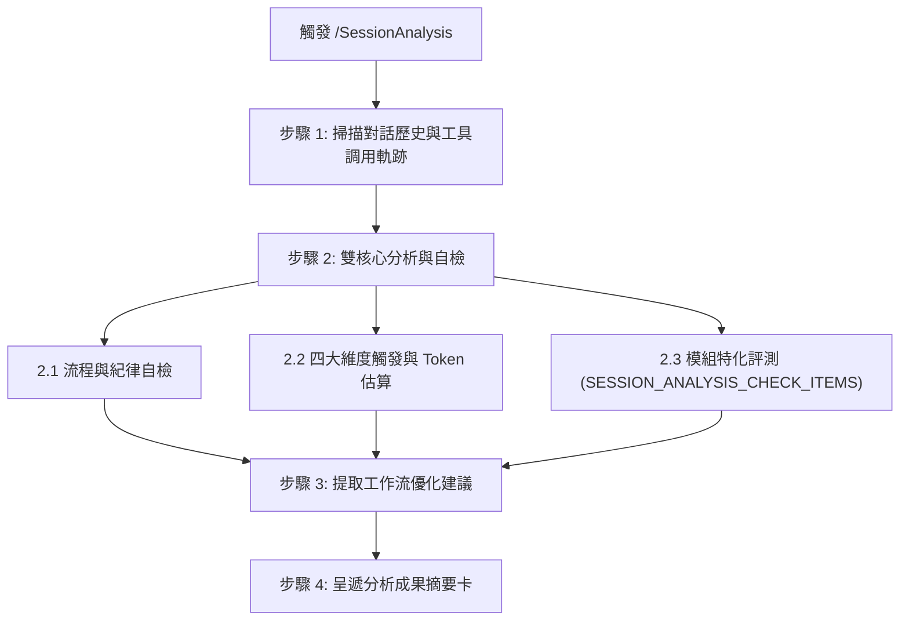

# 對話階段歷程分析工作流 (SessionAnalysis)

本工作流用於任何對話階段（包括日常問答、除錯排查、功能開發或技術調研），以當前 Session 的上下文歷史為分析對象，執行流程規範自檢、四大維度行為與 Token 消耗評估、模組注入評測，並提出具體優化建議。

---

## 🎯 核心原則

1. **異常過濾呈遞 (Exception-Only Reporting)**：流程規範自檢採全量核對但僅呈報異常項目；若全數合規，僅需單行確認，避免無謂消耗 Token。
2. **文檔根因溯源 (Documentation Root Cause)**：若發現流程或行為偏差，必須溯源定位導致該偏差的具體文檔章節或指示，釐清理解盲點或指引缺陷。
3. **行為與資源量化 (Behavioral & Token Accounting)**：對 Skills、Workflows、CLI 與其餘對話行為進行分類統計與 Token 佔比推估，客觀評估對話效率。
4. **模組宣告式擴充 (Declarative Modularity)**：特定模組工具之評測指標由各 Donor 模組透過錨點宣告注入，工作流本體維持通用與解耦。

---

## 🚀 執行步驟



### 步驟 1：掃描對話歷史與工具調用軌跡

1. 檢視當前 Session 之完整訊息歷史、使用者指令與提問。
2. 盤點工具調用歷程（文字檢索、檔案讀寫、終端命令等）與參數傳遞。
3. 統計各類行為頻次與大致文字吞吐量。

---

### 步驟 2：雙核心分析與自檢

#### 2.1 流程與紀律自檢（異常過濾呈遞模式）

Agent 自我核對以下通用規範清單。在最終報告中**僅列出未通過或有瑕疵之項目與文檔根因溯源**；若全數合規，僅需標記 `✅ 核心紀律全數合規`：

- **核心公理**：
  - [ ] **零臆測**：是否杜絕自行假設需求、猜測 API 行為或腦補解法？
  - [ ] **可追溯**：各項架構與實作決策是否具備明確紀錄與對應依據？
  - [ ] **分級管控**：是否依任務規模選擇適當之工作模式與路徑？
- **執行與推進紀律**：
  - [ ] **單 Turn 邊界**：一次回應是否維持單一邏輯邊界，未跨階段連發？
  - [ ] **Checkpoint 停步**：產出重要決策或階段產物後是否主動等待確認？
  - [ ] **嚴禁空降實作**：未經共識與確認前，是否未擅自修改實體檔案？
- **除錯排查與範疇防護**：
  - [ ] **由近及遠排查**：異常時是否優先檢視自身邏輯與呼叫參數，未隨意深入底層依賴？
  - [ ] **範疇越界阻斷**：發現超出原定範疇之問題時，是否及時停手確認而非擅自擴大修改？
  - [ ] **防淺層修補**：同一問題反覆出現時是否深入分析根因，而非表面試錯？
- **文檔與產物紀律**：
  - [ ] **檔案讀取失效處置**：指定檔案無法讀取時是否明確回報，未盲猜替代路徑？
  - [ ] **產物格式純淨**：落檔時是否徹底清除導引註解與未替換佔位符？

#### 2.2 四大維度觸發與 Token 消耗分析

分析當前 Session 的所有互動與操作，歸納為以下四大維度：

1. **Skills（技能手冊）**：
   - 盤點觸發之技能清單。
   - 評估觸發時機是否合宜？有無漏觸發或多餘觸發？
   - 預估 Skills 指引載入之 Token 消耗。
2. **Workflows（工作流程）**：
   - 盤點調用之 Slash Commands / 工作流清單。
   - 評估工作流各步驟執行是否完整？有無擅自跳步或偏離？
   - 預估 Workflow 載入之 Token 消耗。
3. **CLI（外部命令與工具）**：
   - 統計終端指令調用次數（包括 yscb CLI、git、套件管理、編譯工具等）。
   - 計算調用命令之輸入文字與輸出切片讀寫之 Token 消耗（I/O 消耗一律計入此維度）。
4. **Other（推理、對話與一般操作）**：
   包含原生檔案檢視、代碼產出、思考推理與人機互動，細分為以下 4 個子維度進行統計與評估：
   - **Read (檔案檢視)**：`view_file`、`list_dir` 等原生讀取與走訪工具之內容輸入 Token。
   - **Write (代碼寫入)**：`write_to_file`、`replace_file_content` 等程式碼或 Markdown 產出之輸出 Token。
   - **Thinking (思考推理)**：模型內部深度思考與推導歷程 (Thinking traces / CoT) 之 Token 消耗。
   - **Dialogue (對話互動)**：使用者提問輸入、澄清問答 (`ask_question`) 與進度回報等顯式對話文字。

**總體彙總**：
- 預估本次 Session 總 Token 消耗。
- 計算並呈遞四大維度之 Token 消耗估算值與百分比佔比（Skills % / Workflows % / CLI % / Other %），並展開 Other 內部 4 個子維度細項。

#### 2.3 模組特化評測 (Contributed Modular Evaluations)

> 以下自檢與評測項目由各模組透過錨點注入：

`__@{SESSION_ANALYSIS_CHECK_ITEMS}__`

---

### 步驟 3：工作流優化建議 (Optimization Insights)

回顧對話過程中的交互摩擦、重複操作或引導盲點，提出 1~3 項具體可行的改進建議：
1. **工具與自動化**：是否有高頻重複動作可封裝為專用工具或命令？
2. **指引與文檔**：是否有指引存在語意模糊或易引導偏差之處？
3. **流程流暢度**：是否有冗餘等待或非必要中斷可進一步簡化？

---

### 步驟 4：呈遞分析成果摘要卡 (Summary Card & Exit)

向開發者呈遞以下結構化報告，並結束當前 Turn：

```markdown
# 🔍 對話階段歷程分析報告 (Session Analysis Report)

### 📌 流程與紀律自檢 (Guardrails Audit)
- [✅ 核心紀律全數合規 | ⚠️ 發現 X 項不合規項目]
- **不合規項目與文檔根因溯源**（若有）：
  - **項目**：[不合規行為描述]
  - **文檔根因溯源**：閱讀 `[檔案路徑#Lxx]` 中的 [章節/描述]，延伸做出了 [偏差決策/行為]。

### 📊 四大維度行為與 Token 消耗分析 (Dimension Breakdown)
- **總 Token 消耗預估**：約 `[N]` Tokens
- **維度佔比與評析**：
  - **Skills**：約 `[A]` Tokens (`[A_pct]%`) | 觸發：`[清單]` | 時機評估：`[正確 / 偏差說明]`
  - **Workflows**：約 `[B]` Tokens (`[B_pct]%`) | 調用：`[清單]` | 執行評估：`[完整 / 偏差說明]`
  - **CLI (含 I/O 讀寫)**：約 `[C]` Tokens (`[C_pct]%`) | 調用 `[X]` 次 | 說明：`[簡述]`
  - **Other**：約 `[D]` Tokens (`[D_pct]%`)
    - **Read (檔案檢視)**：約 `[D1]` Tokens (`[D1_pct]%`) | 說明：`[簡述]`
    - **Write (代碼寫入)**：約 `[D2]` Tokens (`[D2_pct]%`) | 說明：`[簡述]`
    - **Thinking (思考推理)**：約 `[D3]` Tokens (`[D3_pct]%`) | 說明：`[簡述]`
    - **Dialogue (對話互動)**：約 `[D4]` Tokens (`[D4_pct]%`) | 說明：`[簡述]`

### 🧩 模組特化評測 (Modular Evaluations)
- [依各模組宣告注入之評測項目呈遞]

### 💡 工作流優化建議 (Optimization Insights)
1. [優化建議 1]
2. [優化建議 2]
```

---

`__@{WORKFLOW_SESSIONANALYSIS}__`
