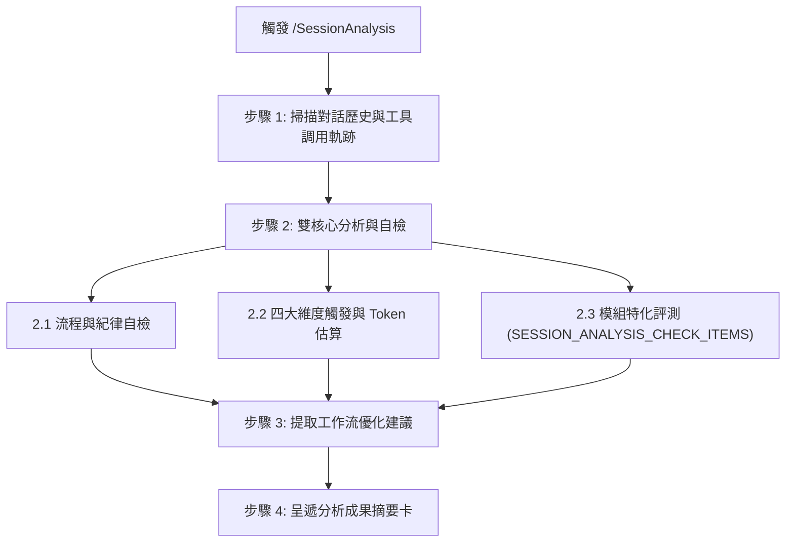

# 對話階段歷程分析工作流 (SessionAnalysis)

本工作流用於任何對話階段（包括日常問答、除錯排查、功能開發或技術調研），以當前 Session 的上下文歷史為分析對象，執行流程規範自檢、四大維度行為與 Token 消耗評估、模組注入評測，並提出具體優化建議。

---

## 🎯 核心原則

1. **禁止一切主觀性評論 (Strictly Objective Statistics)**：除最後「工作流優化建議」外，**全篇嚴禁一切形容詞、主觀褒貶或吹捧評語**（例如嚴禁「表現良好」、「非常優異」、「時機合宜」、「已達商業可用性」等）。僅允許客觀統計數據、次數、百分比與事實描述（例如僅回覆「通過率：{n}%」、「調用：{count} 次」）。
2. **異常過濾呈遞 (Exception-Only Reporting)**：流程規範自檢採全量核對但僅呈報異常項目；若全數合規，強制僅輸出單行確認卡，嚴禁逐項條列 Checkbox。
3. **文檔根因溯源 (Documentation Root Cause)**：若發現流程或行為偏差，必須溯源定位導致該偏差的具體文檔章節或指示，釐清理解盲點或指引缺陷。
4. **行為與資源量化 (Behavioral & Token Accounting)**：對 Skills、Workflows、CLI 與其餘對話行為進行純統計數據分類與 Token 佔比推估。
5. **模組宣告式擴充 (Declarative Modularity)**：特定模組工具之評測指標由各 Donor 模組透過錨點宣告注入，工作流本體維持通用與解耦。

---

## 🚀 執行步驟



### 步驟 1：掃描對話歷史與工具調用軌跡

1. 檢視當前 Session 之完整訊息歷史、使用者指令與提問。
2. 盤點工具調用歷程（文字檢索、檔案讀寫、終端命令等）與參數傳遞。
3. 統計各類行為頻次與文字吞吐量。

---

### 步驟 2：雙核心分析與自檢

#### 2.1 流程與紀律自檢（標準呈現卡模式）

Agent 內部核對基準（零臆測 / SSOT 對話節流 / 可追溯 / 分級管控 / 單 Turn 邊界 / Checkpoint 停步 / 嚴禁空降實作 / 由近及遠排查 / 範疇越界阻斷 / 防淺層修補 / 檔案讀取失效回報 / 產物格式純淨）。**嚴禁於 Session 傾倒 Checkbox 清單**，強制僅能依核對結果呈遞以下兩種標準呈現卡之一：

- **情況 A（全數合規時，強制僅呈遞單行，嚴禁條列任何項目）**：
  ```markdown
  - **紀律自檢**：✅ 核心紀律全數合規 (0 異常)
  ```

- **情況 B（存在異常時，僅呈遞未通過項，嚴禁印出通過項）**：
  ```markdown
  - **紀律自檢**：⚠️ 發現 {count} 項異常
    - **異常項**：[{規範名稱}]
      - **事實行為**：[客觀描述發生之行為與偏差事實，無形容詞]
      - **文檔根因溯源**：閱讀 `[檔案路徑#Lxx]` 中的 [章節/描述]，延伸做出 [偏差行為]。
  ```

#### 2.2 四大維度觸發與 Token 消耗分析 (純統計數據模式)

嚴禁任何主觀評估詞彙（如「良好」、「適宜」等），強制僅以純統計數據呈現：

```markdown
- **總 Token 消耗預估**：約 `[N]` Tokens (100%)
- **Skills**：約 `[A]` Tokens (`[A_pct]%`) | 觸發 `[count]` 次：`[清單 / 或「無」]`
- **Workflows**：約 `[B]` Tokens (`[B_pct]%`) | 調用 `[count]` 次：`[清單 / 或「無」]`
- **CLI (含 I/O 讀寫)**：約 `[C]` Tokens (`[C_pct]%`) | 執行 `[count]` 次
- **Other**：約 `[D]` Tokens (`[D_pct]%`)
  - **Read (檔案檢視)**：約 `[D1]` Tokens (`[D1_pct]%`) | 調用 `[count]` 次
  - **Write (代碼寫入)**：約 `[D2]` Tokens (`[D2_pct]%`) | 產出 `[count]` 次
  - **Thinking (思考推導)**：約 `[D3]` Tokens (`[D3_pct]%`)
  - **Dialogue (對話互動)**：約 `[D4]` Tokens (`[D4_pct]%`) | 互動 `[count]` 次
```

#### 2.3 模組特化評測 (Contributed Modular Evaluations)

> 以下自檢與評測項目由各模組透過錨點注入（以純數據呈現）：

`__@{SESSION_ANALYSIS_CHECK_ITEMS}__`

---

### 步驟 3：工作流優化建議 (Optimization Insights)

回顧對話過程中的交互摩擦、重複操作或引導盲點，提出 1~3 項具體可行的改進建議：
1. **工具與自動化**：是否有高頻重複動作可封裝為專用工具或命令？
2. **指引與文檔**：是否有指引存在語意模糊或易引導偏差之處？
3. **流程流暢度**：是否有冗餘等待或非必要中斷可進一步簡化？

---

### 步驟 4：呈遞分析成果摘要卡 (Summary Card & Exit)

向開發者呈遞以下結構化報告（除優化建議外，皆為純統計數據），並結束當前 Turn：

```markdown
# 🔍 對話階段歷程分析報告 (Session Analysis Report)

### 📌 流程與紀律自檢 (Guardrails Audit)
[依 2.1 情況 A 或情況 B 標準卡呈遞，嚴禁條列 Checkbox]

### 📊 四大維度行為與 Token 消耗分析 (Dimension Breakdown)
- **總 Token 消耗預估**：約 `[N]` Tokens (100%)
- **Skills**：約 `[A]` Tokens (`[A_pct]%`) | 觸發 `[count]` 次：`[清單 / 或「無」]`
- **Workflows**：約 `[B]` Tokens (`[B_pct]%`) | 調用 `[count]` 次：`[清單 / 或「無」]`
- **CLI (含 I/O 讀寫)**：約 `[C]` Tokens (`[C_pct]%`) | 執行 `[count]` 次
- **Other**：約 `[D]` Tokens (`[D_pct]%`)
  - **Read (檔案檢視)**：約 `[D1]` Tokens (`[D1_pct]%`) | 調用 `[count]` 次
  - **Write (代碼寫入)**：約 `[D2]` Tokens (`[D2_pct]%`) | 產出 `[count]` 次
  - **Thinking (思考推導)**：約 `[D3]` Tokens (`[D3_pct]%`)
  - **Dialogue (對話互動)**：約 `[D4]` Tokens (`[D4_pct]%`) | 互動 `[count]` 次

### 🧩 模組特化評測 (Modular Evaluations)
- [依各模組宣告注入之純統計指標呈遞 / 若無則填「無模組特化指標」]

### 💡 工作流優化建議 (Optimization Insights)
1. [優化建議 1]
2. [優化建議 2]
```

---

`__@{WORKFLOW_SESSIONANALYSIS}__`
