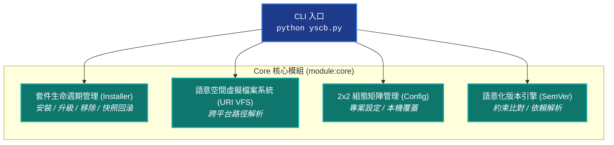

# YS-Codebase Core 核心基礎設施模組 (Infrastructure & Package Manager)

> 模組名稱：`core`  
> 職責定位：微核心基礎設施、模組套件管理、語意空間虛擬檔案系統 (VFS)、2x2 組態矩陣與 CLI 調度器。

---

## 1. 模組架構全景 (Architecture Overview)

`core` 模組提供 YS-Codebase 運行的基礎設施：



---

## 2. 核心機制說明 (Core Mechanisms)

### 2.1 語意空間虛擬檔案系統 (Semantic URI VFS)
Core 提供語意 URI 協定，程式碼與 CLI 統一透過協定存取實體目錄，避免相對路徑依賴：

| 語意 URI 協議 | 預設解析目標 | 職責與說明 |
| :--- | :--- | :--- |
| **`project://`** | 由 `config.project.json` 之 `project_root` 定位 | **宿主專案空間根目錄**（受管理的專案本體） |
| **`yscb://`** | 由 `yscb.config.json` 之 `yscb_root` 定位 | **YS-Codebase 運行端工具庫根目錄** |
| **`module.root://`** | `yscb://.modules/` | **所有已安裝模組的本機根目錄** |
| **`module://`** | `yscb://.modules/{module}/` | **當前作用中模組的運行目錄** |
| **`config.root://`** | `yscb://config/` | **全域模組設定檔根目錄** |
| **`config://`** | `yscb://config/{module}/` | **當前模組專屬設定檔目錄** |
| **`cache.root://`** | `yscb://.cache/` | **全域模組編譯快取與中介產物目錄** |
| **`cache://`** | `yscb://.cache/{module}/` | **當前模組專屬快取目錄** |
| **`temp://`** | `yscb://.temp/` | **系統暫存與測試隔離空間** |
| **`mirror://`** | `yscb://.mirror/` | **本地端模組封裝鏡像備份** |
| **`snapshot://`** | `yscb://.snapshots/` | **系統組態快照備份（用於災難恢復）** |

### 2.2 2x2 組態矩陣邊界 (Configuration Matrix)
Core 實作了「專案 vs 本機」與「全域 vs 模組」的雙維度隔離矩陣：

- **專案共享層級 (`config.project.json`)**：受 Git 版本控制，供團隊成員共享一致配置（如 `core.project_root`）。
- **本機覆蓋層級 (`config.local.json`)**：被 Git 忽略，僅在當前機器生效（透過 `--local` 設定），用於覆蓋個人特化路徑或敏感參數。
- **讀取優先權**：`config.local.json` (Overlay) $\gt$ `config.project.json` (Project) $\gt$ 模組預設值。

### 2.3 模組套件管理與快照防護 (Package Management)
- **安裝與覆蓋**：自動解壓縮模組發布包至 `.modules/<name>`，並遞迴增量補齊模組組態（不破壞用戶已修改之鍵值）。
- **災難回滾**：每次執行模組安裝、更新或移除前，自動建立系統快照至 `snapshot://`，可隨時一鍵還原。

---

## 3. CLI 指令集速查與範例 (CLI Reference & Cookbook)

### 3.1 套件與模組管理 (Package Management)

```bash
# 列出目前已安裝的模組
python yscb.py list

# 查詢已安裝模組的健康度與狀態
python yscb.py status

# 安裝模組 (預設自預設 Provider 下載最新版)
python yscb.py install agents-workflow

# 安裝特定版本的模組
python yscb.py install agents-workflow@1.0.2.9

# 指定來源 Provider 目錄安裝模組
python yscb.py install knowledge-db --provider=./custom_release_dir

# 強制覆蓋重新安裝
python yscb.py install core --force

# 升級指定模組 (或不帶模組名稱檢查升級所有模組)
python yscb.py update agents-workflow

# 移除指定模組
python yscb.py remove my-module

# 移除模組並清除快取 (--clean) 與組態檔 (--purge)
python yscb.py remove my-module --clean --purge

# 當發生異常時，回滾至前一次或指定快照
python yscb.py rollback
```

### 3.2 組態設定管理 (Configuration Management)

```bash
# 列出所有模組的有效組態 (含專案/本機狀態標記)
python yscb.py config list

# 列出指定模組的組態 (支援 JSON 輸出)
python yscb.py config list --mod=core --json

# 讀取指定模組的特定組態鍵
python yscb.py config get core project_root

# 設定專案層級組態 (寫入 config.project.json，團隊共享)
python yscb.py config set core project_root ./

# 設定本機覆蓋組態 (寫入 config.local.json，本機專屬)
python yscb.py config set dev sandbox_dir /tmp/my_sandbox --local

# 手動重載組態快取
python yscb.py config reload
```

### 3.3 語意 URI 虛擬檔案系統 (URI VFS)

```bash
# 列出系統中所有已註冊的語意 URI 協定清單與實體解析路徑
python yscb.py uri list

# 將語意 URI 解析為本機實體絕對路徑
python yscb.py uri resolve project://AGENTS.md
python yscb.py uri resolve module://scripts/cli.py

# 將本機實體路徑反查為語意 URI
python yscb.py uri to-uri H:/UseFolder/CodeRepo/my_project/AGENTS.md

# 執行全系統 URI 健康檢查 (檢查是否存在 !undefined 未定義協定)
python yscb.py uri check
```

---

## 4. Python SDK 公開 API 速查 (Python SDK Reference)

下游擴充模組或自訂腳本可在 Python 代碼中直接引用 `core` 提供之工具庫：

### 4.1 語意 URI 解析 (`core.uri`)

```python
from core import uri

# 解析語意 URI 為實體絕對路徑
agents_path = uri.resolve("project://AGENTS.md")

# 將實體路徑反查為語意 URI
protocol_uri = uri.to_uri("/path/to/my_project/AGENTS.md")

# 模組作用域上下文管理器 (在區塊內自動將 module:// 綁定至指定模組)
with uri.module_scope("knowledge-db"):
    db_config_path = uri.resolve("module://manifest.json")

# 宿主專案作用域上下文管理器
with uri.project_scope("/path/to/another_project"):
    another_agents = uri.resolve("project://AGENTS.md")
```

### 4.2 模組組態存取 (`core.config`)

```python
from core import config

# 獲取指定模組的有效設定值 (自動套用 local 覆蓋規則)
proj_root = config.get("core", "project_root", default="./")

# 獲取模組全部組態字典
core_all_cfg = config.get_all("core")

# 動態設定組態 (local=False 寫入 project, local=True 寫入 local)
config.set("core", "custom_key", "custom_value", local=False)

# 重載快取
config.reload("core")
```

### 4.3 語意化版本比較 (`core.semver`)

```python
from core import semver

# 解析版本字串
v = semver.parse_semver("1.0.2-alpha.1")
# v -> VersionTuple(major=1, minor=0, patch=2, prerelease='alpha.1')

# 版本比較 (v1 > v2 回傳 1, v1 < v2 回傳 -1, 相等回傳 0)
cmp = semver.compare_semver("1.0.3", "1.0.2.9")  # 1

# 檢查版本是否滿足約束表達式
is_valid = semver.match_constraint("1.2.5", ">=1.0.0, <2.0.0")  # True

# 自候選清單中找出符合約束的最高版本
best = semver.find_best_version(["1.0.0", "1.1.0", "1.2.5", "2.0.0"], "<2.0.0")  # "1.2.5"
```

### 4.4 私有微環境與 Pip 管理 SDK (`core.PipManager`)

```python
from core import PipManager, PipInstallError

# 1. 規格正規化與去重 (免實例化靜態工具)
specs = PipManager.parse_pip_dependencies({
    "fastembed": ">=0.5.0",
    "tree-sitter": "",
})
# specs -> ["fastembed>=0.5.0", "tree-sitter"]

# 2. 微環境路徑解析
mgr = PipManager()  # 自動解析當前專案或傳入自定義 yscb_dir
venv_dir = mgr.get_venv_dir()           # .venv/py310
py_exec = mgr.get_python_executable()   # .venv/py310/bin/python 或 Scripts/python.exe
site_pkg = mgr.get_site_packages_dir()  # .venv/py310/.../site-packages

# 3. 靜默安裝套件 (Wheel-Only 安全隔離)
try:
    mgr.install_packages(["fastembed>=0.5.0"])
except PipInstallError as e:
    print(f"安裝失敗: {e}")
```

---

## 5. 常見情境操作指南 (Cookbook)

### 💡 情境 1：新專案初次接入 YSCB
當在一個全新的專案中引入 YSCB 時，只需兩步完成環境綁定：
```bash
# 1. 綁定宿主專案根目錄 (注意：路徑必須為相對於 yscb.host 即 yscb.py 所在目錄之路徑)
python yscb.py config set core project_root ./

# 2. 驗證 URI 解析狀態
python yscb.py uri check
```

### 💡 情境 2：指定本機離線 Release 套件庫安裝
在無外網或離線環境下，直接指定本地封裝目錄安裝：
```bash
python yscb.py install agents-workflow --provider=./my_offline_packages/release
```

### 💡 情境 3：個人專屬配置不進版本庫
若某台開發機需要特化的暫存路徑或調試參數：
```bash
python yscb.py config set core debug_mode true --local
# 自動寫入 config/core/config.local.json (被 .gitignore 忽略)
```
