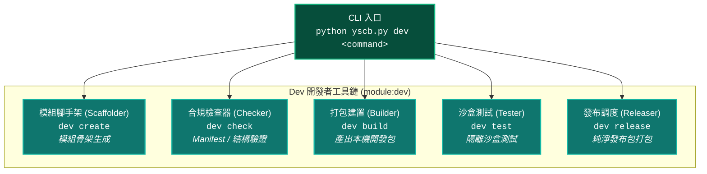
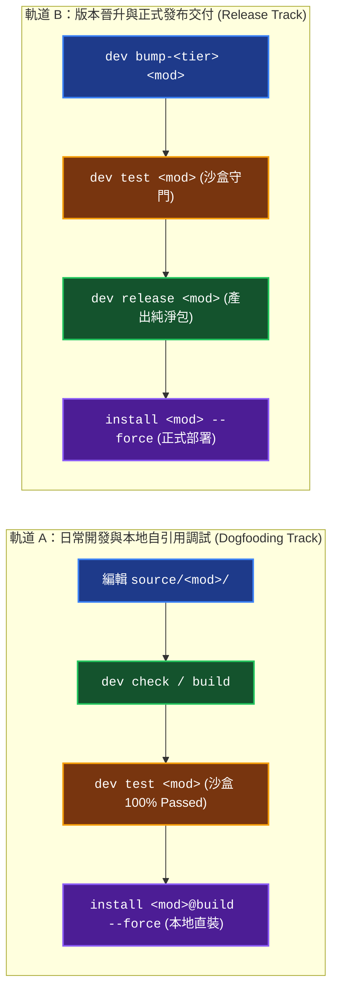

# YS-Codebase Dev 開發者工具箱模組 (Developer Toolchain)

> 模組名稱：`dev`  
> 職責定位：模組開發工具箱。提供模組腳手架、合規檢查、打包建置、沙盒測試與發布流水線。

---

## 1. 工具鏈架構全景 (Architecture Overview)

`dev` 模組提供模組開發所需的工具鏈：



---

## 2. 雙軌開發與發布閉環流水線 (Dual-Track Pipeline)

在 YS-Codebase 生態系中，模組開發嚴格遵循三大空間隔離與雙軌流水線：

- **空間 ① 源碼開發空間 (`source/<module>/`)**：【唯一真理來源 (SSOT)】所有自訂邏輯、腳本、設定均在此編寫。
- **空間 ② 測試驗證空間 (`cache://dev/sandbox/`)**：【品質守門】由 `dev test` 自動於拋棄式沙盒中驗證，未 100% 通過前嚴禁部署。
- **空間 ③ 運行消費空間 (`modules/<module>/`)**：【部署運行產物】由 CLI 透過 `install` 物化部署，嚴禁直接手動修改。



---

## 3. CLI 指令集速查矩陣 (CLI Reference)

### 3.1 模組建立與靜態合規檢查

```bash
# 建立全新模組標準骨架 (自動生成 manifest.json, scripts/cli.py, contributes.json 與測試目錄)
python yscb.py dev create my-module --desc="我的自訂擴充模組"

# 靜態合規檢查 (驗證 manifest.json 格式、語意 URI 規範與 scripts 語法)
python yscb.py dev check my-module

# 檢查所有源碼模組之合規性
python yscb.py dev check --all
```

### 3.2 構建打包與版本管理

本專案預設採用四段式語意版本號格式 `Major.Minor.Patch.Revision`，各欄位語意定義如下：

| 版本位階 | CLI 遞增指令 | 定義與適用情境 |
| :--- | :--- | :--- |
| **Major (第 1 位)** | `python yscb.py dev bump-major <mod>` | **破壞性變更**（不相容的架構重構或介面變更） |
| **Minor (第 2 位)** | `python yscb.py dev bump-minor <mod>` | **可適性變更**（可藉由 migrate 遷移腳本升級之變更） |
| **Patch (第 3 位)** | `python yscb.py dev bump-patch <mod>` | **具代表性功能新增**（向下相容的新功能特性） |
| **Revision (第 4 位)** | `python yscb.py dev bump-revision <mod>` | **日常除錯與增修**（向下相容的小型修復與優化） |

```bash
# 開發建置打包 (產出 build/<mod>/<ver>/<ver>.build.zip，包含 tests/)
python yscb.py dev build my-module

# 語意化版本單向遞增 (自動更新 source/<mod>/manifest.json)
python yscb.py dev bump-revision my-module  # 1.0.0.0 -> 1.0.0.1 (日常除錯、增修)
python yscb.py dev bump-patch my-module     # 1.0.0.0 -> 1.0.1.0 (具代表性功能新增)
python yscb.py dev bump-minor my-module     # 1.0.0.0 -> 1.1.0.0 (可適性變更，可 migrate 升級)
python yscb.py dev bump-major my-module     # 1.0.0.0 -> 2.0.0.0 (破壞性變更)
```

### 3.3 隔離沙盒測試 (Testing Engine)

```bash
# 執行指定模組之沙盒測試 (自動前置 build -> 建立隔離沙盒 -> 跑測 -> 清理沙盒)
python yscb.py dev test my-module

# 執行全生態系所有模組測試 (預設啟用多進程並行加速)
python yscb.py dev test --all

# 指定測試平行度 (Worker 數量)
python yscb.py dev test --all -j 4

# 強制循序跑測
python yscb.py dev test --all --sequential

# 略過前置 build 直接跑測 (用於快速除錯)
python yscb.py dev test my-module --no-build

# 傳遞 unittest 參數 (如執行特定測試檔或測試案例)
python yscb.py dev test my-module -k test_my_feature

# 啟用節流輸出模式 (全通僅輸出單行，前置日誌深度靜默，節省 95% 以上 Token I/O)
python yscb.py dev test --all --quiet
python yscb.py dev test my-module -q
```

### 3.4 純淨發布與 Git 發布流水線

```bash
# 發布預檢 (執行 3-Gate 就緒校驗：靜態合規、不可變性防護、版本單調性)
python yscb.py dev release-check my-module

# 純淨發布打包 (排除 tests/ 與 .yscbignore，產出純淨發布包至 release/ 目錄)
python yscb.py dev release my-module

# 強制覆蓋同版本發布
python yscb.py dev release my-module --force

# 本地 Git 安全發布流水線 (自動感應打包 -> 建立本機 git commit 與 tag，嚴禁 remote push)
python yscb.py dev release-git my-module "feat: 新增資料轉換機制"
```

### 3.5 底層調試工具 (Low-level Operators)

```bash
# 原地執行單元測試 (不建立沙盒，直接在當前目錄跑測)
python yscb.py dev op-test my-module

# 手動建立微型虛擬沙盒 (用於手動環境探勘與除錯)
python yscb.py dev op-mksb --dir=./debug_sandbox
```

---

## 4. 單元測試撰寫指南 (Testing Quickstart)

`dev` 模組內建專用測試基類 `YSCBTestCase`，為自訂模組測試提供標準斷言與生命週期支援：

### 4.1 標準測試案例撰寫範例 (`source/<module>/tests/test_example.py`)

```python
import unittest
from dev.testing import YSCBTestCase
from core import uri

class TestMyModuleFeature(YSCBTestCase):
    """自訂模組功能測試案例。"""

    def setUp(self):
        super().setUp()
        # 測試前置設定 (如準備 mock 資料或暫存檔案)

    def tearDown(self):
        # 測試後置清理
        super().tearDown()

    def test_ft_01_core_functionality(self):
        """FT-01: 驗證核心轉換邏輯正確性。"""
        # 透過語意 URI 存取模組資產
        manifest_uri = "module://manifest.json"
        self.assertTrue(uri.exists(manifest_uri))

    def test_et_01_invalid_input_guardrail(self):
        """ET-01: 驗證異常輸入時能正確拋出例外防禦。"""
        with self.assertRaises(ValueError):
            # 呼叫受測函式
            pass
```

---

## 5. 常見開發者操作指南 (Cookbook)

### 💡 情境 1：從零開發自訂模組並本地試用 (軌道 A)
```bash
# 1. 建立模組骨架
python yscb.py dev create my-helper --desc="輔助自動化工具"

# 2. 編輯 source/my-helper/scripts/cli.py 與業務邏輯代碼

# 3. 執行沙盒測試確保 100% 通過
python yscb.py dev test my-helper

# 4. 以 @build 通道直裝至本機環境進行實機體驗
python yscb.py install my-helper@build --force

# 5. 測試呼叫已安裝之模組 CLI
python yscb.py my-helper --help
```

### 💡 情境 2：正式晉升版本並發布交付 (軌道 B)
```bash
# 1. 遞增版本號 (例如發布 Revision 更新)
python yscb.py dev bump-revision my-helper

# 2. 執行全量沙盒回歸測試
python yscb.py dev test my-helper

# 3. 正式打包純淨發布包
python yscb.py dev release my-helper

# 4. 以正式發布通道更新環境中的模組
python yscb.py install my-helper --force
```
