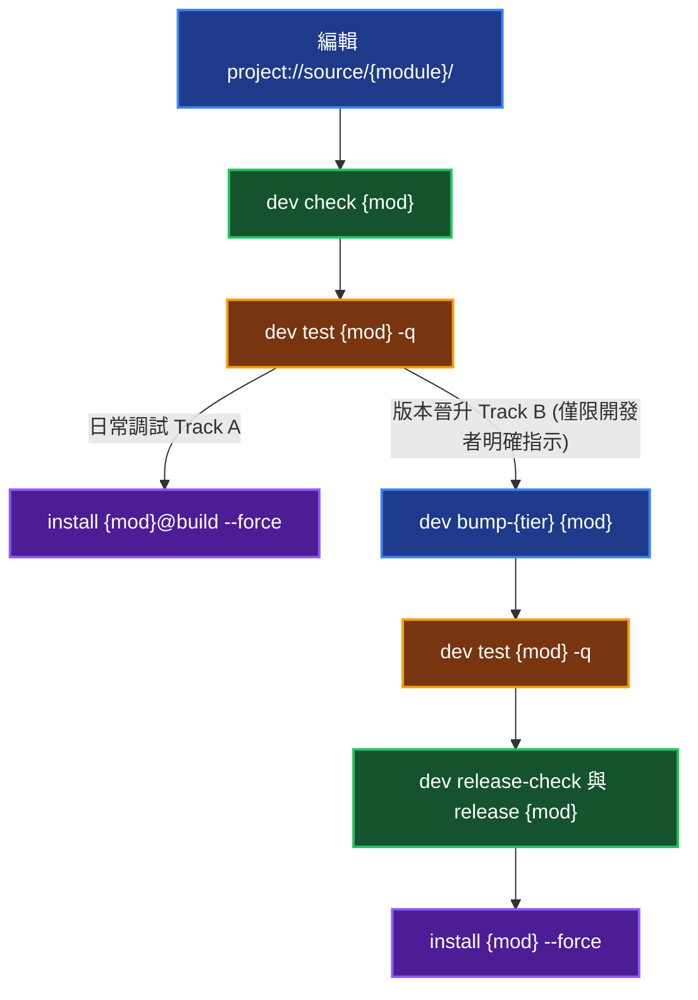

# 生態系模組開發與 Dogfooding 閉環指南 (Module Dev & Dogfooding Guild)

本手冊定義 YSCB 生態系模組開發的三大空間隔離規範、雙軌流水線心智模型與剛性守門鐵律，並作為主題分流引流樞紐 (Main Hub)。

---

## 1. 核心公理與三層空間隔離矩陣 (3-Tier Space Matrix)

進行生態系模組開發時，必須強制遵守三大空間隔離邊界：

| 空間層級 | 路徑範疇 | 空間定位與操作約束 |
| :--- | :--- | :--- |
| **空間 ① 源碼空間** | `project://source/<module>/` | 【唯一真理 SSOT】所有邏輯代碼、腳本、模板、資產與測試 **100% 必須在此編寫**。 |
| **空間 ② 測試空間** | `cache://dev/sandbox/` | 【品質守門閘門】自動化測試於拋棄式沙盒執行（`python yscb.py dev test <mod> -q`），未 100% 通過嚴禁同步。 |
| **空間 ③ 運行空間** | `project://.modules/<module>/` 與 `project://.mirror/` | 【編譯物化產物】**嚴禁手動直接修改**，一律由 CLI 透過 `@build` 或正式安裝同步編譯物化。 |

---

## 2. 雙軌開發與 Dogfooding 閉環心智模型 (Dual-Track Pipeline)

### 軌道 A：日常開發調試 (Dogfooding Track)
未獲明確版本晉升指示時之本機熱開發閉環：
- **流水線**：`編輯 source/<mod>/` $\rightarrow$ `dev check <mod>` $\rightarrow$ `dev test <mod> -q` $\rightarrow$ `install <mod>@build --force`
- **Server 背景自動熱重載**：若涉及常駐守護服務（如 `server`, `knowledge-db`），`install` 物化完成後 Server 後台之 `ModulesWatcher` 會自動感知 `project://.modules/` 變更並自動重載 Worker 子進程（或 Master 自重啟），**完全無需手動執行 reload**。

### 軌道 B：版本晉升交付 (Release Track)
> [!CAUTION]
> **[GATED] 授權守門 (Gated Authority) — 嚴禁 Agent 自主觸發**：
> **僅在開發者明確指示**（顯式要求「執行版本晉升」、「bump 版本」或「release 模組」）時方可進行。未獲開發者明確指示前，嚴禁自行假設需求或擅自進入軌道 B。

- **流水線**：`dev bump-<tier> <mod>` $\rightarrow$ `dev test <mod> -q` $\rightarrow$ `dev release-check <mod>` $\rightarrow$ `dev release <mod>` $\rightarrow$ `install <mod> --force`

---

## [GUARD] 3. 剛性守門鐵律 (Rigid Guardrails - 絕對禁止條款)

1. **SSOT 修改唯一性**：任何業務邏輯、腳本、設定檔或資產變更，**100% 必須在 `project://source/<module>/` 進行**；嚴禁直接編輯 `project://.modules/` 或 `project://.agents/` 等運行端編譯產物。
2. **嚴禁未授權正式發布**：**嚴禁 Agent 自主觸發軌道 B**。唯有在開發者明確指示時方可執行 `dev bump-*` 或 `dev release`；未獲指示前，一律強制維持在軌道 A (`@build`)。
3. **部署後免重複測試**：沙盒測試通過並完成 `@build` 或正式安裝物化後，**嚴禁重複調用 `dev test` 跑測**；物化成功即視為達標。
4. **異動前影響評估守門**：修改公共介面、核心基類或擴充點前，強制以 `python yscb.py knowledge-db callers <symbol>` 與 `impact <symbol>` 排查影響半徑。
5. **語意 URI 剛性解耦**：模組內部跨空間存取**嚴禁硬編碼相對路徑**，必須 100% 使用語意協議（`project://`、`module://`、`config://`、`cache://`、`storage://`）。

---

## 4. 專題手冊分流導航矩陣 (Reference Navigation Matrix)

所有模組開發動作均依**觸發時機**剛性分流查閱專屬專題手冊：

| 觸發時機 (Trigger Condition) | 強制查閱之專屬主題手冊 | 核心規範與導航範疇 |
| :--- | :--- | :--- |
| **模組初始化 / 建立全新模組骨架** | [CLI 活躍合約與指令手冊](./references/cli_and_commands.md#51-模組骨架初始化-scaffold-bootstrapping) | `dev create <name>` 官方腳手架指令、8 大標準檔案拓撲 |
| **CLI 指令實作 / 存取 CmdBags / 對稱性宣告** | [CLI 活躍合約與指令手冊](./references/cli_and_commands.md) | `CmdBags` 活躍契約、CLI 與 `core.json` 1:1 對稱性規範、平鋪命名、PEP 562 延遲載入、Dev 工具鏈矩陣 |
| **宣告擴充點 (Host) / 注入能力 (Donor) / Schema 撰寫** | [Contributes 擴充注入與 Schema 規範指南](./references/contributes_guide.md) | 輕量 Schema DSL 語法、`module://` 語意 URI 查找 Host 契約、Donor 注入結構規範、Did you mean 智能糾錯 |
| **撰寫測試案例 / 4-tier 分類 / 沙盒鉤子 / 跑測節流** | [測試工程實踐與沙盒機制指南](./references/testing_and_sandbox.md) | `YSCBTestCase` 範式、`mark_passed()` 狀態閉環、`@require` 4-tier 分類、`hook.dev.py` 沙盒鉤子、專屬斷言庫 |
| **代碼交付前靜態檢核 / 四大文檔視角隔離 / AST 紅線排查** | [模組開發品質與驗收標準](./references/acceptance_checklist.md) | 四大文檔視角垂直展開隔離、AST 檢核紅線清冊、`configurable/` 規範、`_manifest.md` 檢查 |
| **版本晉升 / 正式發布 ([!] 僅限開發者明確指示時)** | [CLI 活躍合約與指令手冊: 軌道 B](./references/cli_and_commands.md#55-發布流水線-授權守門) | `release-check` 獨立預檢、`release` 打包、`release-git` 本機一鍵發布管線 |
